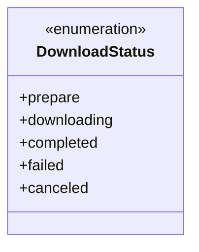
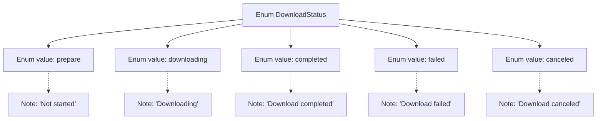

# Basic Information

|      |      |
|------|------|
| Name | DownloadStatus |
| Language | .java |
| Code Path | WeFe/common/java/common-lang/src/main/java/com/welab/wefe/common/http/download/DownloadStatus.java |
| Package Name | com.welab.wefe.common.http.download |
| Dependencies | [] |
| Brief Description | The enumeration DownloadStatus defines download states: preparing, downloading, completed, failed, canceled. |

# Description

This enumeration type defines five states for file downloads: prepare indicates the download has not yet started; downloading indicates the file is currently being downloaded; completed indicates the download has finished; failed indicates the download has failed; canceled indicates the download was canceled. Each state includes corresponding comments explaining its meaning.

# Class Summary

| Name   | Type  | Description |
|-------|------|-------------|
| DownloadStatus | enum | The enumeration DownloadStatus defines download states: preparing, downloading, completed, failed, canceled. |

## Class DownloadStatus

|      |      |
|------|------|
| Access Modifier | public |
| Type | enum |
| Name | DownloadStatus |
| Description | The enumeration DownloadStatus defines download states: preparing, downloading, completed, failed, canceled. |

### UML Class Diagram

This enumeration class defines five download states: prepare (preparing), downloading (in progress), completed (finished), failed (error), and canceled (aborted). Each state is represented by a distinct enumeration value to clearly identify various phases or outcomes during the download process. This design facilitates state management and logical decision-making while enhancing code readability and maintainability. The use of enumeration types ensures the uniqueness and type safety of state values.

### Internal Method Call Graph

This flowchart illustrates the structure of the DownloadStatus enum, containing 5 enum values (prepare/downloading/completed/failed/canceled) along with their corresponding English annotations. Each enum value is connected via dashed lines to its descriptive note, clearly expressing different states that may occur during the download process and their meanings. This design is commonly used in scenarios requiring state tracking such as file downloaders, where enum values can explicitly identify various stages of the download workflow.

### Field List

| Name  | Type  | Description |
|-------|-------|------|

### Method List

| Name  | Type  | Description |
|-------|-------|------|

