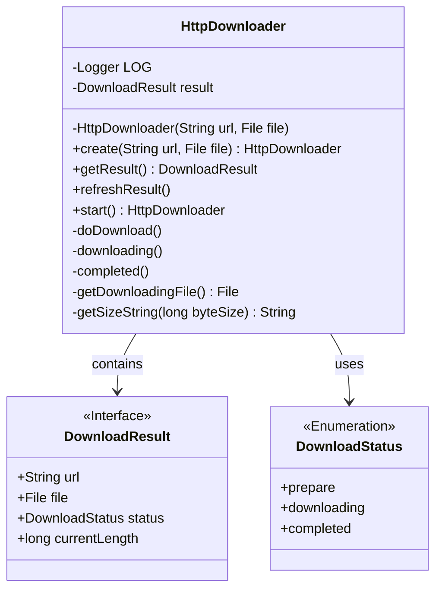
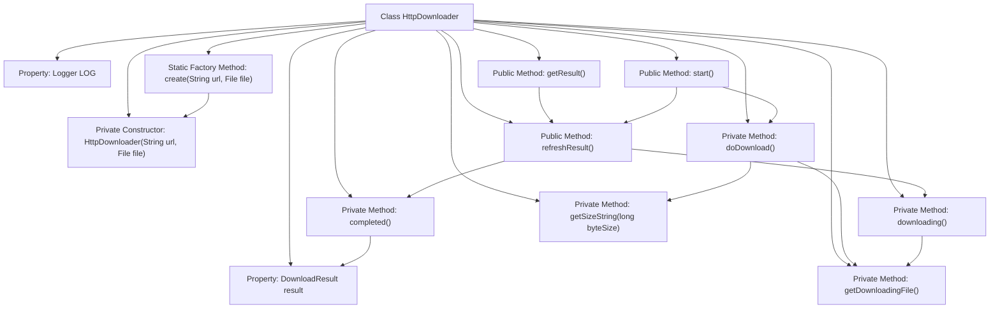
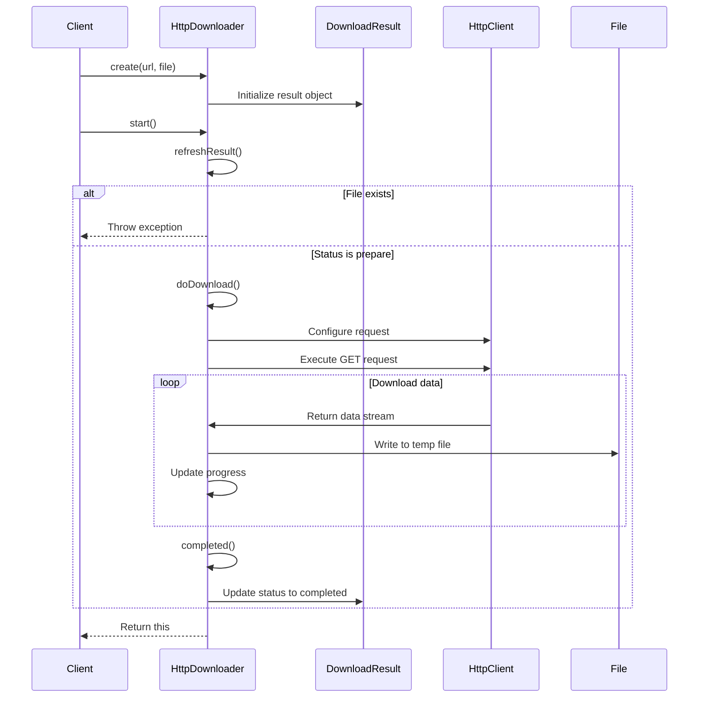

# Basic Information

|      |      |
|------|------|
| Name | HttpDownloader |
| Language | .java |
| Code Path | WeFe/common/java/common-lang/src/main/java/com/welab/wefe/common/http/download/HttpDownloader.java |
| Package Name | com.welab.wefe.common.http.download |
| Dependencies | ['org.apache.http.client.config.RequestConfig', 'org.apache.http.client.methods.CloseableHttpResponse', 'org.apache.http.client.methods.HttpGet', 'org.apache.http.impl.client.CloseableHttpClient', 'org.apache.http.impl.client.HttpClients', 'org.slf4j.Logger', 'org.slf4j.LoggerFactory', 'java.io.File', 'java.io.FileOutputStream', 'java.io.IOException', 'java.io.InputStream', 'java.math.BigDecimal', 'java.math.RoundingMode'] |
| Brief Description | The HttpDownloader class is designed for HTTP file downloads, supporting the creation of download tasks, status checking, execution of downloads, and progress tracking. It checks file existence before downloading, generates temporary files during the download process, and updates the status upon completion. It also provides timeout settings and buffer optimization. |

# Description

HttpDownloader is a Java class designed for HTTP file downloads, with instances created via the static factory method `create`. It utilizes a `DownloadResult` object to track download status, URL, and target file. The constructor checks whether the file already exists to avoid overwriting. The core method `start` triggers the download process, which internally executes the actual download through the `doDownload` method, using Apache HttpClient to handle requests, set timeout parameters, and write data in chunks to a temporary file (with the `.downloading` suffix). Progress is logged during the download, and the file is renamed upon completion. The `refreshResult` method updates the download status (preparing/downloading/completed), and includes helper methods for formatting file sizes. Exception handling covers file existence checks and connection release.

# Class Summary

| Name   | Type  | Description |
|-------|------|-------------|
| HttpDownloader | class | The HttpDownloader class is designed for HTTP file downloads, incorporating features such as download status management, timeout configuration, progress monitoring, and file handling. |

## Class HttpDownloader

|      |      |
|------|------|
| Access Modifier | public |
| Type | class |
| Name | HttpDownloader |
| Description | The HttpDownloader class is designed for HTTP file downloads, incorporating features such as download status management, timeout configuration, progress monitoring, and file handling. |

### UML Class Diagram

Class diagram description:  
HttpDownloader is a utility class for HTTP file downloads, encompassing core download logic and state management. It stores download results (URL, target file, status, and current size) via the DownloadResult interface, and manages download states (prepare/downloading/completed) using the DownloadStatus enumeration. The class provides methods for creating instances, retrieving results, refreshing status, and initiating downloads, with private methods handling actual download processes, state transitions, and file operations. It implements download progress tracking through temporary .downloading files, featuring comprehensive exception handling and logging capabilities.

### Internal Method Call Graph

The flowchart illustrates the complete structure of the HttpDownloader class, including 11 main members and 8 internal call relationships. The core process is: after creating an instance via the factory method, calling start() triggers the download, with refreshResult() managing the state during the process, and ultimately doDownload() completes the HTTP request and file writing. The sequence diagram details the interaction process from instance creation to download completion, highlighting key steps such as status checks and HTTP communication.

### Field List

| Name  | Type  | Description |
|-------|-------|------|
| LOG = LoggerFactory.getLogger(HttpDownloader.class) | Logger | Define a private static log object LOG for the HttpDownloader class. |
| result | DownloadResult | Private download result object `result` |

### Method List

| Name  | Type  | Description |
|-------|-------|------|
| completed | void | Check file existence, report error if not found; set status to completed, update to actual file length if current length is 0. |
| start | HttpDownloader | The method starts the downloader, first refreshing the status. If the status is not ready, it returns directly; otherwise, it executes the download and returns the current object. An IO exception may be thrown. |
| getResult | DownloadResult | The method getResult returns the download result after refreshing it. |
| refreshResult | void | The method `refreshResult` checks the download status: if the file exists and the status is downloading, it calls `completed()`; if the file being downloaded exists, it calls `downloading()`. |
| downloading | void | This method checks if the downloaded file exists, and throws an exception if it does not. It sets the status to "downloading," and updates the current length to the file length if it is currently 0. |
| doDownload | void | The method `doDownload` implements the file download functionality, sets HTTP request timeout parameters, creates temporary files, reads data in chunks and writes it to the file, displays download progress in real-time, and closes resources upon completion. |
| create | HttpDownloader | Create a static method to generate an HttpDownloader instance based on a URL and file path. |
| getDownloadingFile | File | Get the temporary file path during download by appending a `.downloading` suffix to the original file path. |
| getSizeString | String | Convert byte count into a human-readable string, displaying bytes if less than 1024, KB if between 1024 and 1MB, and MB if greater than 1MB, with two decimal places retained. |

