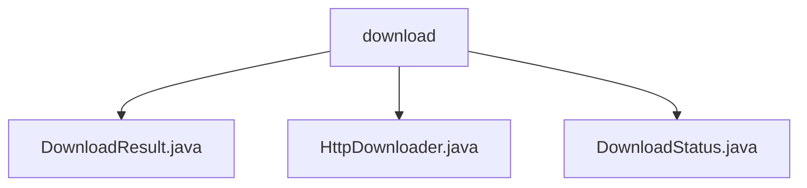

# Basic Information

|      |      |
|------|------|
| Name | download |
| Language | .java |
| Code Path | WeFe/common/java/common-lang/src/main/java/com/welab/wefe/common/http/download |
| Package Name | docs.common.java.common-lang.src.main.java.com.welab.wefe.common.http.download |
| Brief Description | The DownloadResult class records download status, size, files, etc. The HttpDownloader handles HTTP downloads, checks files, writes in chunks, and updates status. The DownloadStatus enum defines five download states: Ready, Downloading, Completed, Failed, Canceled. |

# Description

## Overview  
The core responsibility of this module is to implement HTTP file download functionality, ensuring reliability through state tracking and chunked writing. The interface specifications include DownloadResult for encapsulating result data, HttpDownloader for executing the download process, and the DownloadStatus enum defining the state machine. The key data structure is DownloadResult, which contains fields such as status and totalLength, resembling a task progress report. The only external dependency is Apache HttpClient. For example, resumable downloads are achieved via .downloading temporary files, and status updates are handled through refreshResult.

## Primary Business Scenarios  
A typical application involves multi-threaded chunked downloads of large files, with a process flow including instance creation → file verification → chunked download → file renaming. The interaction pattern resembles the observer pattern, with progress callbacks via DownloadResult. Complete functionality covers state management (e.g., failed/canceled), exception handling, and file existence validation. The API types follow the factory pattern (create) and command pattern (start). For instance, it prevents overwriting existing files and formats file size displays.

### Package Internal Structure View

This flowchart illustrates the file structure related to the HTTP download functionality in the common-lang module of the WeFe project. The root node is the download directory, which contains three Java implementation files: DownloadResult.java handles download results, HttpDownloader.java implements the core logic of the downloader, and DownloadStatus.java defines the download status enumeration. These files collectively form the foundational components of the HTTP download feature, reflecting a modular design philosophy.

# File List

| Name   | Type  | Description |
|-------|------|-------------|
| [DownloadResult.java](DownloadResult.md) | file | The DownloadResult class contains download status, total file size, current size, file object, URL, and error information. |
| [HttpDownloader.java](HttpDownloader.md) | file | The HttpDownloader class is designed for HTTP file downloads, supporting the creation of download tasks, status checking, execution of downloads, and progress tracking. It checks file existence before downloading, generates temporary files during the download process, and updates the status upon completion. It also provides timeout settings and buffer optimization. |
| [DownloadStatus.java](DownloadStatus.md) | file | The enumeration DownloadStatus defines download states: preparing, downloading, completed, failed, canceled. |

