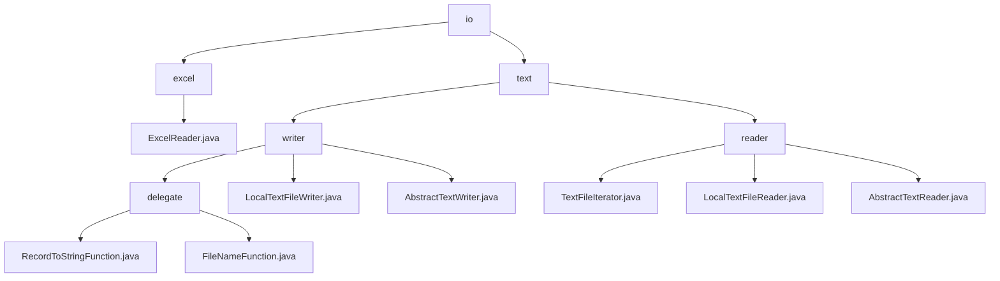

# Basic Information

|      |      |
|------|------|
| Name | io |
| Language | .java |
| Code Path | WeFe/common/java/common-lang/src/main/java/com/welab/wefe/common/io |
| Package Name | docs.common.java.common-lang.src.main.java.com.welab.wefe.common.io |
| Brief Description | ExcelReader is a Java class that supports reading Excel data, offering multiple initialization methods and data traversal functionalities. The text processing module supports data serialization, segmented storage, and line-by-line reading, making it suitable for ETL and high-throughput log processing. |

# Description

## Overview  
This module is a versatile toolkit for data processing, with core responsibilities including Excel file parsing and batch text data processing. The ExcelReader provides workbook operations and type-aware cell reading (a lightweight wrapper similar to POI), while the text module implements partitioned storage and iterative reading (similar to the MapReduce pattern). A unified interface specification covers Closeable resource management, Iterator traversal, and functional serialization interfaces. Key data structures include Excel worksheets/cells, text partition configurations, and read-state tracking. It relies on JVM shutdown hooks, Java IO libraries, and synchronization mechanisms, such as log-to-CSV conversion, database exports, and intermediate storage for distributed computing.  

## Key Business Scenarios  
The module supports structured and unstructured data processing workflows. On the Excel side, it implements a "load-iterate-close" process (e.g., report parsing), while the text side combines partitioned writing and buffered reading (e.g., log archiving). Both interaction modes adopt iterator interfaces: Excel supports Map/List row data mapping, and the text module implements prefetching and line number tracking. Typical use cases include ETL pipelines (e.g., Excel-to-CSV conversion), batch log analysis, and high-throughput data persistence, resembling the producer-consumer model of a message bus.

### Package Internal Structure View

This flowchart illustrates the hierarchical structure of the io directory under the common-lang module in the WeFe project. The top level is the io directory, which branches into two subdirectories: excel and text. The excel directory contains the ExcelReader.java file, while the text directory is divided into writer and reader sections. The writer section includes abstract classes, implementation classes, and a delegate directory, whereas the reader section comprises abstract classes and concrete implementation classes. The entire structure clearly reflects the modular design of file read/write functionality.

# File List

| Name   | Type  | Description |
|-------|------|-------------|
| [excel](excel/_module.md) | package | The `ExcelReader` class is designed for reading Excel files and supports initialization via file names, files, or input streams. It provides functionalities such as obtaining the number of worksheets, row and column counts, row data, and column names. It supports data traversal with or without header rows and automatically handles empty cells. Implementing the `Closeable` interface ensures resource release. |
| [text](text/_module.md) | package | The text processing toolkit includes write and read modules. The write module supports record serialization and dynamic sharded storage, relying on JVM hooks and synchronization locks, making it suitable for ETL pipelines. The read module processes text line by line through an iterator, designed for scenarios like log analysis. Both are based on Java standard IO and are thread-safe. |

