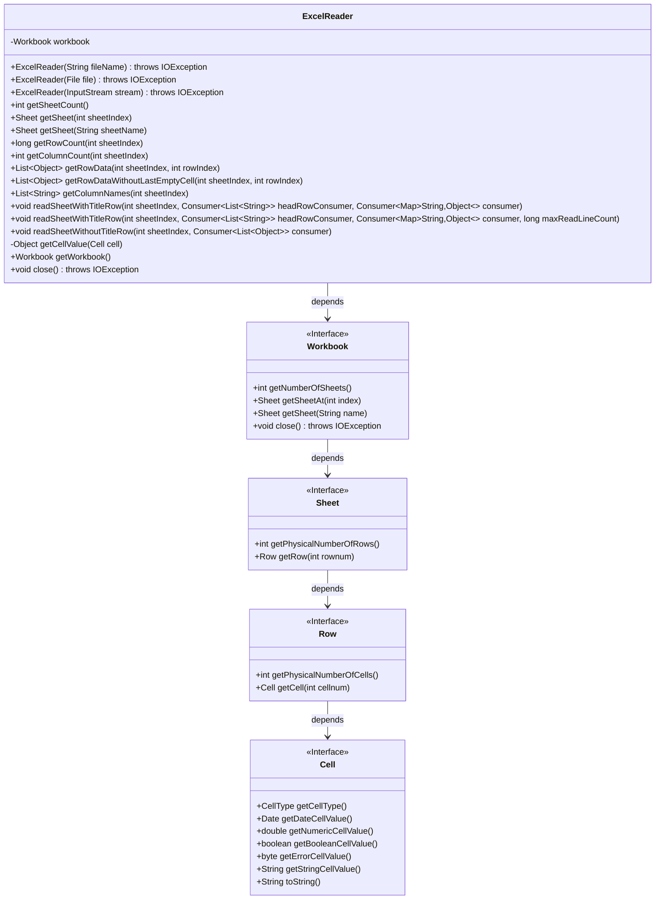
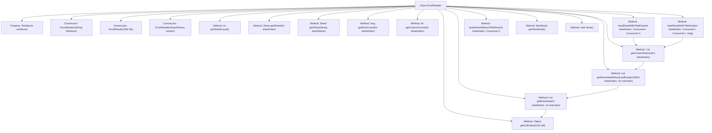

# Basic Information

|      |      |
|------|------|
| Name | ExcelReader |
| Language | .java |
| Code Path | WeFe/common/java/common-lang/src/main/java/com/welab/wefe/common/io/excel/ExcelReader.java |
| Package Name | com.welab.wefe.common.io.excel |
| Dependencies | ['com.alibaba.fastjson.util.TypeUtils', 'com.welab.wefe.common.util.StringUtil', 'org.apache.poi.ss.usermodel', 'java.io.Closeable', 'java.io.File', 'java.io.IOException', 'java.io.InputStream', 'java.util.ArrayList', 'java.util.LinkedHashMap', 'java.util.List', 'java.util.Map', 'java.util.function.Consumer', 'java.util.stream.Collectors'] |
| Brief Description | The ExcelReader class is designed for reading Excel files, supporting initialization via file name, file object, or input stream. It provides functionalities to obtain the number of worksheets, row and column counts, row data, and column names, accommodating data traversal with or without header rows while automatically handling empty cells. By implementing the Closeable interface, it ensures proper resource release. |

# Description

ExcelReader is a Java class that implements the Closeable interface, designed for reading data from Excel files. It supports initializing the workbook via a filename, File object, or InputStream. It provides functionalities such as obtaining the number of worksheets, retrieving a specified worksheet, and getting the row and column counts. It can read single-row data and automatically excludes trailing empty cells. It offers methods to retrieve column headers and two traversal modes: traversal with header rows (converting data into Maps) and traversal without header rows (directly returning row data lists). The internal method getCellValue handles different types of cell data (numeric, date, boolean, string, etc.). Finally, the close method is used to release resources by closing the workbook.

# Class Summary

| Name   | Type  | Description |
|-------|------|-------------|
| ExcelReader | class | The ExcelReader class is designed for reading Excel files, supporting construction from files or input streams. It provides functionalities to retrieve worksheets, row/column counts, row data, and iteration capabilities. It accommodates reading with or without header rows, automatically handles cell types, and ensures resource closure. |

## Class ExcelReader

|      |      |
|------|------|
| Access Modifier | public |
| Type | class |
| Name | ExcelReader |
| Description | The ExcelReader class is designed for reading Excel files, supporting construction from files or input streams. It provides functionalities to retrieve worksheets, row/column counts, row data, and iteration capabilities. It accommodates reading with or without header rows, automatically handles cell types, and ensures resource closure. |

### UML Class Diagram

This class diagram illustrates the structure of the ExcelReader class and its dependencies with related interfaces. ExcelReader is a Closeable-implementing class designed for reading Excel file contents, offering multiple constructors to support different input sources. Core functionalities include obtaining worksheet counts, reading row/column data, and processing cell values. The class operates Excel documents through the Workbook interface, which further relies on Sheet, Row, and Cell interfaces to access worksheet, row, and cell data respectively. The private method getCellValue() handles conversion of different cell value types, demonstrating meticulous processing capabilities for Excel data formats.

### Internal Method Call Graph

This flowchart illustrates the complete structure of the ExcelReader class, including 3 constructors, 12 core methods, and 1 private utility method. The class operates Excel files through Workbook objects, providing various data reading capabilities such as traversal with/without title rows, row/column counting, and cell value retrieval. Key methods like getRowData and getCellValue form a call chain to support flexible data processing workflows. All methods ultimately rely on the underlying Workbook for Excel operations and ensure resource release through the Closeable interface.

### Field List

| Name  | Type  | Description |
|-------|-------|------|
| workbook | Workbook | Private Workbook object instance. |

### Method List

| Name  | Type  | Description |
|-------|-------|------|
| getSheetCount | int | Get the number of worksheets in the workbook. |
| getWorkbook | Workbook | Methods to obtain the current workbook object. |
| getRowDataWithoutLastEmptyCell | List<Object> | This method retrieves the specified worksheet row data and removes trailing empty cells, returning the processed list. |
| readSheetWithoutTitleRow | void | Read data from the specified worksheet (without header row), process it row by row, and pass it to the consumer. |
| getCellValue | Object | Methods for obtaining cell values, handling different types such as numbers, dates, booleans, errors, strings, and blanks, returning corresponding values or null. |
| getRowData | List<Object> | Retrieve row data from a specified Excel worksheet and return a list of cell values. Returns null if the row is empty. |
| getColumnCount | int | Get the number of columns for a specified worksheet index, returning the actual count of cells in the first row of that sheet. |
| readSheetWithTitleRow | void | Read data from the specified worksheet in Excel, process the header row and each row of data, with support for a maximum row limit. The header row is processed via the headRowConsumer callback, while data rows are converted into Maps and handled by the consumer. |
| readSheetWithTitleRow | void | This method is used to read a table with header rows, processing both the header and data rows through a callback function, supporting the specification of table index and optional row count limits. |
| getSheet | Sheet | Get the worksheet with the specified name. |
| getColumnNames | List<String> | This method retrieves the first row data of the specified worksheet index, converts it into a string list for return, and automatically filters out trailing empty cells. |
| getSheet | Sheet | Get the worksheet at the specified index. The method calls the `getSheetAt` function of the workbook and returns the Sheet object corresponding to the `sheetIndex`. |
| getRowCount | long | Get the total number of rows in the specified worksheet. |
| close | void | This method overrides close(), calls workbook.close(), and may throw an IOException. |

