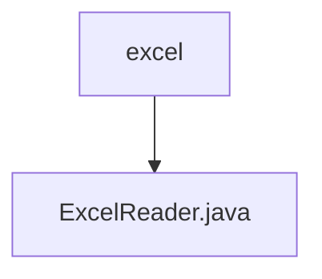

# Basic Information

|      |      |
|------|------|
| Name | excel |
| Language | .java |
| Code Path | WeFe/common/java/common-lang/src/main/java/com/welab/wefe/common/io/excel |
| Package Name | docs.common.java.common-lang.src.main.java.com.welab.wefe.common.io.excel |
| Brief Description | The `ExcelReader` class is designed for reading Excel files and supports initialization via file names, files, or input streams. It provides functionalities such as obtaining the number of worksheets, row and column counts, row data, and column names. It supports data traversal with or without header rows and automatically handles empty cells. Implementing the `Closeable` interface ensures resource release. |

# Description

ExcelReader is a Java class that implements the Closeable interface, designed for reading data from Excel files. It supports initializing the workbook through a filename, File object, or InputStream. It provides functionalities such as obtaining the number of worksheets, retrieving a specified worksheet, and getting the row and column counts. It can read single-row data with automatic exclusion of trailing empty cells. It offers methods to retrieve column headers and two iteration modes: iteration with header rows (converting data into Maps) and iteration without header rows (directly returning row data lists). The internal method getCellValue handles different types of cell data (numeric, date, boolean, string, etc.). Finally, the close method is used to release resources by closing the workbook.

### Package Internal Structure View

This flowchart illustrates the package structure relationship of the excel module under the common-lang component in the WeFe project. The top-level node is the excel directory, which contains a specific Java file, ExcelReader.java, as its subordinate. This structure clearly reflects the code organization of the Excel reading functionality, with ExcelReader.java serving as the core implementation file within the excel package. The entire structure is concise and straightforward, adhering to the standard package organization conventions of Java projects.

# File List

| Name   | Type  | Description |
|-------|------|-------------|
| [ExcelReader.java](ExcelReader.md) | file | The `ExcelReader` class is designed for reading Excel files, supporting initialization via file name, file object, or input stream. It provides functionalities to obtain the number of worksheets, row and column counts, row data, and column names. It supports data traversal with or without header rows and automatically handles empty cells. By implementing the `Closeable` interface, it ensures proper resource release. |

