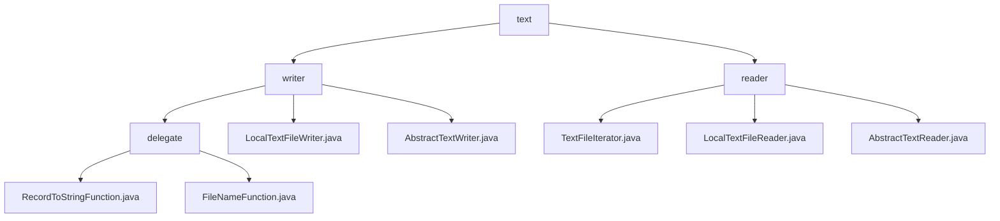

# Basic Information

|      |      |
|------|------|
| Name | text |
| Language | .java |
| Code Path | WeFe/common/java/common-lang/src/main/java/com/welab/wefe/common/io/text |
| Package Name | docs.common.java.common-lang.src.main.java.com.welab.wefe.common.io.text |
| Brief Description | The text processing toolkit includes write and read modules. The write module supports record serialization and dynamic sharded storage, relying on JVM hooks and synchronization locks, making it suitable for ETL pipelines. The read module processes text line by line through an iterator, designed for scenarios like log analysis. Both are based on Java standard IO and are thread-safe. |

# Description

## Overview  
This module is a universal toolkit for text data processing, with core responsibilities including record serialization/sharded storage and line-by-line reading (combining Mapper and iterator patterns similar to MapReduce). It provides functional interfaces RecordToStringFunction/FileNameFunction for writing, and Iterator/Closeable specifications for reading. Key data structures cover write statistics metrics, file configuration items, and read states (line numbers/buffers). It relies on JVM shutdown hooks, BufferedWriter, and Java standard IO libraries, with thread safety implemented via synchronization locks. Examples include log-to-CSV conversion, HDFS chunked storage, and log file line-by-line analysis.

## Primary Business Scenarios  
The module supports ETL pipelines and batch data processing, forming a "process-store-read" closed loop. The writing end combines serialization and sharding functions through LocalTextFileWriter (e.g., database-to-CSV conversion with sequential file rotation), while the reading end implements prefetching and line number tracking via TextFileIterator. The interaction mode uniformly adopts the Iterator interface (e.g., traversal via while(hasNext)), suitable for high-throughput log archiving, distributed computation persistence, and log analysis scenarios, akin to the message landing and consumption pattern of an event bus.

### Package Internal Structure View

This flowchart illustrates the module structure of text IO processing in the WeFe project. The top level is the `text` directory, which branches into two submodules: `writer` and `reader`. The `writer` module includes the concrete implementation class `LocalTextFileWriter.java`, the abstract class `AbstractTextWriter.java`, and the `delegate` subdirectory. The `reader` module comprises the iterator implementation `TextFileIterator.java`, the concrete implementation class `LocalTextFileReader.java`, and the abstract class `AbstractTextReader.java`. The `delegate` directory contains two functional class files.

# File List

| Name   | Type  | Description |
|-------|------|-------------|
| [reader](reader/_module.md) | package | TextFileIterator reads text files line by line, maintaining line numbers and state. LocalTextFileReader reads local files, supporting character sets and size calculation. AbstractTextReader is the abstract base class for text reading, providing methods for obtaining file names and readers. |
| [writer](writer/_module.md) | package | Provide two generic function interfaces: RecordToStringFunction (record-to-text conversion) and FileNameFunction (generates storage paths), suitable for data processing scenarios such as ETL. LocalTextFileWriter is a thread-safe local text writer that supports automatic sharding and error handling. AbstractTextWriter is an abstract base class that provides core writing functionality and statistical metrics. |

