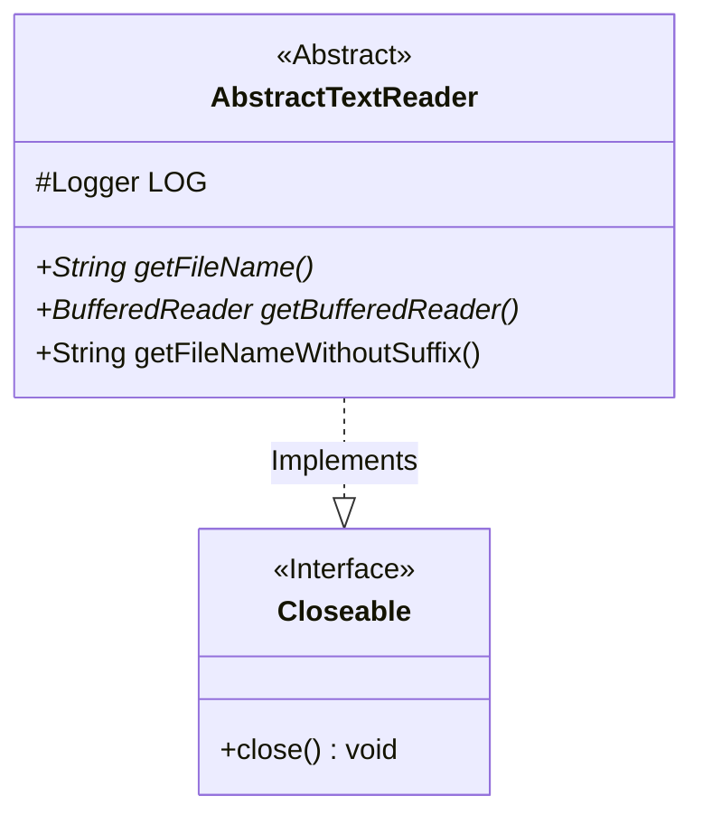
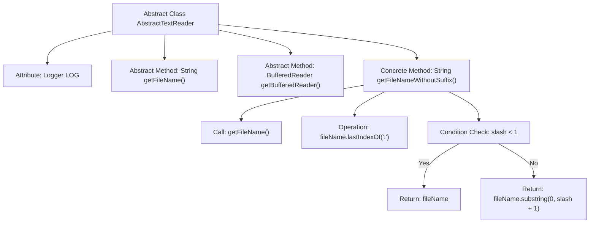

# Basic Information

|      |      |
|------|------|
| Name | AbstractTextReader |
| Language | .java |
| Code Path | WeFe/common/java/common-lang/src/main/java/com/welab/wefe/common/io/text/reader/AbstractTextReader.java |
| Package Name | com.welab.wefe.common.io.text.reader |
| Dependencies | ['org.slf4j.Logger', 'org.slf4j.LoggerFactory', 'java.io.BufferedReader', 'java.io.Closeable'] |
| Brief Description | The abstract class AbstractTextReader implements the Closeable interface, providing abstract methods for obtaining file names, filenames without extensions, and BufferedReader objects, with built-in logging functionality. |

# Description

AbstractTextReader is an abstract class that implements the Closeable interface for reading text files. It contains a protected Logger object for logging purposes. The class provides three methods: getFileName is an abstract method used to retrieve the file name; getBufferedReader is also an abstract method that returns a BufferedReader object for reading file content line by line; getFileNameWithoutSuffix is a concrete method that obtains the filename without its suffix by truncating the string before the last dot. This class provides a foundational framework for text reading, with specific implementations to be completed by subclasses.

# Class Summary

| Name   | Type  | Description |
|-------|------|-------------|
| AbstractTextReader | class | The abstract class AbstractTextReader implements the Closeable interface, providing methods to obtain the file name, BufferedReader object, and filename without extension. |

## Class AbstractTextReader

|      |      |
|------|------|
| Access Modifier | public abstract |
| Type | class |
| Name | AbstractTextReader |
| Description | The abstract class AbstractTextReader implements the Closeable interface, providing methods to obtain the file name, BufferedReader object, and filename without extension. |

### UML Class Diagram

This code demonstrates an abstract class AbstractTextReader that implements the Closeable interface. The class contains a protected Logger object and three methods: two abstract methods getFileName() and getBufferedReader(), along with a concrete method getFileNameWithoutSuffix(). Designed primarily for file reading operations, it provides functionalities such as obtaining file names, buffered readers, and file names without suffixes. The abstract methods require subclass implementations for specific logic, reflecting the template method design pattern.

### Internal Method Call Graph

This code defines an abstract class AbstractTextReader, containing a logger, two abstract methods, and one concrete method. The flowchart illustrates the class structure and method invocation relationships, with emphasis on the internal logic of getFileNameWithoutSuffix(): first obtaining the file name, locating the last dot position, and returning the file name with or without suffix based on the condition check. This design provides a foundational framework for text readers, enforcing subclasses to implement critical file operation functionalities.

### Field List

| Name  | Type  | Description |
|-------|-------|------|
| LOG = LoggerFactory.getLogger(this.getClass()) | Logger | The class defines a protected and immutable logger instance for logging output within the current class. |

### Method List

| Name  | Type  | Description |
|-------|-------|------|
| getFileName | String | Abstract method `getFileName`, returns the file name string. |
| getBufferedReader | BufferedReader | Abstract method that returns a BufferedReader object. |
| getFileNameWithoutSuffix | String | Get the filename without extension, or return the original filename if it has no extension. |

