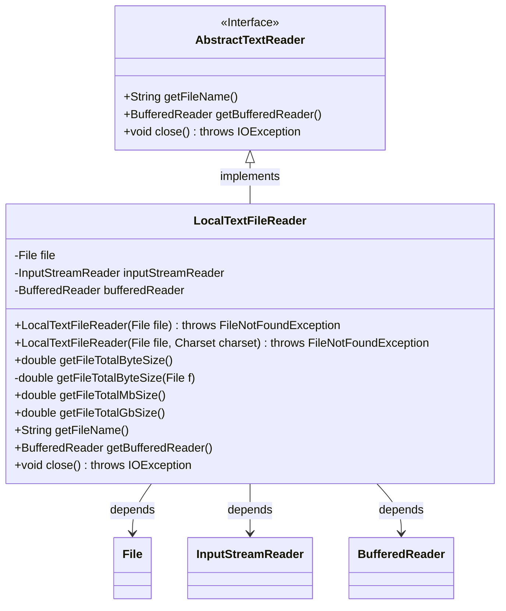
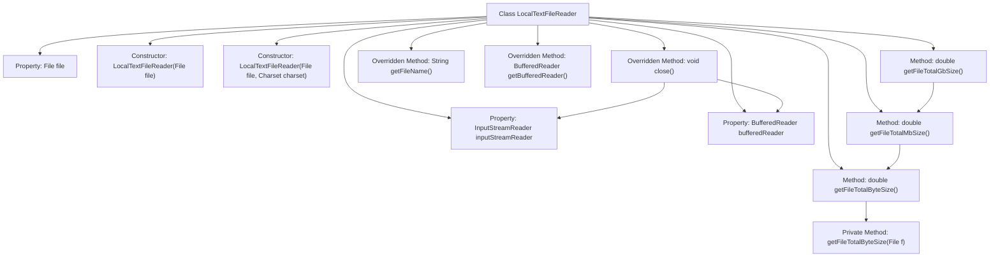

# Basic Information

|      |      |
|------|------|
| Name | LocalTextFileReader |
| Language | .java |
| Code Path | WeFe/common/java/common-lang/src/main/java/com/welab/wefe/common/io/text/reader/LocalTextFileReader.java |
| Package Name | com.welab.wefe.common.io.text.reader |
| Dependencies | ['java.io', 'java.nio.charset.Charset', 'java.nio.charset.StandardCharsets'] |
| Brief Description | The LocalTextFileReader class inherits from AbstractTextReader, supports reading local text files with UTF-8 encoding as default, and provides file size calculation (bytes/MB/GB) along with resource closing functionality. |

# Description

The `LocalTextFileReader` class inherits from `AbstractTextReader` and is used to read local text files. The constructor supports specifying a character set (defaulting to UTF-8) and checks whether the file exists. It provides methods to obtain the file name and file size (in bytes/MB/GB), with file size calculations supporting recursive directory processing. Content is read via `BufferedReader`, and resource closing logic is implemented to ensure safe release of input streams and readers.

# Class Summary

| Name   | Type  | Description |
|-------|------|-------------|
| LocalTextFileReader | class | The LocalTextFileReader class inherits from AbstractTextReader and is used to read local text files, supporting UTF-8 encoding. It provides file size calculation (in bytes/MB/GB) and resource closing functionality. |

## Class LocalTextFileReader

|      |      |
|------|------|
| Access Modifier | public |
| Type | class |
| Name | LocalTextFileReader |
| Description | The LocalTextFileReader class inherits from AbstractTextReader and is used to read local text files, supporting UTF-8 encoding. It provides file size calculation (in bytes/MB/GB) and resource closing functionality. |

### UML Class Diagram

Class diagram description: The LocalTextFileReader class inherits from the AbstractTextReader interface and implements file reading functionality. Core members include File object, InputStreamReader, and BufferedReader, providing constructors for UTF-8 or specified charset reading. Main features include recursive file byte size calculation (with MB/GB unit conversion), filename retrieval, buffered reader acquisition, and resource closing methods. The composite pattern handles file size calculation, demonstrating effective resource management mechanisms.

### Internal Method Call Graph

The flowchart depicts the structure of the LocalTextFileReader class and its method invocation relationships. This class inherits from AbstractTextReader, containing file-reading related properties and constructors, providing functionality to calculate file sizes (with byte/MB/GB unit conversions), and implementing resource-closing logic. The core method getFileTotalByteSize recursively calculates total file size, while other methods perform unit conversions based on it. The flowchart clearly shows the initialization of stream objects by constructors, recursive calculation logic, and sequential invocation relationships for resource closure.

### Field List

| Name  | Type  | Description |
|-------|-------|------|
| file | File | Private file object `file`. |
| inputStreamReader | InputStreamReader | InputStreamReader is a class in Java used to convert byte streams into character streams. |
| bufferedReader | BufferedReader | Declare a variable named bufferedReader of type BufferedReader. |

### Method List

| Name  | Type  | Description |
|-------|-------|------|
| close | void | This method closes the bufferedReader and inputStreamReader resources, ensuring they are set to null after closing to prevent memory leaks. |
| getFileTotalMbSize | double | This method converts the total number of bytes in the file into megabytes by dividing by 1024 twice to achieve unit conversion. |
| getFileTotalByteSize | double | The method getFileTotalByteSize returns the total byte size of the file, invoking the method of the same name to process the specific file parameters. |
| getFileName | String | Method override, returns the filename. |
| getFileTotalGbSize | double | The method converts the total file size from MB to GB by dividing by 1024 to achieve unit conversion. |
| getFileTotalByteSize | double | Recursively calculate the total byte count of a file or directory. For a file, return its size directly; for a directory, traverse its sub-items and accumulate the sizes. |
| getBufferedReader | BufferedReader | This method returns a BufferedReader object instance. |

