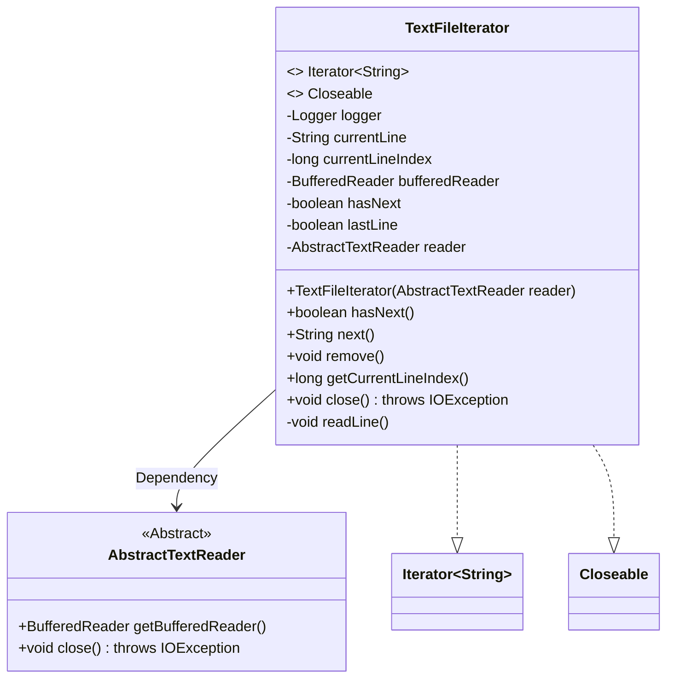
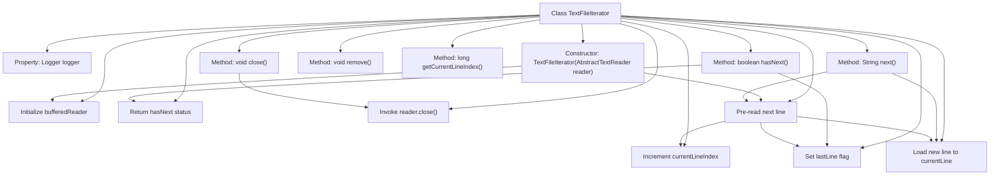

# Basic Information

|      |      |
|------|------|
| Name | TextFileIterator |
| Language | .java |
| Code Path | WeFe/common/java/common-lang/src/main/java/com/welab/wefe/common/io/text/reader/TextFileIterator.java |
| Package Name | com.welab.wefe.common.io.text.reader |
| Dependencies | ['org.slf4j.Logger', 'org.slf4j.LoggerFactory', 'java.io.BufferedReader', 'java.io.Closeable', 'java.io.IOException', 'java.util.Iterator'] |
| Brief Description | The TextFileIterator class implements the Iterator and Closeable interfaces, designed for reading text files line by line. It includes attributes such as current line content, line number, and read status. It traverses files via the hasNext and next methods and supports resource closure. |

# Description

The TextFileIterator is a class that implements both the Iterator and Closeable interfaces, designed for reading text files line by line. It utilizes a BufferedReader to read file content, maintaining the current line content (`currentLine`), line number (`currentLineIndex`), and status flags (`hasNext` and `lastLine`). The constructor accepts an instance of AbstractTextReader and initializes the reader, prefetching the first line. The `hasNext` method determines whether further reading is possible based on the status, while the `next` method returns the current line and prefetches the next one. The `readLine` method performs the actual read operation and updates the status. The class also provides methods to retrieve the current line number and a `close` method to release resources, but it does not support the `remove` operation.

# Class Summary

| Name   | Type  | Description |
|-------|------|-------------|
| TextFileIterator | class | The TextFileIterator class implements the iterator and closeable interfaces, designed for reading text files line by line while tracking line numbers and state, with support for lookahead and resource release. |

## Class TextFileIterator

|      |      |
|------|------|
| Access Modifier | public |
| Type | class |
| Name | TextFileIterator |
| Description | The TextFileIterator class implements the iterator and closeable interfaces, designed for reading text files line by line while tracking line numbers and state, with support for lookahead and resource release. |

### UML Class Diagram

This code demonstrates a `TextFileIterator` class that implements both `Iterator<String>` and `Closeable` interfaces for reading text files line by line. It obtains a `BufferedReader` through `AbstractTextReader` for underlying file operations, maintains current line state and index, and provides standard iterator methods. The class diagram clearly shows its inheritance relationships, private states, and public interfaces, reflecting the integration of file reading and iteration functionalities.

### Internal Method Call Graph

This code implements a text file iterator primarily designed for reading file content line by line. The flowchart illustrates the class structure, property relationships, and method invocation chains. The core logic utilizes BufferedReader to pre-fetch the next line while implementing the Iterator interface, maintaining line number indexing and end-of-file markers. The constructor immediately pre-reads the first line, and the next() method triggers the next pre-read when returning the buffered line, forming a pipelined operation. Exception handling and resource closure are implemented through the Closeable interface, with the remove() method explicitly prohibited.

### Field List

| Name  | Type  | Description |
|-------|-------|------|
| currentLineIndex = -1 | long | The variable currentLineIndex is initialized to -1 to record the current line index. |
| lastLine = false | boolean | The variable `lastLine` is of boolean type, with an initial value of false, indicating whether it is the last line. |
| hasNext = true | boolean | The boolean variable hasNext indicates whether there is a next element, with an initial value of true. |
| logger = LoggerFactory.getLogger(this.getClass()) | Logger | Define a protected logger object within the class, initializing the logger with the current class. |
| currentLine | String | Current line string variable |
| bufferedReader | BufferedReader | The private member variable bufferedReader, of type BufferedReader. |
| reader | AbstractTextReader | Private text reader instance. |

### Method List

| Name  | Type  | Description |
|-------|-------|------|
| hasNext | boolean | Check if the iterator has the next element: returns false if it has reached the last row, otherwise returns the hasNext status. |
| next | String | This method returns the current line content and pre-reads the next line. Each call returns the already read currentLine while invoking readLine() to pre-read subsequent content for hasNext judgment. |
| readLine | void | The method `readLine` reads the next line of text and increments the line number. If the end is reached, it sets `lastLine` to true, and logs an error in case of an exception. |
| remove | void | Java method override, throwing UnsupportedOperationException to indicate an illegal operation. |
| getCurrentLineIndex | long | Methods to obtain the current line index, returns a long integer value currentLineIndex. |
| close | void | Java method override, calling the reader's close method which may throw an IOException. |

