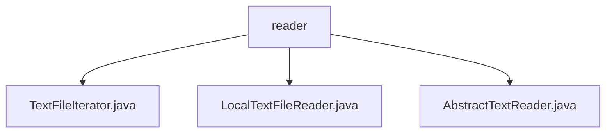

# Basic Information

|      |      |
|------|------|
| Name | reader |
| Language | .java |
| Code Path | WeFe/common/java/common-lang/src/main/java/com/welab/wefe/common/io/text/reader |
| Package Name | docs.common.java.common-lang.src.main.java.com.welab.wefe.common.io.text.reader |
| Brief Description | TextFileIterator reads text files line by line, maintaining line numbers and state. LocalTextFileReader reads local files, supporting character sets and size calculation. AbstractTextReader is the abstract base class for text reading, providing methods for obtaining file names and readers. |

# Description

## Overview  
This module provides line-by-line reading capability for text files, with its core responsibility being to safely and efficiently process local text files through the iterator pattern (similar to the event bus pattern). The interface specifications include Iterator's hasNext/next operations, Closeable's resource release, and extended functionalities such as line number queries. Key data structures include currentLine (current line content), currentLineIndex (line number counter), and BufferedReader (buffered reader). The only external dependency is the Java standard IO library. For example, TextFileIterator implements a pre-read mechanism, while LocalTextFileReader supports recursive directory size calculation.

## Main Business Scenarios  
The module is suitable for scenarios requiring line-by-line text reading, such as log analysis and batch data processing. The complete workflow includes initializing the reader (with optional charset specification), iterating to retrieve line content, and finally closing the resource. The interaction mode is uniformly implemented through the Iterator interface, such as processing each line of data via while(hasNext()). Typical applications include using LocalTextFileReader to read local log files and obtaining suffix-free filenames via getFileNameWithoutSuffix for subsequent processing. API types fall into three categories: state queries (hasNext), content retrieval (next), and resource management (close).

### Package Internal Structure View

This flowchart illustrates the class structure relationships of the text reading module in the WeFe project. The root node "reader" represents the text reader directory, which includes three concrete implementation classes: TextFileIterator handles text file iteration, LocalTextFileReader implements local text reading, and AbstractTextReader serves as an abstract base class providing common functionality. The entire structure clearly reflects the hierarchical design of the text processing module.

# File List

| Name   | Type  | Description |
|-------|------|-------------|
| [TextFileIterator.java](TextFileIterator.md) | file | The TextFileIterator class implements the Iterator and Closeable interfaces, designed for reading text files line by line. It includes attributes such as the current line content, line number, and read status. It traverses files via the hasNext and next methods and supports resource closure. |
| [LocalTextFileReader.java](LocalTextFileReader.md) | file | The LocalTextFileReader class inherits from AbstractTextReader, supports reading local text files with UTF-8 encoding as default, and provides file size calculation (bytes/MB/GB) along with resource closing functionality. |
| [AbstractTextReader.java](AbstractTextReader.md) | file | The abstract class AbstractTextReader implements the Closeable interface, providing abstract methods for obtaining the file name, suffix-free file name, and BufferedReader object, while incorporating logging functionality. |

