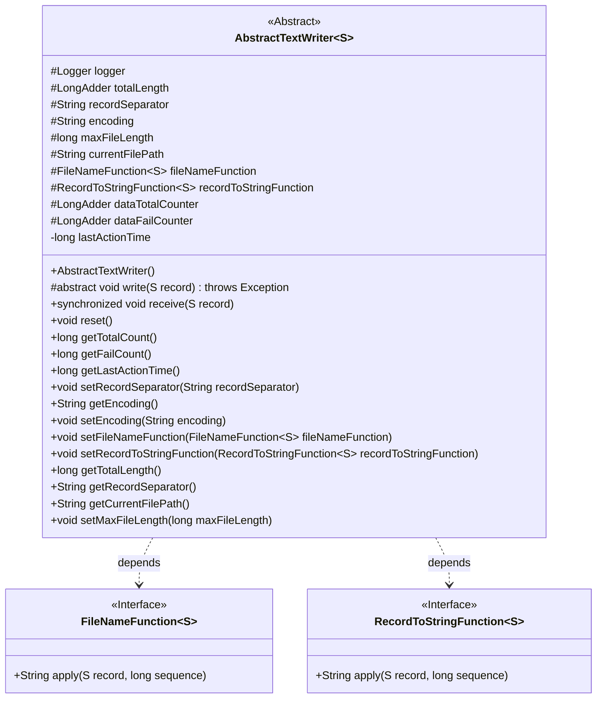

# Basic Information

|      |      |
|------|------|
| Name | AbstractTextWriter |
| Language | .java |
| Code Path | WeFe/common/java/common-lang/src/main/java/com/welab/wefe/common/io/text/writer/AbstractTextWriter.java |
| Package Name | com.welab.wefe.common.io.text.writer |
| Dependencies | ['com.alibaba.fastjson.JSON', 'com.welab.wefe.common.io.text.writer.delegate.FileNameFunction', 'com.welab.wefe.common.io.text.writer.delegate.RecordToStringFunction', 'org.slf4j.Logger', 'org.slf4j.LoggerFactory', 'java.io.Closeable', 'java.io.IOException', 'java.util.concurrent.atomic.LongAdder'] |
| Brief Description | Abstract text writing class that supports custom encoding, delimiters, and filename generation, records written data volume, failure count, and last activity time, and provides reset and statistical functions. |

# Description

This is an abstract text writer class `AbstractTextWriter` that implements the `Closeable` interface. It includes configuration items such as record separators, text encoding, and maximum file length, as well as core components like the current file path, filename generation function, and record-to-string conversion function. The class internally maintains counters for total written length, total received data count, write failure count, and a last activity timestamp. The constructor registers a JVM shutdown hook to ensure resource release. Key functionalities include receiving data and invoking abstract write methods, resetting counters, obtaining various statistical metrics, and providing getter/setter methods for related properties. All write operations are thread-safe through synchronized methods, with error logs recorded and failure counters updated upon write failures.

# Class Summary

| Name   | Type  | Description |
|-------|------|-------------|
| AbstractTextWriter | class | AbstractTextWriter, an abstract text writing class, implements Closeable and includes configurations such as logging, counters, encoding, and delimiters. It provides functionalities for data reception, writing, resetting, and statistics, while supporting custom filenames and record transformation functions. |

## Class AbstractTextWriter

|      |      |
|------|------|
| Access Modifier | public abstract |
| Type | class |
| Name | AbstractTextWriter |
| Description | AbstractTextWriter, an abstract text writing class, implements Closeable and includes configurations such as logging, counters, encoding, and delimiters. It provides functionalities for data reception, writing, resetting, and statistics, while supporting custom filenames and record transformation functions. |

### UML Class Diagram

This code defines an abstract class `AbstractTextWriter`, which is a generic class designed for handling text data writing operations. The class contains multiple protected member variables such as logger, counters, file paths, etc., and provides functionalities like data reception, reset, and count queries. `AbstractTextWriter` depends on two interfaces, `FileNameFunction` and `RecordToStringFunction`, which are used for generating filenames and converting records to strings, respectively. The class also implements the `Closeable` interface to ensure proper resource release upon program termination.

### Internal Method Call Graph

```mermaid
graph TD
    A["Abstract Class AbstractTextWriter<S>"]
    B["Property: Logger logger"]
    C["Property: LongAdder totalLength"]
    D["Property: String recordSeparator"]
    E["Property: String encoding"]
    F["Property: long maxFileLength"]
    G["Property: String currentFilePath"]
    H["Property: FileNameFunction<S> fileNameFunction"]
    I["Property: RecordToStringFunction<S> recordToStringFunction"]
    J["Property: LongAdder dataTotalCounter"]
    K["Property: LongAdder dataFailCounter"]
    L["Property: long lastActionTime"]
    M["Constructor: AbstractTextWriter()"]
    N["Abstract Method: write(S record)"]
    O["Method: receive(S record)"]
    P["Method: reset()"]
    Q["Method: getTotalCount()"]
    R["Method: getFailCount()"]
    S["Method: getLastActionTime()"]
    T["Method: setRecordSeparator(String)"]
    U["Method: getEncoding()"]
    V["Method: setEncoding(String)"]
    W["Method: setFileNameFunction(FileNameFunction<S>)"]
    X["Method: setRecordToStringFunction(RecordToStringFunction<S>)"]
    Y["Method: getTotalLength()"]
    Z["Method: getRecordSeparator()"]
    AA["Method: getCurrentFilePath()"]
    AB["Method: setMaxFileLength(long)"]

    A --> B
    A --> C
    A --> D
    A --> E
    A --> F
    A --> G
    A --> H
    A --> I
    A --> J
    A --> K
    A --> L
    A --> M
    A --> N
    A --> O
    A --> P
    A --> Q
    A --> R
    A --> S
    A --> T
    A --> U
    A --> V
    A --> W
    A --> X
    A --> Y
    A --> Z
    A --> AA
    A --> AB
    M --> M1["Register ShutdownHook"]
    M1 --> M2["Call close()"]
    O --> O1["dataTotalCounter.increment()"]
    O --> O2["Update lastActionTime"]
    O --> O3["Call write(record)"]
    O3 --> O4["Exception Handling: dataFailCounter.increment()"]
    P --> P1["Reset all counters"]
    P --> P2["Clear currentFilePath"]
```

This code demonstrates the design of an abstract class `AbstractTextWriter<S>` primarily used for handling text data writing operations. The class contains multiple properties for tracking write states (such as total length, failure count, etc.) along with various setter and getter methods. Core functionalities include receiving data (`receive` method), abstract write method (`write`), and reset method (`reset`). The constructor registers a cleanup hook upon JVM shutdown to ensure proper resource release. Through the abstract method pattern, this class allows subclasses to implement specific write logic while providing comprehensive error handling and state tracking mechanisms.

### Field List

| Name  | Type  | Description |
|-------|-------|------|
| currentFilePath | String | The string variable for the current file path, used to store or access file location information. |
| encoding = "utf-8" | String | Define a string variable `encoding` with a default value of "utf-8", using the `protected` modifier to restrict its access scope. |
| fileNameFunction | FileNameFunction<S> | The protected filename generation function, of type `FileNameFunction<S>`. |
| dataFailCounter = new LongAdder() | LongAdder | Declare a protected long integer accumulator variable dataFailCounter and initialize it as a new instance. |
| dataTotalCounter = new LongAdder() | LongAdder | Define a protected LongAdder type variable named dataTotalCounter for thread-safe accumulation of total data volume. |
| totalLength = new LongAdder() | LongAdder | Declare a protected long integer accumulator totalLength, initialized as a new LongAdder instance. |
| maxFileLength = Integer.MAX_VALUE | long | The maximum file length is limited to the maximum value of an integer. |
| recordSeparator = System.lineSeparator() | String | Define a string variable `recordSeparator` whose value is the system's default line separator. |
| lastActionTime = System.currentTimeMillis() | long | The variable that records the time of the last operation, with an initial value set to the current system time. |
| recordToStringFunction = (record, sequence) -> JSON.toJSONString(record) | RecordToStringFunction<S> | A function that converts a record object into a JSON string, using the serialization method of the JSON library. |
| logger = LoggerFactory.getLogger(this.getClass()) | Logger | Define the logger instance of the current class for outputting log information. |

### Method List

| Name  | Type  | Description |
|-------|-------|------|
| setMaxFileLength | void | A public method to set the maximum file length, with a parameter of long type maxFileLength, which is assigned to the class variable this.maxFileLength. |
| getTotalLength | long | Get the total length as a long integer value. |
| getRecordSeparator | String | Methods to obtain the record separator, returning a string-type recordSeparator variable. |
| getCurrentFilePath | String | Methods to obtain the current file path, returning a string-type path value. |
| setEncoding | void | Methods for setting string encoding, assigning the input parameter to the class member variable encoding. |
| reset | void | This method resets the counters and clears the current file path, including zeroing out the counters for total data count, failure count, and total length, while setting currentFilePath to null. |
| getEncoding | String | Get the current encoded string. |
| setRecordSeparator | void | The method to set the record separator assigns the input string to the `recordSeparator` member variable of the class. |
| getFailCount | long | Method to get the failure count, returns a long integer value. |
| getTotalCount | long | Methods to obtain the total amount of data, returning a long integer value. |
| receive | void | The synchronous method `receive` accepts record S, updates the total counter, and records the last operation time. It attempts to write the record, and upon failure, updates the failure counter and logs an error message. |
| getLastActionTime | long | Method to get the last action time, returns a long type value lastActionTime. |
| write | void | Abstract method `write`, accepts parameter of type S, may throw exceptions. |
| setFileNameFunction | void | Set the filename generation function, with the parameter of type FileNameFunction, to specify the file naming rule. |
| setRecordToStringFunction | void | Set a record-to-string function to convert record objects into strings. |

