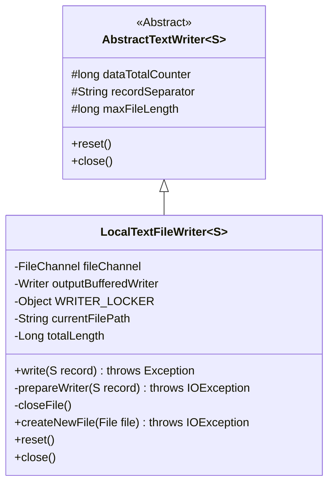
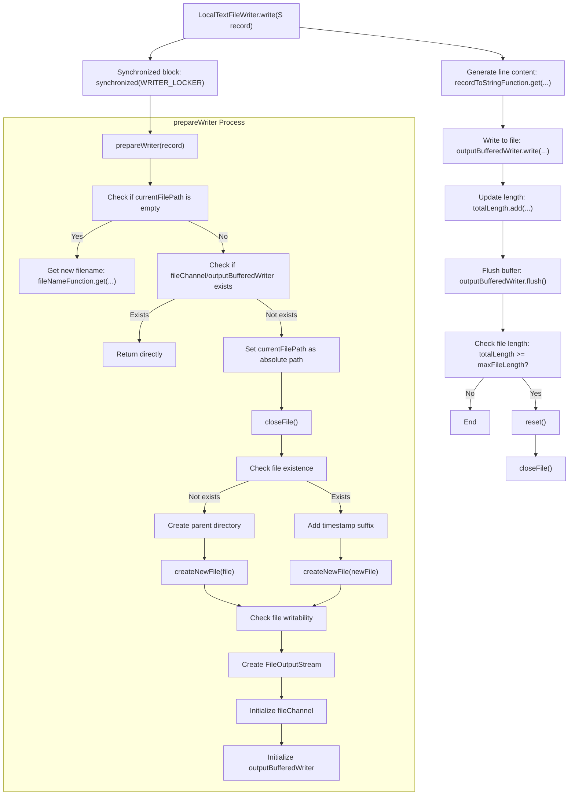

# Basic Information

|      |      |
|------|------|
| Name | LocalTextFileWriter |
| Language | .java |
| Code Path | WeFe/common/java/common-lang/src/main/java/com/welab/wefe/common/io/text/writer/LocalTextFileWriter.java |
| Package Name | com.welab.wefe.common.io.text.writer |
| Dependencies | ['org.apache.commons.lang3.StringUtils', 'java.io', 'java.nio.channels.Channels', 'java.nio.channels.FileChannel'] |
| Brief Description | Local text file writing class, supporting synchronous writing, file size limitation, automatic directory and file creation, ensuring thread safety and resource release. |

# Description

LocalTextFileWriter is a generic class that inherits from AbstractTextWriter, designed for writing records to local text files. It ensures thread safety through synchronization locks, employs BufferedWriter for efficient data writing, and automatically handles file creation, path generation, and size limitations. The class automatically resets when files reach maximum length, provides resource release and error handling mechanisms, and supports custom filenames and encoding formats.

# Class Summary

| Name   | Type  | Description |
|-------|------|-------------|
| LocalTextFileWriter | class | The LocalTextFileWriter class inherits from AbstractTextWriter, implementing thread-safe local file writing functionality with support for file size limits, path creation, and resource release. |

## Class LocalTextFileWriter

|      |      |
|------|------|
| Access Modifier | public |
| Type | class |
| Name | LocalTextFileWriter |
| Description | The LocalTextFileWriter class inherits from AbstractTextWriter, implementing thread-safe local file writing functionality with support for file size limits, path creation, and resource release. |

### UML Class Diagram

Class diagram description: LocalTextFileWriter is a generic class that inherits from AbstractTextWriter, designed for writing records to local text files. It contains private members such as file channels and buffered writers, ensures thread safety through synchronization locks, and provides functionalities like file creation and resource release. It automatically resets when files reach maximum length, implementing complete file writing lifecycle management.

### Internal Method Call Graph

This code implements a local text file writer with core functionalities including thread-safe file writing, automatic file rotation, and resource management. The main workflow is: protecting the file preparation phase through synchronized blocks, converting records to strings for buffer writing, and deciding whether to reset files based on length. The prepareWriter method handles file path generation, directory creation, and file initialization to ensure files are writable. The closeFile method safely releases all file resources. The design emphasizes thread safety and resource leak prevention.

### Field List

| Name  | Type  | Description |
|-------|-------|------|
| fileChannel | FileChannel | Private file channel variable `fileChannel`. |
| WRITER_LOCKER = new Object() | Object | Define a private immutable object WRITER_LOCKER for synchronizing write operations. |
| outputBufferedWriter | Writer | Private writer output buffered stream. |

### Method List

| Name  | Type  | Description |
|-------|-------|------|
| createNewFile | boolean | Check if the file exists. If not, create a new file. Returns false if the file already exists. Throws an exception if creation fails and the file still does not exist. |
| closeFile | void | Methods for closing files: safely close the outputBufferedWriter and fileChannel, catch and log IO exceptions, and finally nullify the resources. |
| write | void | Synchronously write records, convert them to strings after preprocessing, write to the buffer, flush, and check the file length—reset if the limit is exceeded. |
| prepareWriter | void | The method `prepareWriter` prepares a file writer: if the path is empty, it generates a new path; checks the file's writability, creates parent directories or renames the file if necessary; initializes the output stream and buffered writer. Throws an IO error in case of exceptions. |
| reset | void | The method reset closes the file and calls the parent class's reset method. |
| close | void | Java method override, call closeFile() to close the file. |

