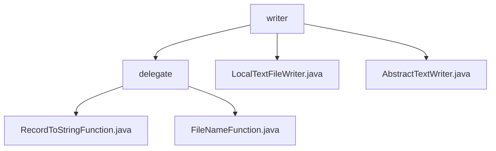

# Basic Information

|      |      |
|------|------|
| Name | writer |
| Language | .java |
| Code Path | WeFe/common/java/common-lang/src/main/java/com/welab/wefe/common/io/text/writer |
| Package Name | docs.common.java.common-lang.src.main.java.com.welab.wefe.common.io.text.writer |
| Brief Description | Provide two generic function interfaces: RecordToStringFunction (record-to-text conversion) and FileNameFunction (generates storage paths), suitable for data processing scenarios such as ETL. LocalTextFileWriter is a thread-safe local text writer that supports automatic sharding and error handling. AbstractTextWriter is an abstract base class that provides core writing functionality and statistical metrics. |

# Description

## Overview  
This module is a universal toolkit for text data processing, with core responsibilities including record serialization and segmented storage (similar to the combination of MapReduce's Mapper and OutputFormat). It provides two functional interfaces: RecordToStringFunction (record-to-text conversion) and FileNameFunction (dynamic path generation), both designed with generics and constrained by @FunctionalInterface. Key data structures include write statistics (total length/failure count, etc.) and file configuration items (maximum length/encoding, etc.). It relies on the JVM shutdown hook mechanism and BufferedWriter, with thread safety achieved through synchronized locks. Examples include log formatting to CSV and HDFS block path generation.

## Primary Business Scenarios  
Typically used in ETL data pipelines to achieve a "processing-storage" closed loop. LocalTextFileWriter serves as the concrete implementation, combining the functionalities of both interfaces: first serializing records via RecordToStringFunction (e.g., database to CSV) and then using FileNameFunction for segmented storage (e.g., rotating files by sequence number). The abstract layer AbstractTextWriter provides foundational capabilities, including automatic file splitting, thread-safe writing, and resource cleanup. It is suitable for high-throughput log archiving, persistent storage of distributed computation results, and similar scenarios, such as message landing processing akin to the event bus pattern.

### Package Internal Structure View

This flowchart illustrates the class structure related to text writing in the WeFe project. The top level is the writer directory, which contains a delegate subdirectory and two direct files. The delegate directory includes two functional class files responsible for record conversion and filename generation respectively. The entire structure clearly reflects the modular division and dependencies of the text writing functionality.

# File List

| Name   | Type  | Description |
|-------|------|-------------|
| [LocalTextFileWriter.java](LocalTextFileWriter.md) | file | Local text file writing class, supporting synchronous writing, file size limitation, automatic directory and file creation, ensuring thread safety and resource release. |
| [AbstractTextWriter.java](AbstractTextWriter.md) | file | Abstract text writing class that supports custom encoding, delimiters, and filename generation, tracks the amount of written data, failure count, and last activity time, and provides reset and statistical functions. |
| [delegate](delegate/_module.md) | package | The RecordToStringFunction is a Java functional interface used to convert data records and serial numbers into strings. The FileNameFunction is a functional interface designed to generate file paths based on data records and serial numbers. Both are annotated with @FunctionalInterface and are suitable for data processing and dynamic path generation scenarios. |

