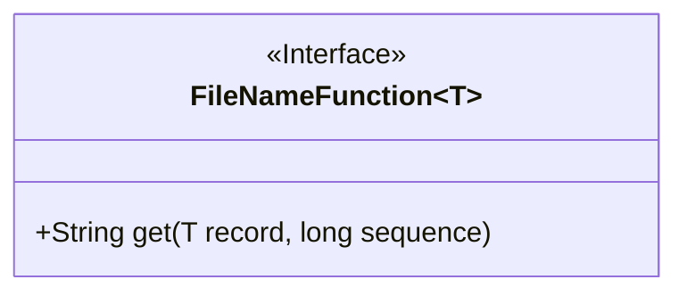
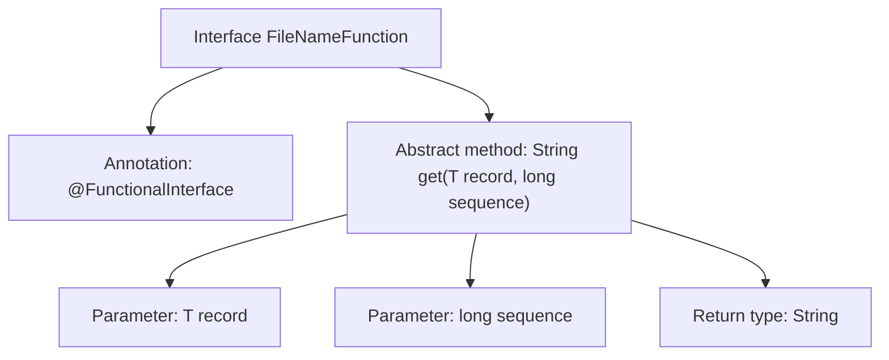

# Basic Information

|      |      |
|------|------|
| Name | FileNameFunction |
| Language | .java |
| Code Path | WeFe/common/java/common-lang/src/main/java/com/welab/wefe/common/io/text/writer/delegate/FileNameFunction.java |
| Package Name | com.welab.wefe.common.io.text.writer.delegate |
| Dependencies | [] |
| Brief Description | Define the functional interface FileNameFunction, containing the method get, which returns the data storage path based on the record and sequence number. |

# Description

This is a functional interface named FileNameFunction, marked with the @FunctionalInterface annotation. It defines an abstract method `get`, which is used to retrieve the data storage path. The method accepts two parameters: `record` represents the data object, and `sequence` represents the serial number of the data. The generic design of the interface allows flexible adaptation to different types of data objects. This interface is primarily used in scenarios where file paths need to be dynamically generated based on data and sequence numbers.

# Class Summary

| Name   | Type  | Description |
|-------|------|-------------|
| FileNameFunction | interface | Define a functional interface FileNameFunction, containing the method get, which returns the data storage path based on the record and sequence number. |

## Class FileNameFunction

|      |      |
|------|------|
| Access Modifier | @FunctionalInterface;public |
| Type | interface |
| Name | FileNameFunction |
| Description | Define a functional interface FileNameFunction, containing the method get, which returns the data storage path based on the record and sequence number. |

### UML Class Diagram

This code defines a generic functional interface `FileNameFunction<T>`, annotated with `@FunctionalInterface`. The interface contains an abstract method `get()`, which takes a parameter `record` of generic type `T` and a `long` type parameter `sequence`, returning a `String` type result. The interface is designed for obtaining data storage paths, allowing different filename generation strategies to be defined by implementing this interface. The diagram clearly shows the generic declaration of the interface and its unique method signature.

### Internal Method Call Graph

This flowchart illustrates the structure of a generic functional interface FileNameFunction<T>. The interface is marked with the @FunctionalInterface annotation, indicating it's a single abstract method (SAM) functional interface. Its core abstract method get takes two parameters: a generic type T record and a long type sequence, returning a String result. This interface primarily defines specifications for obtaining data storage paths, generating corresponding path strings by inputting data records and sequence numbers, making it suitable for scenarios requiring dynamic filename generation.

### Field List

| Name  | Type  | Description |
|-------|-------|------|

### Method List

| Name  | Type  | Description |
|-------|-------|------|
| get | String | Get the string value corresponding to the specified record and serial number. |

