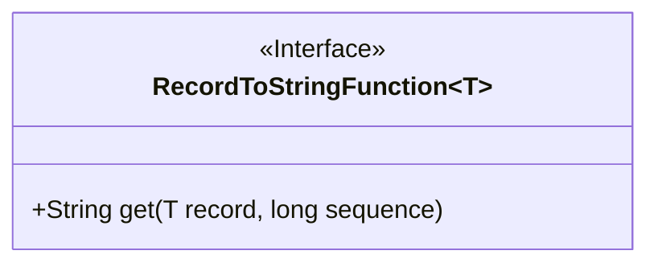
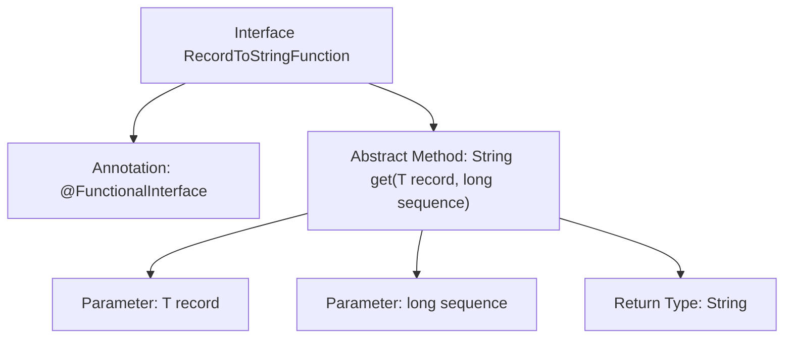

# Basic Information

|      |      |
|------|------|
| Name | RecordToStringFunction |
| Language | .java |
| Code Path | WeFe/common/java/common-lang/src/main/java/com/welab/wefe/common/io/text/writer/delegate/RecordToStringFunction.java |
| Package Name | com.welab.wefe.common.io.text.writer.delegate |
| Dependencies | [] |
| Brief Description | This is a functional interface that defines a method for converting records and sequence numbers into strings. |

# Description

This is a Java functional interface named RecordToStringFunction, designed to convert data records into text. The interface is annotated with @FunctionalInterface, indicating it is a single abstract method functional interface. It defines a get method that takes two parameters: record representing the data object to be converted, and sequence denoting the serial number of the data. The method returns the converted string result. This interface is suitable for scenarios requiring sequential data processing and text output generation.

# Class Summary

| Name   | Type  | Description |
|-------|------|-------------|
| RecordToStringFunction | interface | This is a functional interface that defines a method for converting records and sequence numbers into strings. |

## Class RecordToStringFunction

|      |      |
|------|------|
| Access Modifier | @FunctionalInterface;public |
| Type | interface |
| Name | RecordToStringFunction |
| Description | This is a functional interface that defines a method for converting records and sequence numbers into strings. |

### UML Class Diagram

This class diagram illustrates a generic functional interface `RecordToStringFunction<T>`, which defines an abstract method `get` for converting generic records to strings. The interface is marked with `<<Interface>>`, and the method accepts a generic record and sequence number as parameters, returning a string result. As a functional interface, it is suitable for use in Lambda expressions or method reference scenarios, commonly employed in data transformation processing pipelines.

### Internal Method Call Graph

This flowchart illustrates the structure of a generic functional interface, including the `@FunctionalInterface` annotation and the definition of its core abstract method `get()`. The method accepts a generic record and sequence number as parameters, returning a string type result for implementing record-to-text conversion logic. The interface design is concise, adheres to the Single Responsibility Principle, and is suitable for Lambda expressions or method reference scenarios.

### Field List

| Name  | Type  | Description |
|-------|-------|------|

### Method List

| Name  | Type  | Description |
|-------|-------|------|
| get | String | Get the value at the specified position in the record. The parameters are the record object and the sequence number, and the return type is string. |

