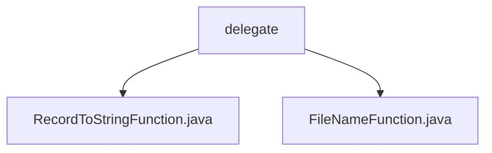

# Basic Information

|      |      |
|------|------|
| Name | delegate |
| Language | .java |
| Code Path | WeFe/common/java/common-lang/src/main/java/com/welab/wefe/common/io/text/writer/delegate |
| Package Name | docs.common.java.common-lang.src.main.java.com.welab.wefe.common.io.text.writer.delegate |
| Brief Description | The RecordToStringFunction is a Java functional interface used to convert data records and serial numbers into strings. The FileNameFunction is a functional interface designed to generate file paths based on data records and serial numbers. Both are annotated with @FunctionalInterface and are suitable for data processing and dynamic path generation scenarios. |

# Description

## Overview  
This module provides two core functional interfaces: `RecordToStringFunction` and `FileNameFunction`, both designed with generics. `RecordToStringFunction` is responsible for converting data records into text, such as log formatting; `FileNameFunction` generates storage paths based on data and sequence numbers, akin to a file naming strategy pattern. Both are annotated with `@FunctionalInterface` to ensure single responsibility, accepting `record` objects and `sequence` number parameters to support sequential processing scenarios.  

## Key Business Scenarios  
Applicable to data pipeline processing scenarios, such as text transformation and dynamic path generation during ETL processes. `RecordToStringFunction` implements record serialization, like converting database records to CSV rows; `FileNameFunction` is used for sharded storage, such as generating HDFS block paths by sequence numbers. Together, they form a "process-store"闭环 (closed loop), similar to the combination of Mapper and OutputFormat in MapReduce.

### Package Internal Structure View

This flowchart illustrates the code structure of the text writer delegate in the common-lang module of the WeFe project. The root node is the delegate directory, which contains two Java files: RecordToStringFunction.java and FileNameFunction.java, each implementing distinct text writing functionalities. The structure is concise and clearly hierarchical, aligning with the provided path information.

# File List

| Name   | Type  | Description |
|-------|------|-------------|
| [RecordToStringFunction.java](RecordToStringFunction.md) | file | This is a functional interface that defines a method for converting records and sequence numbers into strings. |
| [FileNameFunction.java](FileNameFunction.md) | file | Define a functional interface FileNameFunction, containing the method get, which returns the data storage path based on the record and sequence number. |

