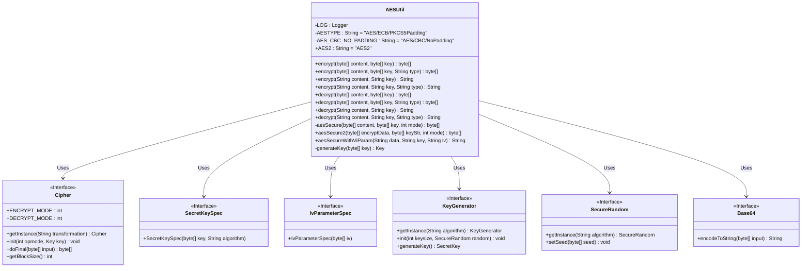
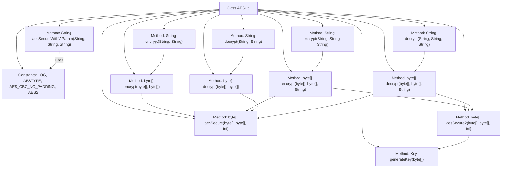

# Basic Information

|      |      |
|------|------|
| Name | AESUtil |
| Language | .java |
| Code Path | WeFe/common/java/common-lang/src/main/java/com/welab/wefe/common/util/AESUtil.java |
| Package Name | com.welab.wefe.common.util |
| Dependencies | ['com.welab.wefe.common.constant.Constant', 'org.apache.commons.codec.binary.Base64', 'org.slf4j.Logger', 'org.slf4j.LoggerFactory', 'javax.crypto.Cipher', 'javax.crypto.KeyGenerator', 'javax.crypto.spec.IvParameterSpec', 'javax.crypto.spec.SecretKeySpec', 'java.io.IOException', 'java.io.UnsupportedEncodingException', 'java.security.Key', 'java.security.SecureRandom'] |
| Brief Description | The AESUtil class provides AES encryption and decryption functionality, supporting ECB and CBC modes, and includes various encryption methods and exception handling. |

# Description

AESUtil is a utility class that provides AES encryption and decryption functionalities, supporting multiple encryption modes and padding schemes. The class defines two encryption types, AES/ECB/PKCS5Padding and AES/CBC/NoPadding, as well as a custom type AES2. Its main features include encryption and decryption operations for byte arrays and strings, supporting calls with different encryption types. The encryption method uses a key generator to produce keys and implements encryption/decryption through the Cipher class. The decryption method converts encrypted hexadecimal strings back to the original data. The class also offers an encryption method with an initial vector (IV) parameter to ensure data block alignment before encryption. Error handling is implemented by logging error messages. All methods are static and can be called directly.

# Class Summary

| Name   | Type  | Description |
|-------|------|-------------|
| AESUtil | class | The AESUtil class provides AES encryption and decryption functionality, supporting ECB and CBC modes. It includes methods for encrypting and decrypting strings and byte arrays, handling different encryption types and exception logging. |

## Class AESUtil

|      |      |
|------|------|
| Access Modifier | public |
| Type | class |
| Name | AESUtil |
| Description | The AESUtil class provides AES encryption and decryption functionality, supporting ECB and CBC modes. It includes methods for encrypting and decrypting strings and byte arrays, handling different encryption types and exception logging. |

### UML Class Diagram

This code demonstrates an AES encryption utility class AESUtil, which provides multiple methods for AES encryption and decryption, supporting different encryption modes and padding schemes. The class includes static constants defining encryption algorithm types, along with overloaded encrypt and decrypt methods handling both byte array and string inputs/outputs. Private methods aesSecure and aesSecure2 implement the core encryption logic, while the aesSecureWithViParam method supports encryption with initialization vectors. The class relies on interfaces from the Java Cryptography Standard such as Cipher and SecretKeySpec, combining these interfaces to achieve AES encryption/decryption functionality, while utilizing Base64 for encoding conversion. The overall design reflects flexible support for various AES encryption scenarios, with enhanced robustness through exception handling and logging.

### Internal Method Call Graph

This code demonstrates an AES encryption utility class AESUtil, which provides various methods for AES encryption and decryption. The class includes two encryption modes (AES/ECB/PKCS5Padding and AES/CBC/NoPadding) with corresponding encryption/decryption methods, supporting both byte array and string input/output. The core methods aesSecure and aesSecure2 implement the actual encryption/decryption logic, while other methods mainly serve as overloads and wrappers for different parameter types. The class also contains an encryption method with initialization vector (IV) - aesSecureWithViParam, and a key generation method generateKey. All methods handle potential exceptions and log errors.

### Field List

| Name  | Type  | Description |
|-------|-------|------|
| LOG = LoggerFactory.getLogger(AESUtil.class) | Logger | The AESUtil class defines a static immutable log object LOG. |
| AES_CBC_NO_PADDING = "AES/CBC/NoPadding" | String | AES encryption algorithm, CBC mode, no padding. |
| AESTYPE = "AES/ECB/PKCS5Padding" | String | AES encryption algorithm, ECB mode, PKCS5 padding. |
| AES2 = "AES2" | String | Defined a public static constant string AES2 with the value "AES2". |

### Method List

| Name  | Type  | Description |
|-------|-------|------|
| decrypt | String | The static method `decrypt` is used to decrypt string content. It takes encrypted content and a key as input, and returns the decrypted string. If an encoding exception occurs, it logs the error and returns null. |
| aesSecure | byte[] | Using the AES algorithm to encrypt or decrypt content, supporting encryption or decryption modes, generating secure random numbers based on keys, and logging exceptions. |
| encrypt | byte[] | The static method `encrypt` takes a byte array `content` and `key`, and returns the encrypted byte array using AES encryption mode. |
| decrypt | String | The static method `decrypt` is used to decrypt string content. It accepts content, a key, and a type parameter, and returns the decrypted string. If an encoding exception occurs, it logs the error and returns null. |
| encrypt | String | The static method `encrypt` is used to encrypt a string, accepting parameters for content, key, and type, and returns a hexadecimal string or null. Error logs are recorded in case of exceptions. |
| aesSecureWithViParam | String | This method uses AES CBC mode without padding to encrypt data, processes the input data length to align with the block size, encrypts it with a key and IV, and returns the Base64-encoded result. Returns null if an error occurs. |
| generateKey | Key | The method `generateKey` takes a byte array `key` and generates an AES key. On success, it returns a `SecretKeySpec`; on failure, it logs an error and returns `null`. |
| aesSecure2 | byte[] | The Java method `aesSecure2` uses the AES algorithm to encrypt and decrypt data. It accepts a byte array parameter and a mode, then returns the processed result. If an exception occurs, it logs the error. |
| encrypt | String | The static method `encrypt` takes a content string and a key string, converts them into byte arrays using UTF-8 encoding for encryption, and returns a hexadecimal string. If an exception occurs, it logs the error and returns `null`. |
| decrypt | byte[] | This is a Java static method for AES decryption. It takes encrypted content and a key as input, and returns the decrypted byte array. Internally, it calls the aesSecure method with the operation mode set to decryption. |
| decrypt | byte[] | The static method `decrypt` uses AES to decrypt the content `content` based on the type `type`, supporting two AES modes. |
| encrypt | byte[] | Encryption Method: Based on the type parameter, select the AES encryption method. For AES2 type, call aesSecure2; otherwise, call aesSecure, both using encryption mode. |

