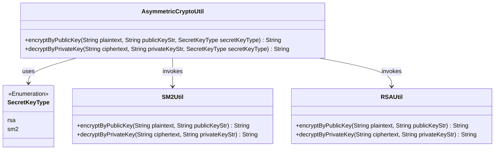
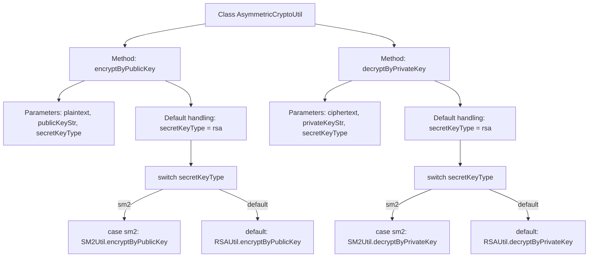

# Basic Information

|      |      |
|------|------|
| Name | AsymmetricCryptoUtil |
| Language | .java |
| Code Path | WeFe/common/java/common-lang/src/main/java/com/welab/wefe/common/util/AsymmetricCryptoUtil.java |
| Package Name | com.welab.wefe.common.util |
| Dependencies | ['com.welab.wefe.common.constant.SecretKeyType'] |
| Brief Description | Asymmetric encryption utility class, supports public key encryption and private key decryption, defaults to RSA, with optional SM2. |

# Description

The AsymmetricCryptoUtil class provides asymmetric encryption functionality, containing two static methods. The encryptByPublicKey method encrypts plaintext using a public key, supporting both SM2 and RSA algorithms with RSA as the default. The decryptByPrivateKey method decrypts ciphertext using a private key, also supporting SM2 and RSA algorithms with RSA as the default. Both methods accept key strings and key type parameters, automatically selecting RSA when no type is specified.

# Class Summary

| Name   | Type  | Description |
|-------|------|-------------|
| AsymmetricCryptoUtil | class | Asymmetric encryption utility class, supports public key encryption and private key decryption, defaults to RSA algorithm, with optional SM2. |

## Class AsymmetricCryptoUtil

|      |      |
|------|------|
| Access Modifier | public |
| Type | class |
| Name | AsymmetricCryptoUtil |
| Description | Asymmetric encryption utility class, supports public key encryption and private key decryption, defaults to RSA algorithm, with optional SM2. |

### UML Class Diagram

This diagram illustrates the structure of the asymmetric encryption utility class AsymmetricCryptoUtil, which selects encryption algorithms via the SecretKeyType enumeration and delegates specific operations to either SM2Util or RSAUtil. Core functionalities include public key encryption and private key decryption, supporting both RSA and SM2 algorithms with RSA as the default. The inter-class relationships clearly demonstrate the application of the strategy pattern.

### Internal Method Call Graph

This code demonstrates an asymmetric cryptographic utility class containing two core methods: public key encryption and private key decryption. The flowchart clearly presents the method invocation paths: first handling default values for key types, then routing to corresponding cryptographic implementations (SM2Util or RSAUtil) based on the key type (sm2/rsa). Both methods feature symmetrical structures including parameter validation, default value handling, and algorithm routing logic, reflecting excellent code reusability and extensibility design.

### Field List

| Name  | Type  | Description |
|-------|-------|------|

### Method List

| Name  | Type  | Description |
|-------|-------|------|
| encryptByPublicKey | String | Encrypt plaintext using public key, supports RSA and SM2 algorithms, with RSA as default. |
| decryptByPrivateKey | String | This method decrypts text using a private key, supporting both RSA and SM2 algorithms, with RSA as the default. It invokes the corresponding decryption utility class based on the type of key provided. |

