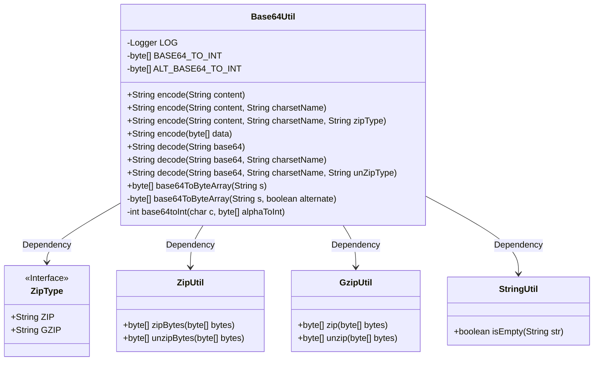
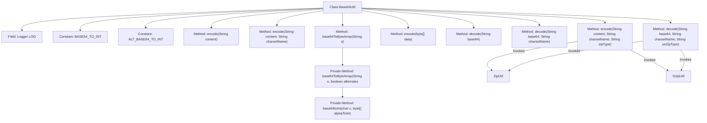

# Basic Information

|      |      |
|------|------|
| Name | Base64Util |
| Language | .java |
| Code Path | WeFe/common/java/common-lang/src/main/java/com/welab/wefe/common/util/Base64Util.java |
| Package Name | com.welab.wefe.common.util |
| Dependencies | ['com.welab.wefe.common.constant.Constant', 'com.welab.wefe.common.constant.ZipType', 'org.apache.commons.codec.binary.Base64', 'org.slf4j.Logger', 'org.slf4j.LoggerFactory', 'java.io.UnsupportedEncodingException', 'java.nio.charset.Charset'] |
| Brief Description | Base64 utility class, providing bidirectional conversion between strings and Base64 encoding, with support for UTF-8 encoding and ZIP/GZIP compression options. |

# Description

Base64Util is a utility class that provides Base64 encoding and decoding functionalities. It supports encoding and decoding operations for both strings and byte arrays, using UTF-8 charset by default. The encoding method allows optional compression (ZIP or GZIP), while the decoding method supports corresponding decompression operations. The class includes two internal lookup tables, BASE64_TO_INT and ALT_BASE64_TO_INT, for converting Base64 characters into 6-bit integers. Private methods base64ToByteArray and base64toInt implement the conversion logic from Base64 strings to byte arrays, with strict validation of input formats. All operations are provided via static methods and include error handling with logging.

# Class Summary

| Name   | Type  | Description |
|-------|------|-------------|
| Base64Util | class | Base64 utility class, providing bidirectional conversion between strings and Base64, supporting UTF-8 encoding and ZIP/GZIP compression options. |

## Class Base64Util

|      |      |
|------|------|
| Access Modifier | public |
| Type | class |
| Name | Base64Util |
| Description | Base64 utility class, providing bidirectional conversion between strings and Base64, supporting UTF-8 encoding and ZIP/GZIP compression options. |

### UML Class Diagram

Base64Util is a utility class providing Base64 encoding/decoding functionality, supporting UTF-8 encoding, ZIP/GZIP compression, and multiple character set processing. It contains static methods for encoding/decoding strings and byte arrays, internally utilizes ZipUtil and GzipUtil for compression/decompression operations, and performs null checks via StringUtil. The class defines BASE64 character mapping tables and alternative mapping tables for underlying conversions.

### Internal Method Call Graph

This flowchart illustrates the complete structure of the Base64Util class, encompassing core encoding/decoding methods and auxiliary methods. The class employs overloaded design to offer multiple encoding options (supporting UTF-8 default encoding, custom character sets, and ZIP/GZIP compression). The decoding process mirrors corresponding encoding logic. The private method base64ToByteArray implements precise conversion from Base64 strings to byte arrays, with character mapping validation performed via the base64toInt method. Compression functionality is achieved through ZipUtil and GzipUtil utility classes, adopting a layered design to ensure independence among functional modules.

### Field List

| Name  | Type  | Description |
|-------|-------|------|
| LOG = LoggerFactory.getLogger(Base64Util.class) | Logger | The Base64Util class defines a protected static final logger named LOG. |
| ALT_BASE64_TO_INT = {-1, -1, -1, -1, -1, -1, -1, -1, -1, -1, -1, -1, -1, -1, -1,            -1, -1, -1, -1, -1, -1, -1, -1, -1, -1, -1, -1, -1, -1, -1, -1, -1, -1, 0, 1, 2, 3, 4, 5, 6, 7,            8, -1, 62, 9, 10, 11, -1, 52, 53, 54, 55, 56, 57, 58, 59, 60, 61, 12, 13, 14, -1, 15, 63, 16, -1,            -1, -1, -1, -1, -1, -1, -1, -1, -1, -1, -1, -1, -1, -1, -1, -1, -1, -1, -1, -1, -1, -1, -1, -1,            -1, 17, -1, 18, 19, 21, 20, 26, 27, 28, 29, 30, 31, 32, 33, 34, 35, 36, 37, 38, 39, 40, 41, 42,            43, 44, 45, 46, 47, 48, 49, 50, 51, 22, 23, 24, 25} | byte[] | Define the ALT_BASE64 character-to-index mapping array, where -1 indicates an invalid character. |
| BASE64_TO_INT = {-1, -1, -1, -1, -1, -1, -1, -1, -1, -1, -1, -1, -1, -1, -1,            -1, -1, -1, -1, -1, -1, -1, -1, -1, -1, -1, -1, -1, -1, -1, -1, -1, -1, -1, -1, -1, -1, -1, -1,            -1, -1, -1, -1, 62, -1, -1, -1, 63, 52, 53, 54, 55, 56, 57, 58, 59, 60, 61, -1, -1, -1, -1, -1,            -1, -1, 0, 1, 2, 3, 4, 5, 6, 7, 8, 9, 10, 11, 12, 13, 14, 15, 16, 17, 18, 19, 20, 21, 22, 23, 24,            25, -1, -1, -1, -1, -1, -1, 26, 27, 28, 29, 30, 31, 32, 33, 34, 35, 36, 37, 38, 39, 40, 41, 42,            43, 44, 45, 46, 47, 48, 49, 50, 51} | byte[] | The BASE64 decoding uses a byte array, where -1 indicates an invalid character, and other values represent the corresponding numerical values. |

### Method List

| Name  | Type  | Description |
|-------|-------|------|
| encode | String | The static method `encode` takes a string content and a character set name, calls the method of the same name with empty parameters, and returns the encoded result. |
| encode | String | This method encodes a byte array into a Base64 string, returning null if the input is empty. |
| encode | String | The static method `encode` converts a string into a byte array using the specified character set, optionally compresses it, and then performs Base64 encoding, ultimately returning the string corresponding to the character set. It handles exceptions and logs them. |
| decode | String | The static method `decode` accepts a base64 string and decodes the result using UTF-8 encoding by default. |
| encode | String | The static method `encode` converts the string according to UTF-8 encoding by calling the overloaded method. |
| decode | String | The static method `decode` takes a Base64 string, a character set, and a compression type as input, decodes it, decompresses if necessary, and finally converts it into a string of the specified character set before returning. |
| base64ToByteArray | byte[] | Convert a Base64 string to a byte array, without processing line breaks by default. |
| base64ToByteArray | byte[] | Convert a Base64 string to a byte array, handling complete and partial groups, supporting alternate encoding tables, validating input length, and processing padding characters. |
| decode | String | The static method `decode` takes parameters `base64` and `charsetName`, calls the overloaded method `decode`, and returns the result, with the third parameter being `null`. |
| base64toInt | int | This method converts a Base64 character into its corresponding integer value, throwing an exception if the character is invalid. |

