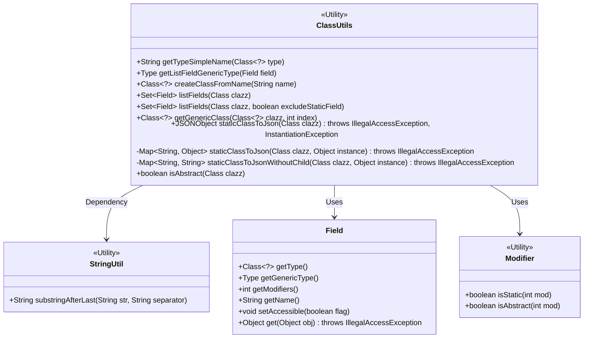
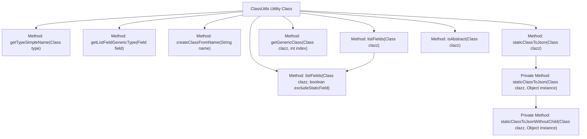
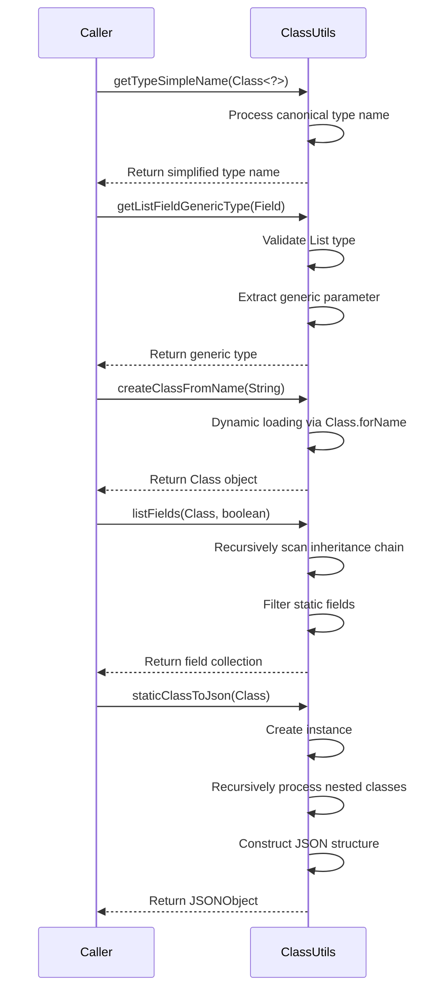

# Basic Information

|      |      |
|------|------|
| Name | ClassUtils |
| Language | .java |
| Code Path | WeFe/common/java/common-lang/src/main/java/com/welab/wefe/common/util/ClassUtils.java |
| Package Name | com.welab.wefe.common.util |
| Dependencies | ['com.alibaba.fastjson.JSONObject', 'sun.reflect.generics.reflectiveObjects.TypeVariableImpl', 'java.lang.reflect.Field', 'java.lang.reflect.Modifier', 'java.lang.reflect.ParameterizedType', 'java.lang.reflect.Type', 'java.util'] |
| Brief Description | ClassUtils provides static methods for handling class information: obtaining type simple names, listing generic types, creating class instances, listing class fields (including parent classes), obtaining generic classes, converting static classes to JSON, and determining abstract classes. |

# Description

ClassUtils is a utility class that provides a series of static methods for handling Java class information. Its primary functionalities include: retrieving the simplified name of a class, obtaining the generic type of a List field, creating a class instance based on the class name, listing all fields of a class (including parent class fields with the option to exclude static fields), acquiring the generic type of a class, converting a static class to JSON format, and determining whether a class is abstract. These methods cover common operations such as class information retrieval, processing, and conversion, making them suitable for various Java development scenarios.

# Class Summary

| Name   | Type  | Description |
|-------|------|-------------|
| ClassUtils | class | The ClassUtils utility class provides static methods: obtaining type simple names, list generic types, creating classes from class names, listing class fields (including parent classes), obtaining generic classes, converting static classes to JSON, and determining abstract classes. |

## Class ClassUtils

|      |      |
|------|------|
| Access Modifier | public |
| Type | class |
| Name | ClassUtils |
| Description | The ClassUtils utility class provides static methods: obtaining type simple names, list generic types, creating classes from class names, listing class fields (including parent classes), obtaining generic classes, converting static classes to JSON, and determining abstract classes. |

### UML Class Diagram

This class diagram illustrates the structure of the `ClassUtils` utility class and its relationships with other key classes. `ClassUtils` provides various static methods for class operations, including retrieving type names, handling generic fields, listing class fields, and converting classes to JSON. It depends on `StringUtil` for string processing, utilizes the `Field` class to manipulate field properties, and checks modifier states via `Modifier`. The diagram clearly presents the access levels, parameters, and return types of each method, along with the collaborative relationships between utility classes.

### Internal Method Call Graph

This flowchart demonstrates the core method invocation relationships of the ClassUtils utility class, encompassing three functional modules: type processing, reflection operations, and JSON conversion. The sequence diagram details the invocation process of key methods, including parameter validation, recursive processing, and exception handling, with particular emphasis on the inheritance chain scanning in listFields and nested class processing in staticClassToJson. The overall structure clearly illustrates the utility class's encapsulation and extension capabilities of Java's reflection mechanism.

### Field List

| Name  | Type  | Description |
|-------|-------|------|

### Method List

| Name  | Type  | Description |
|-------|-------|------|
| getGenericClass | Class<?> | Get the generic type of a class, supporting superclasses and interfaces, returns the generic class at the specified position or null. |
| createClassFromName | Class<?> | Static methods create class objects based on the class name string, returning the class object upon success, or printing an exception and returning null upon failure. |
| listFields | Set<Field> | Lists all fields of a class, including those from parent classes, with an option to exclude static fields. Returns empty if the input class is null, and removes duplicates from the result. |
| getListFieldGenericType | Type | Get the generic type of the List field, throw an exception if it is not a List type. |
| getTypeSimpleName | String | This method retrieves the simplified name of a class: first take the fully qualified name, extract the part after the last dot, replace dollar signs with dots, and return the result. |
| isAbstract | boolean | This method checks whether the given class is an abstract class by obtaining the class's modifiers and invoking Modifier.isAbstract for the determination. |
| staticClassToJson | JSONObject | Convert a class instance to a JSONObject, call the method with the same name to process the instance, and return the result. |
| staticClassToJsonWithoutChild | Map<String, String> | This method converts the class field names and values into a Map, without processing subclass fields. It retrieves the fields via reflection and stores them as strings in the result. |
| staticClassToJson | Map<String, Object> | Static method to convert a class and its inner classes into JSON format, recursively processing subclasses and merging the results. |
| listFields | Set<Field> | The static method `listFields` takes a Class parameter and returns its field collection, which by default includes inherited fields. |

