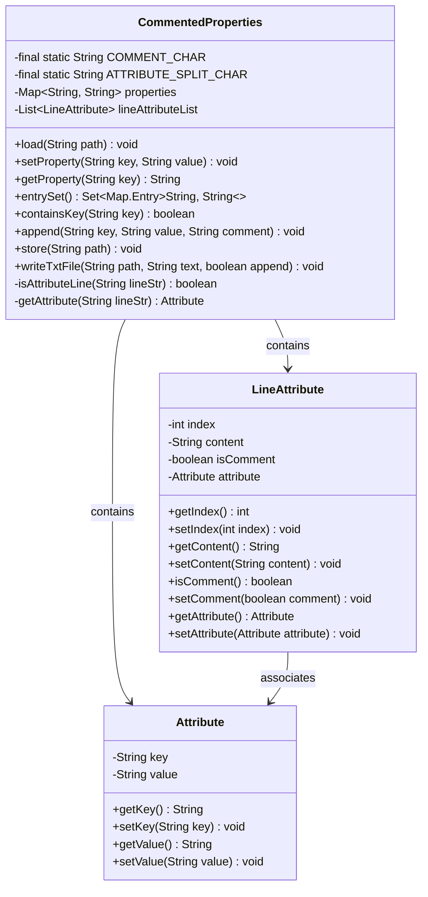
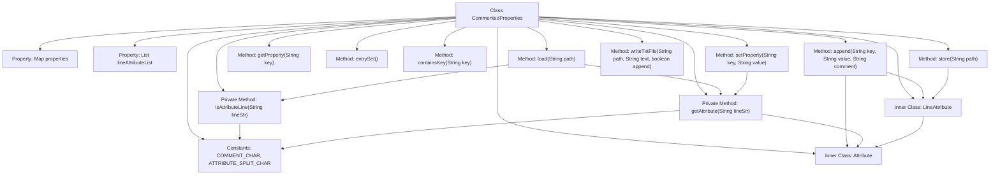

# Basic Information

|      |      |
|------|------|
| Name | CommentedProperties |
| Language | .java |
| Code Path | WeFe/common/java/common-lang/src/main/java/com/welab/wefe/common/util/CommentedProperties.java |
| Package Name | com.welab.wefe.common.util |
| Dependencies | ['java.io.FileWriter', 'java.io.IOException', 'java.io.Writer', 'java.util'] |
| Brief Description | The CommentedProperties class is used to manage annotated property files, supporting loading, modifying, adding, and saving properties while preserving comments and line order. |

# Description

The `CommentedProperties` class is a utility tool for managing property files with comments. It stores key-value pairs in a HashMap while maintaining original line information through a list of `LineAttribute` objects, which include line numbers, content, comment status, and property objects. The class provides functionalities such as loading files, getting/setting properties, appending new properties, and saving files. It supports comment lines starting with `#` and property lines using `=` to separate keys and values. The inner class `LineAttribute` records metadata for each line, while the `Attribute` class encapsulates key-value pairs. File operations preserve original formatting and comments to ensure read-write consistency.

# Class Summary

| Name   | Type  | Description |
|-------|------|-------------|
| CommentedProperties | class | The CommentedProperties class is used for managing annotated property files, supporting loading, modifying, adding, and storing properties while preserving comments and line order. |

## Class CommentedProperties

|      |      |
|------|------|
| Access Modifier | public |
| Type | class |
| Name | CommentedProperties |
| Description | The CommentedProperties class is used for managing annotated property files, supporting loading, modifying, adding, and storing properties while preserving comments and line order. |

### UML Class Diagram

This class diagram illustrates a commented property file processor CommentedProperties, which includes two inner classes LineAttribute and Attribute. The main class stores key-value pairs via Map and maintains original line information using List, supporting loading, modifying, appending, and saving property files. LineAttribute records each line's content and type (comment/attribute), while Attribute encapsulates the key-value pair structure. The overall design achieves line-level precise maintenance and comment preservation functionality for property files.

### Internal Method Call Graph

This code implements an annotated properties file processor with core functionalities including loading property files, setting/getting property values, appending new properties, and file persistence. The flowchart illustrates the class structure, constant definitions, key method call relationships, and associations between two inner classes LineAttribute and Attribute. The core logic revolves around the load() method for file content parsing, setProperty() for attribute modification, and store() method for data persistence, maintaining mapping relationships between property key-value pairs and original line information throughout the process.

### Field List

| Name  | Type  | Description |
|-------|-------|------|
| COMMENT_CHAR = "#" | String | Define a private static constant COMMENT_CHAR with the value "#", used to represent the comment symbol. |
| lineAttributeList = new ArrayList<>() | List<LineAttribute> | Declare an immutable LineAttribute type list variable lineAttributeList, initialized as an empty ArrayList. |
| properties = new HashMap<>(16) | Map<String, String> | Define an immutable Map variable named properties with an initial capacity of 16, where both key and value types are String. |
| ATTRIBUTE_SPLIT_CHAR = "=" | String | The constant string ATTRIBUTE_SPLIT_CHAR is defined as an equals sign, used for attribute separation. |

### Method List

| Name  | Type  | Description |
|-------|-------|------|
| getAttribute | Attribute | The method `getAttribute` takes a string parameter, trims leading and trailing whitespace, and creates an `Attribute` object. If the string contains a delimiter, it splits into a key-value pair for assignment; otherwise, the key is the original string, and the value is empty. Finally, it returns the `Attribute` object. |
| setProperty | void | The method `setProperty` updates attribute values: it checks that the key is non-null and exists, and if the value is non-null, it sets it to an empty string; it updates the `properties` map, iterates through the `lineAttributeList` to match the key and updates the corresponding attribute and content. |
| append | void | The method `append` is used to add key-value pairs and comments. If the key is empty or already exists, it will be skipped. It adds the key-value to `properties`, and if there is a comment, it generates a comment line attribute. Finally, it creates a key-value line attribute and adds it to the list. |
| entrySet | Set<Map.Entry<String, String>> | This method returns a collection containing key-value pairs, implemented by directly invoking the entrySet method of the internal properties. |
| store | void | This method writes a list of strings line by line to a file at the specified path, ensuring resource release. |
| getProperty | String | Get the attribute value corresponding to the specified key. |
| load | void | The method reads a UTF-8 encoded file from the specified path and parses the content line by line. For each line, a LineAttribute object is created to record the line number and content. If a line contains attributes (determined by isAttributeLine), the key-value pairs are extracted and stored in the properties map, and the line is marked as a non-comment line. All line attributes are stored in the lineAttributeList. |
| isAttributeLine | boolean | Check if the string is non-empty and not a comment line. |
| writeTxtFile | void | The static method `writeTxtFile` accepts a path, text, and append flag, uses `FileWriter` to write the text to the specified file, with the option to append or overwrite, and finally closes the writer. May throw an `IOException`. |
| containsKey | boolean | Check if the properties contain the specified key, returning a boolean value. |

