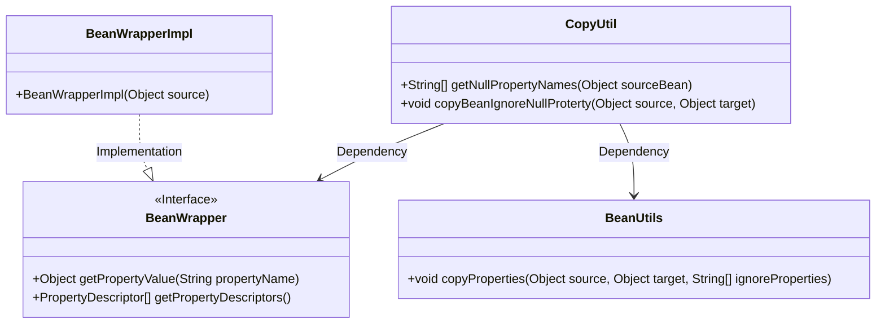
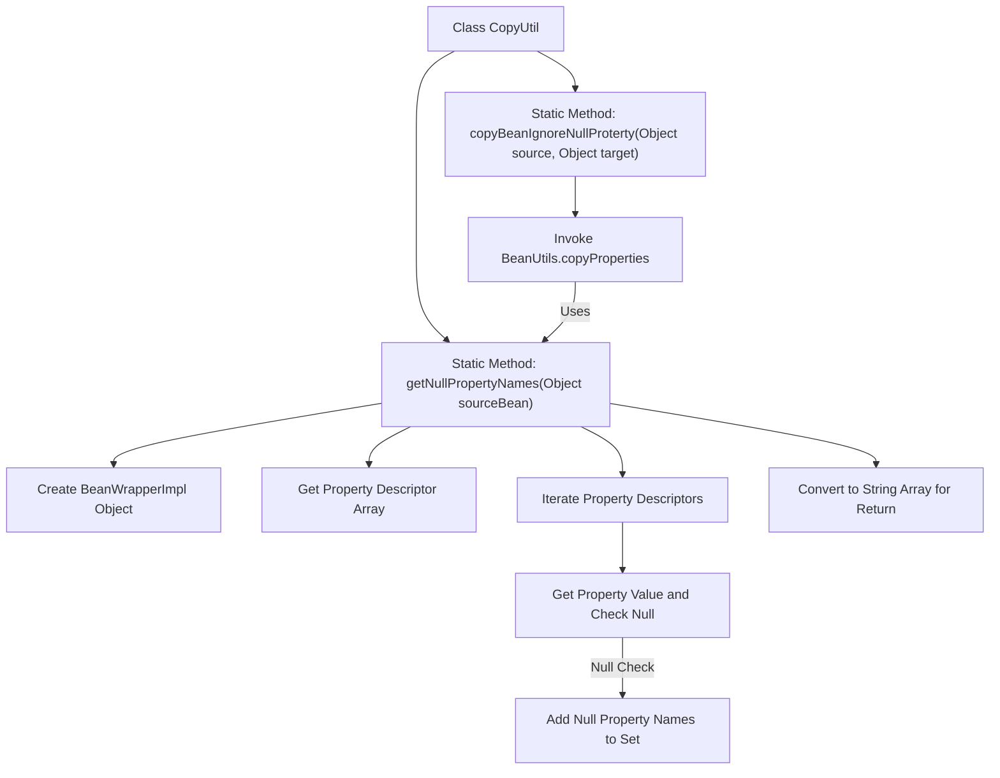

# Basic Information

|      |      |
|------|------|
| Name | CopyUtil |
| Language | .java |
| Code Path | WeFe/common/java/common-lang/src/main/java/com/welab/wefe/common/util/CopyUtil.java |
| Package Name | com.welab.wefe.common.util |
| Dependencies | ['org.springframework.beans.BeanUtils', 'org.springframework.beans.BeanWrapper', 'org.springframework.beans.BeanWrapperImpl', 'java.util.HashSet', 'java.util.Set'] |
| Brief Description | The CopyUtil class provides two static methods: getNullPropertyNames retrieves an array of null property names from an object, and copyBeanIgnoreNullProperty copies non-null properties to the target object. |

# Description

The CopyUtil class provides two static methods for handling JavaBean property copying. The getNullPropertyNames method takes an object as input, retrieves all its property descriptors via BeanWrapper, checks whether each property value is null, collects all null property names, and returns them as a string array. The copyBeanIgnoreNullProperty method leverages Spring's BeanUtils.copyProperties to automatically filter out null-valued properties from the source object when copying its properties to the target object, achieving selective copying of non-null properties.

# Class Summary

| Name   | Type  | Description |
|-------|------|-------------|
| CopyUtil | class | The CopyUtil class provides two static methods: getNullPropertyNames retrieves an array of null property names from an object, while copyBeanIgnoreNullProperty copies non-null properties to the target object. |

## Class CopyUtil

|      |      |
|------|------|
| Access Modifier | public |
| Type | class |
| Name | CopyUtil |
| Description | The CopyUtil class provides two static methods: getNullPropertyNames retrieves an array of null property names from an object, while copyBeanIgnoreNullProperty copies non-null properties to the target object. |

### UML Class Diagram

This code demonstrates a utility class `CopyUtil`, primarily designed for handling JavaBean property copy operations. Core functionalities include detecting null properties in source objects (`getNullPropertyNames`) and performing copy operations while ignoring null properties (`copyBeanIgnoreNullProterty`). The class diagram clearly illustrates the dependency relationships between `CopyUtil`, the `BeanWrapper` interface, its implementation class `BeanWrapperImpl`, and the utility class `BeanUtils`. The `BeanWrapper` interface defines basic operations for retrieving property values and descriptors, while `BeanWrapperImpl` serves as its concrete implementation. The overall design reflects effective encapsulation of Bean manipulation utilities from the Spring framework, making it particularly suitable for scenarios requiring null-value-ignoring property copying.

### Internal Method Call Graph

This flowchart illustrates two core methods of the CopyUtil utility class. The getNullPropertyNames method retrieves all object properties via BeanWrapper, filters null-valued property names into a collection, and returns them as an array. The copyBeanIgnoreNullProterty method utilizes the former's result to invoke Spring's BeanUtils for null-value-ignored property copying. The entire process demonstrates a safe property copying mechanism that effectively prevents target object properties from being accidentally overwritten as null.

### Field List

| Name  | Type  | Description |
|-------|-------|------|

### Method List

| Name  | Type  | Description |
|-------|-------|------|
| copyBeanIgnoreNullProterty | void | The method `copyBeanIgnoreNullProterty` copies non-null properties from the source object to the target object, ignoring null-valued properties. It is implemented using `BeanUtils.copyProperties` and `getNullPropertyNames`. |
| getNullPropertyNames | String[] | Get an array of property names in the object where all values are null. Check property values via BeanWrapper, collect null-valued property names, and return a string array. |

