# Basic Information

|      |      |
|------|------|
| Name | DateUtil |
| Language | .java |
| Code Path | WeFe/common/java/common-lang/src/main/java/com/welab/wefe/common/util/DateUtil.java |
| Package Name | com.welab.wefe.common.util |
| Dependencies | ['org.apache.commons.lang3.StringUtils', 'org.apache.commons.lang3.math.NumberUtils', 'org.apache.commons.lang3.time.DateUtils', 'org.slf4j.Logger', 'org.slf4j.LoggerFactory', 'java.math.BigInteger', 'java.text.ParseException', 'java.text.SimpleDateFormat', 'java.time.Duration', 'java.time.LocalDateTime', 'java.time.ZoneId', 'java.time.ZoneOffset', 'java.util'] |
| Brief Description | The DateUtil class provides date and time processing functionalities, including constant definitions, format conversions, time difference calculations, date additions and subtractions, range checks, and more. It supports various date formats such as YYYY-MM-DD, YYYYMMDDHHmmss, etc., and can retrieve hour, week, and month intervals, check time ranges, convert milliseconds to seconds, handle UTC time, and more. |

# Description

DateUtil is a date and time utility class that provides comprehensive date and time processing functionalities. It includes commonly used time constant definitions, such as milliseconds/seconds for days, hours, and months, as well as various date format strings. Key features include: retrieving hour and weekday information of a time; calculating the interval in days or months between two times; mutual conversion between date strings and timestamps; date addition and subtraction operations; date range validation; timezone conversion; formatted date output; obtaining the start time of a month, dates for N days/months before or after; friendly display of time differences, etc. It supports parsing of multiple date formats, incorporates exception handling and logging, and is suitable for complex date and time calculation and conversion scenarios.

# Class Summary

| Name   | Type  | Description |
|-------|------|-------------|
| DateUtil | class | The DateUtil class provides date and time processing functionalities, including common operations such as constant definitions, format conversion, time difference calculation, date addition/subtraction, and range determination. |

## Class DateUtil

|      |      |
|------|------|
| Access Modifier | public |
| Type | class |
| Name | DateUtil |
| Description | The DateUtil class provides date and time processing functionalities, including common operations such as constant definitions, format conversion, time difference calculation, date addition/subtraction, and range determination. |

### UML Class Diagram

```mermaid
classDiagram
    class DateUtil {
        -Logger LOG
        +long DAY_IN_MILLIS
        +long MONTH_IN_SECOND
        +long HOUR_IN_MILLIS
        +String YYYY_MM_DD
        +String YYYY_MM
        +String YYYYMM
        +String YYYY_MM_DD_HH_MM_SS
        +String YYYY_MM_DD_HH_MM_SS2
        +String YYYY_MM_DD_HH_MM_SS3
        +String YYYY_MM_DD_HH_MM_SS4
        +String YYYY_MM_DD_HH_MM
        +String YYYY_MM_DD_HH
        +String Y4_M2_D2_H2_M2_S2
        +String Y4_M2_D2_H2
        +String YYYY_MM_DDTHH_MM_SS_SSSZ
        +String Y4_M2_D2
        +int getHour(Long timeInMillis)
        +int getDay(Long timeInMillis)
        +Long intervalSeconds(long timeInMillis1, long timeInMillis2)
        +Long intervalDays(long timeInMillis1, long timeInMillis2)
        +Long intervalDays(long timeInMillis1, long timeInMillis2, boolean isAbs)
        +Long intervalDays(String timeString1, String timeString2)
        +long intervalMonths(long timeInMillis1, long timeInMillis2)
        +Long intervalDaysUntilNow(long currentTime, long timeInMillis)
        +Long intervalDaysUntilNow(String date)
        +boolean isWithinSpecifiedTime(long currentTime, long timeInMillis, long maxDays)
        +boolean isWithinSpecifiedTime4Month(long currentTime, long timeInMillis, long maxMonths)
        +String timeInMillisToDate(Long timeInMillis)
        +String timeInMillisToDate(Long timeInMillis, String pattern)
        +long stringToTimeInMillis(String dateStr, String pattern)
        +String getCurrentTimeStr(String format)
        +long getTimestamp(String timestr)
        +long getTimeFromtFormat(String dateString)
        +String toString(Date date, String pattern)
        +String toStringYYYY_MM_DD(Date date)
        +String toStringYYYY_MM_DD_HH_MM_SS2(Date date)
        +String toStringYYYY_MM_DDTHH_MM_SS_SSSZ(Date date)
        +Date fromString(String dateStr, String pattern)
        +String getFirstSecondOfMonthString(long currentTimeInMillis, int monthsBefore, String pattern)
        +long getFirstSecondOfMonth(long currentTimeInMillis, int monthsBefore)
        +long dateToTimeInMillis(String in, String formatString)
        +String getCurrentDate()
        +String getCurrentDate2()
        +String getCurrentDate3()
        +long currentDateMillis()
        +long dateMillis(Date date)
        +Date getCurrentDay()
        +int daysBetween(Date date1, Date date2)
        +String spend2PrettyText(long spend)
        +List~String~ getEverydays(long timeInMillis1, long timeInMillis2)
        +List~String~ getEveryMonths(long timeInMillis1, long timeInMillis2)
        +Date getLastDay(Date date)
        +Date getNextDay(Date date)
        +Date getLastMonthFirstDay(Date date)
        +Date getNextMonthFirstDay(Date date)
        +int monthsBetween(Date date1, Date date2)
        +long convertSecond(long date)
        +long convertSecond(String date)
        +long convertMillisecond(long date)
        +Date getDate(long date)
        +String formatStringDate(String dateStr, String pattern)
        +boolean isDatePattern(String dateStr, String pattern)
        +Date addYears(Date date, long years)
        +Date addMonths(Date date, long months)
        +Date addDays(Date date, long days)
        +Date addHours(Date date, long hours)
        +Date addMinutes(Date date, long minutes)
        +Date minusDays(Date date, long days)
        +long getTimeFromtFormat2(String dateString)
        +long getTimeLong(LocalDateTime time)
        +boolean isEffectiveDate(Date nowTime, Date startTime, Date endTime)
        +Date localToUtc(Date localDate)
        +Date stringToDate(String str, String format)
        +String addMonth(String date, String format, int months)
        +boolean dateBetween(Date startDate, Date endDate, Date targetDate, String format)
        +Date formatDate(String dateStr)
        +int intervalMonths(String endMonth, String startMonth)
        +String getDateBeforeMonth(int howmanymonth)
        +Date hexStrToDate(String hexString)
    }
```

This code defines a utility class named DateUtil, primarily used for handling date and time-related operations. It contains numerous static methods and constants for date formatting, time conversion, date calculations, timezone processing, etc. The class defines various date format constants and provides methods for converting between strings and dates, calculating differences between two dates, adding or subtracting time units, among other functionalities. Additionally, it includes utility methods such as determining if a date falls within a valid range and converting time into human-readable text. This utility class is comprehensively designed to cover most date and time processing needs in daily development.

### Internal Method Call Graph

```mermaid
graph TD
    A["Class DateUtil"]
    B["Constants: Time format strings (YYYY_MM_DD, etc.)"]
    C["Constants: Time unit conversions (DAY_IN_MILLIS, etc.)"]
    D["Logger object: LOG"]
    E["Basic methods"]
    F["Time retrieval methods"]
    G["Time conversion methods"]
    H["Time calculation/comparison methods"]
    I["Time formatting methods"]
    J["Utility methods"]

    A --> B
    A --> C
    A --> D
    A --> E
    A --> F
    A --> G
    A --> H
    A --> I
    A --> J

    E --> E1["getHour(Long)"]
    E --> E2["getDay(Long)"]
    E --> E3["intervalSeconds(long,long)"]
    
    F --> F1["getCurrentTimeStr(String)"]
    F --> F2["getCurrentDate() series"]
    F --> F3["currentDateMillis()"]
    
    G --> G1["timeInMillisToDate(Long,String)"]
    G --> G2["stringToTimeInMillis(String,String)"]
    G --> G3["getTimeFromtFormat(String)"]
    
    H --> H1["intervalDays(long,long,boolean)"]
    H --> H2["intervalMonths(long,long)"]
    H --> H3["isWithinSpecifiedTime() series"]
    
    I --> I1["toString(Date,String)"]
    I --> I2["toStringYYYY_MM_DD() series"]
    I --> I3["fromString(String,String)"]
    
    J --> J1["addDays(Date,long)"]
    J --> J2["addMonths(Date,long)"]
    J --> J3["spend2PrettyText(long)"]
    J --> J4["getEverydays(long,long)"]
```

This flowchart illustrates the complete structure of the DateUtil utility class, comprising 6 main functional modules: constant definitions, basic methods, time retrieval, time conversion, time calculation/comparison, and formatting methods. Core functionalities include time unit conversion (e.g., milliseconds to days), date calculations (e.g., day intervals), multi-format time processing (supporting 20+ date formats), and timezone conversion. The class adopts a static method pattern, implements precise time operations via Calendar and LocalDateTime, and incorporates robust exception handling and logging mechanisms.

### Field List

| Name  | Type  | Description |
|-------|-------|------|
| Y4_M2_D2 = "yyyyMMdd" | String | Define the constant Y4_M2_D2 with the value in date format "yyyyMMdd". |
| HOUR_IN_MILLIS = 60 * 60 * 1000 | long | Define the constant HOUR_IN_MILLIS to represent the number of milliseconds in one hour, with a value of 3600000. |
| YYYY_MM_DD_HH_MM_SS3 = "yyyy-MM-dd HH:mm:00" | String | Define the constant YYYY_MM_DD_HH_MM_SS3 with the value as the datetime format string "yyyy-MM-dd HH:mm:00". |
| YYYY_MM = "yyyy-MM" | String | Define a constant string YYYY_MM with the value "yyyy-MM", representing the year-month format. |
| YYYY_MM_DD_HH_MM_SS = "yyyy-MM-dd.HH.mm.ss" | String | Define datetime format constants in the format of year-month-day.hour.minute.second. |
| YYYY_MM_DDTHH_MM_SS_SSSZ = "yyyy-MM-dd'T'HH:mm:ss.SSSZ" | String | Define datetime format constants in the format of year-month-dayThour:minute:second.millisecond timezone. |
| YYYYMM = "yyyyMM" | String | Define a constant string YYYYMM with the value "yyyyMM", representing the year-month format. |
| Y4_M2_D2_H2_M2_S2 = "yyyyMMddHHmmss" | String | Define the datetime format constant Y4_M2_D2_H2_M2_S2 with the value "yyyyMMddHHmmss". |
| YYYY_MM_DD_HH = "yyyy-MM-dd HH:00:00" | String | Define the constant YYYY_MM_DD_HH with the value "yyyy-MM-dd HH:00:00", representing the datetime format. |
| YYYY_MM_DD = "yyyy-MM-dd" | String | Define the date format constant "YYYY_MM_DD" with the value "yyyy-MM-dd". |
| LOG = LoggerFactory.getLogger(DateUtil.class) | Logger | Declare a static constant logger named LOG for logging output in the DateUtil class. |
| DAY_IN_MILLIS = 24 * 60 * 60 * 1000 | long | Define a constant for the number of milliseconds in a day, with a value of 24 hours multiplied by 60 minutes multiplied by 60 seconds multiplied by 1000 milliseconds. |
| YYYY_MM_DD_HH_MM = "yyyy-MM-dd HH:mm" | String | Define datetime format constants in the format of year-month-day hour:minute. |
| MONTH_IN_SECOND = 30 * 24 * 60 * 60 | long | Define the duration of a month in seconds, with the value being the total number of seconds in 30 days. |
| Y4_M2_D2_H2 = "yyyyMMddHH" | String | Define the constant Y4_M2_D2_H2, representing the datetime format "yyyyMMddHH". |
| YYYY_MM_DD_HH_MM_SS4 = "yyyy-MM-dd HH:00:00" | String | Define the constant YYYY_MM_DD_HH_MM_SS4 with the value "yyyy-MM-dd HH:00:00", representing a datetime format accurate to the hour. |
| YYYY_MM_DD_HH_MM_SS2 = "yyyy-MM-dd HH:mm:ss" | String | Define a datetime format constant in the format of year-month-day hour:minute:second. |

### Method List

| Name  | Type  | Description |
|-------|-------|------|
| getLastDay | Date | Get the previous day of a given date. Achieved by calling the getAfterDay method and passing in -1. |
| daysBetween | int | Calculate the difference in days between two dates by converting milliseconds. |
| isWithinSpecifiedTime4Month | boolean | Check whether the current time and the given time interval fall within the specified number of months, returning a boolean result. |
| isWithinSpecifiedTime | boolean | Static method checks whether the time difference between the current time and the given time falls within the specified number of days, returning a boolean value. Parameters include the current time, comparison time, and maximum number of days. |
| addMinutes | Date | This is a Java method used to add a specified number of minutes to a given date and return the new date. The method first converts the Date to LocalDateTime, adds the minutes, and then converts it back to Date. |
| getCurrentDay | Date | Static method returns the current date object. |
| intervalDaysUntilNow | Long | Static method calculates the day difference between the current time and the input date, returns -1 if the input is empty, and prints an error to return 0 in case of exceptions. |
| timeInMillisToDate | String | Convert a millisecond timestamp into a date string in the default format YYYY_MM_DD. |
| intervalDaysUntilNow | Long | Static method calculates the number of days difference between the current time and the given millisecond timestamp, returning a long integer result. |
| addYears | Date | The static method `addYears` takes a date and a number of years, then returns a new date with the specified number of years added. It uses `LocalDateTime` for time calculations to ensure timezone consistency. |
| getCurrentDate3 | String | The method uses SimpleDateFormat to format the current date and time, returning a string in the format YYYY-MM-DD HH:MM:SS. |
| isDatePattern | boolean | Check if the string conforms to the specified date format. An empty string returns false. If the format is incorrect, log the error and return false. |
| getCurrentDate2 | String | The static method `getCurrentDate2` returns the current date and time string in the specified format using `SimpleDateFormat`. |
| intervalMonths | long | Static method calculates the number of months between two millisecond timestamps by estimating with days divided by 30. |
| addMonths | Date | This method takes a date and a number of months, converts the date to local time, adds the specified months, and then returns the new date. |
| getCurrentDate | String | Define a static method getCurrentDate that returns the current date and time string in the format YYYY_MM_DD_HH_MM_SS2 using SimpleDateFormat. |
| getDate | Date | The static method `getDate` takes a long integer `date` and converts it into a millisecond timestamp. If the result is 0, it returns null; otherwise, it returns the corresponding `Date` object. |
| currentDateMillis | long | This method returns the millisecond timestamp of midnight on the current day, obtained by setting the hour, minute, second, and millisecond to 0 via a Calendar instance. |
| dateToTimeInMillis | long | Convert a date string to a millisecond timestamp in the specified format. Exception handling is required. |
| intervalDays | Long | The static method `intervalDays` calculates the number of days between two millisecond timestamps by calling an overloaded method and defaulting to taking the absolute value. |
| convertMillisecond | long | The static method `convertMillisecond` accepts a long integer date parameter. If the length is 13 digits, it returns the value directly; if it is 10 digits, it multiplies the value by 1000 to convert it to milliseconds; otherwise, it returns 0. |
| getFirstSecondOfMonth | long | This method returns the starting timestamp (in seconds) of the first day of the corresponding month based on the given millisecond time and month offset. It is achieved by adjusting the calendar object and resetting the day, hour, minute, and second to their minimum values. |
| intervalSeconds | Long | Calculate the interval in seconds between two millisecond timestamps, returning the absolute difference divided by 1000. |
| intervalDays | Long | Calculate the number of days between two millisecond timestamps, with an option for absolute value. The parameters are timestamp1, timestamp2, and an absolute value flag. The difference is computed after converting to the UTC+8 timezone. |
| convertSecond | long | The static method `convertSecond` converts a string date to a long integer representing seconds, returning 0 for an empty string. |
| addDays | Date | Java Method: Add specified number of days to a given date and return a new date object. Uses LocalDateTime to handle timezone conversion. |
| getFirstSecondOfMonthString | String | This method calculates the first second of the specified month based on the given timestamp and month offset, and returns the date string in the specified format. |
| timeInMillisToDate | String | Convert a millisecond timestamp into a date string in the specified format. |
| getDay | int | This method takes a millisecond timestamp, converts it to a date, then retrieves the day of the week using the calendar class and returns it. |
| convertSecond | long | This method converts a 13-digit millisecond timestamp into a 10-digit second-level timestamp, returning the input directly if it is already 10 digits. It checks for non-empty strings before processing. |
| formatStringDate | String | The static method `formatStringDate` converts a date string from the format `"MMM d, yyyy h:m:s a"` to the specified format, returning `null` if the conversion fails. |
| addMonth | String | Java Method: Add a specified number of months to a date in a given format, return an empty string and log the error if an exception occurs. |
| intervalDays | Long | The static method `intervalDays` calculates the difference in days between two date strings, parsing them in the `YYYY_MM_DD` format, and returns 0 in case of an exception. |
| getTimeFromtFormat | long | This method converts a date string into a timestamp. If the string is not empty, it first replaces the timezone format and then attempts to parse it in two formats. If successful, it returns the timestamp; otherwise, it logs an error and returns -1. |
| toStringYYYY_MM_DD_HH_MM_SS2 | String | Static method that formats a date object into a string in the YYYY_MM_DD_HH_MM_SS2 format. |
| stringToDate | Date | Convert a string to a date object in the specified format, with the default format being YYYY_MM_DD_HH_MM_SS2. Returns null if the conversion fails. |
| getLastMonthFirstDay | Date | Get the first day of the previous month for the specified date. Achieve this by calling the `getAfterMonthFirstDay` method and passing `-1` as the parameter. |
| getTimestamp | long | The static method `getTimestamp` converts a time string into a second-level timestamp by calling `getTimeFromtFormat` to obtain the millisecond value and then dividing it by 1000 before returning. If the conversion fails, it returns 0. |
| addHours | Date | Java Method: Add specified hours to a given date and return a new date object. Uses LocalDateTime to handle timezone conversion. |
| getAfterDay | Date | This method takes a date and a number of days as input, and returns the date after the specified number of days, with the time portion set to midnight. |
| isEffectiveDate | boolean | Check if the current time is within the start and end time, including boundary values. |
| getCurrentTimeStr | String | This method takes a date format string as input and returns the current time converted to a string according to the specified format. |
| getEveryMonths | List<String> | This method retrieves all months between two timestamps, formatted as a list of YYYY_MM_DD strings. Starting from the 1st day of the starting month, it increments month by month until the end time. |
| toStringYYYY_MM_DDTHH_MM_SS_SSSZ | String | This is a Java static method that formats a Date object into a string in the YYYY_MM_DDTHH_MM_SS_SSSZ format. |
| getTimeLong | long | Convert LocalDateTime to a Beijing timestamp (in seconds), ignoring milliseconds. |
| stringToTimeInMillis | long | Static method converts a date string to a millisecond timestamp in the specified format, returning -1 on failure. |
| getEverydays | List<String> | This method retrieves all dates between two timestamps, formatted as a list of YYYY_MM_DD strings. Starting from midnight of the beginning timestamp, it increments day by day until the end timestamp. |
| getTimeFromtFormat2 | long | The static method `getTimeFromFormat2` converts a date string into a timestamp. It handles both `+08:00` and `08:00` formats and supports parsing two types of date formats. Returns -1 in case of an exception. |
| getNextMonthFirstDay | Date | Get the date of the first day of the next month for a given date, and call the method to calculate the first day one month later. |
| spend2PrettyText | String | Convert milliseconds into a human-readable format, such as days, hours, minutes, seconds, and milliseconds. The input must be non-negative, and zero returns "0 ms". |
| getAfterMonthFirstDay | Date | The method takes a date and a number of months, and returns the midnight time of the first day of the month after adding the specified number of months to the given date. |
| minusDays | Date | The static method `minusDays` takes a Date object and a number of days, then returns a new Date object with the specified number of days subtracted. It uses `LocalDateTime` for date calculation and converts the result back to the Date type. |
| localToUtc | Date | Convert local time to UTC time by adjusting for time zone and daylight saving time offsets. |
| dateBetween | boolean | Check whether the target date falls between the start and end dates by performing string comparison, with the date format specified. |
| formatDate | Date | The static method `formatDate` converts a string date into a `Date` object. After validating the input, it splits the year, month, and day by the delimiter, sets the `Calendar` object, and returns it. Invalid input returns `null`. |
| intervalMonths | int | Calculate the month difference between two month strings in the format YYYY-MM. Return -1 if an error occurs. |
| getDateBeforeMonth | String | This method calculates the date for a specified number of months prior to the current date, handling cross-year transitions and variations in the number of days across different months, and returns the result as a string formatted as YYYY-MM-DD. |
| hexStrToDate | Date | Convert a hexadecimal string to a date object, supporting the 0x prefix and ignoring case. |
| getNextDay | Date | The static method getNextDay takes a Date parameter and returns the date of the next day. Internally, it calls getAfterDay with an offset of 1 to achieve this. |
| fromString | Date | Static methods convert strings into Date objects in the specified format, logging errors and returning null upon failure. |
| dateMillis | long | This method clears the time portion of the given date and returns the start timestamp (in milliseconds) of the day. |
| getHour | int | The static method `getHour` accepts a millisecond timestamp and returns the corresponding hour (in 24-hour format). |
| monthsBetween | int | Calculate the month difference between two dates and return the integer result. Log exceptions and return 0 when handling errors. |
| toStringYYYY_MM_DD | String | The static method `toStringYYYY_MM_DD` formats a Date object into a YYYY-MM-DD string. |
| toString | String | This method converts a date object into a string in the specified format, returning null if the date is empty. |

