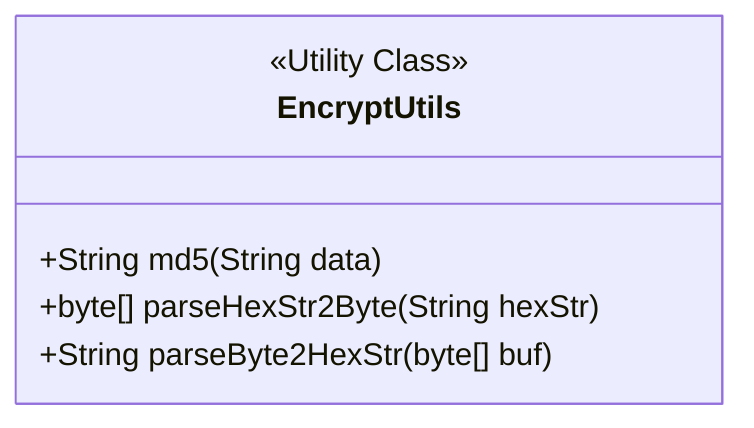
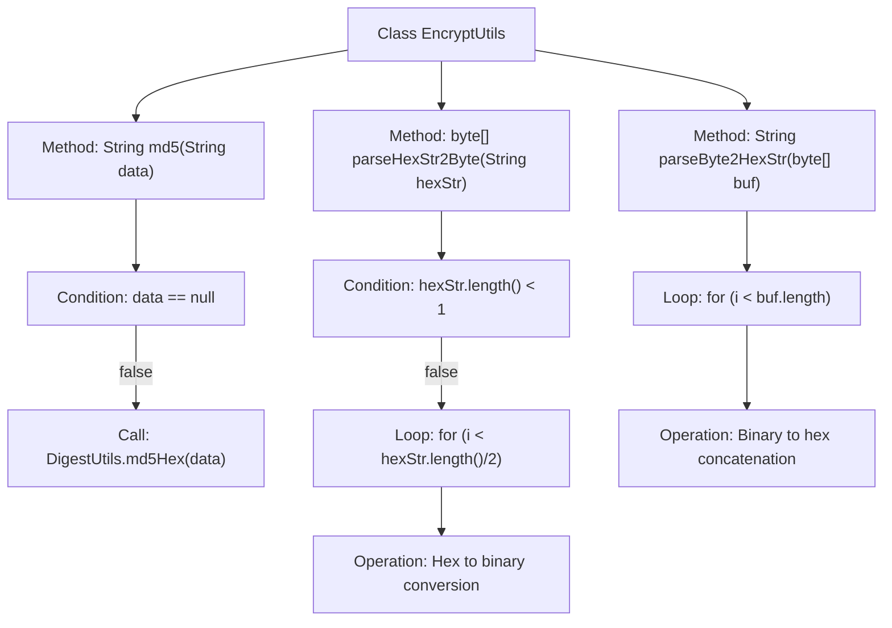

# Basic Information

|      |      |
|------|------|
| Name | EncryptUtils |
| Language | .java |
| Code Path | WeFe/common/java/common-lang/src/main/java/com/welab/wefe/common/util/EncryptUtils.java |
| Package Name | com.welab.wefe.common.util |
| Dependencies | ['org.apache.commons.codec.digest.DigestUtils'] |
| Brief Description | The EncryptUtils class provides MD5 digest generation and conversion between hexadecimal and binary. It includes three static methods: md5, parseHexStr2Byte, and parseByte2HexStr. |

# Description

The `EncryptUtils` class provides three static encryption utility methods: The `md5` method computes a 32-bit lowercase MD5 digest for the input string and returns `null` for empty input; `parseHexStr2Byte` converts a hexadecimal string to a binary array and returns `null` for empty input; `parseByte2HexStr` converts a binary array to an uppercase hexadecimal string. All methods include null or boundary handling.

# Class Summary

| Name   | Type  | Description |
|-------|------|-------------|
| EncryptUtils | class | The EncryptUtils class provides MD5 encryption and mutual conversion between hexadecimal and binary. The md5 method generates a 32-bit lowercase digest, parseHexStr2Byte converts hexadecimal to binary, and parseByte2HexStr performs the reverse operation. |

## Class EncryptUtils

|      |      |
|------|------|
| Access Modifier | public |
| Type | class |
| Name | EncryptUtils |
| Description | The EncryptUtils class provides MD5 encryption and mutual conversion between hexadecimal and binary. The md5 method generates a 32-bit lowercase digest, parseHexStr2Byte converts hexadecimal to binary, and parseByte2HexStr performs the reverse operation. |

### UML Class Diagram

This code demonstrates an encryption utility class `EncryptUtils` containing three static methods: `md5()` for generating MD5 digests of strings, `parseHexStr2Byte()` for converting hexadecimal strings to binary byte arrays, and `parseByte2HexStr()` for converting binary byte arrays to hexadecimal strings. Designed as a stateless utility class with all static methods, it focuses on data format conversion and hash computation functionality. Each method includes null or boundary value handling (e.g., null checks in `md5()`, empty string validation in `parseHexStr2Byte()`), reflecting robustness considerations.

### Internal Method Call Graph

This flowchart illustrates three core methods of the EncryptUtils class: md5() for MD5 hashing, parseHexStr2Byte() for hexadecimal string to byte array conversion, and parseByte2HexStr() for byte array to hexadecimal string conversion. Each method includes necessary null checks or length validation, and completes data transformation through loops or third-party library calls. The process clearly demonstrates conditional branching and loop handling logic, highlighting key steps in data format conversion.

### Field List

| Name  | Type  | Description |
|-------|-------|------|

### Method List

| Name  | Type  | Description |
|-------|-------|------|
| md5 | String | This method is used to generate an MD5 hash value of a string. If the input is null, it returns null; otherwise, it returns the MD5 hash string. |
| parseHexStr2Byte | byte[] | Convert a hexadecimal string to a byte array. An empty string returns null. Every two characters are parsed as one byte, with the high 4 bits and low 4 bits calculated separately and then merged. |
| parseByte2HexStr | String | Convert a byte array to a hexadecimal string, with each byte converted to two uppercase hexadecimal characters, padding with zeros if necessary. |

