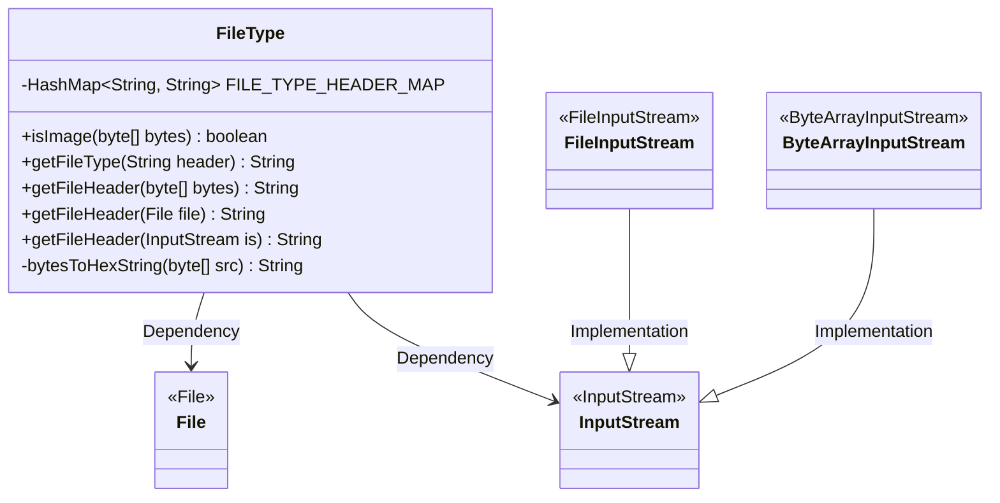
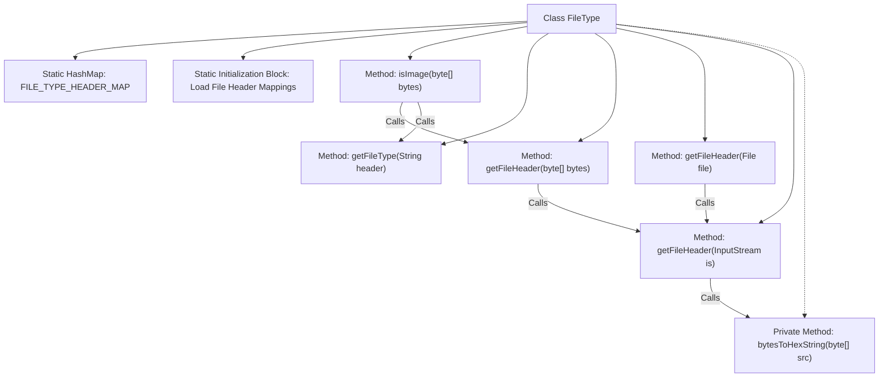

# Basic Information

|      |      |
|------|------|
| Name | FileType |
| Language | .java |
| Code Path | WeFe/common/java/common-lang/src/main/java/com/welab/wefe/common/util/FileType.java |
| Package Name | com.welab.wefe.common.util |
| Dependencies | ['java.io', 'java.util.HashMap', 'java.util.Map'] |
| Brief Description | The FileType class identifies file types through file headers, supporting various formats such as images, documents, audio, and video. It provides methods for retrieving file headers and determining whether a file is an image. |

# Description

The code defines a FileType class for identifying file types based on file header information. The class contains a static HashMap that stores hexadecimal file header signatures and their corresponding extensions for common file types, such as images (jpg, png, etc.), documents (doc, pdf, etc.), and audio/video files (wav, avi, etc.). It provides multiple methods: isImage checks whether a file is an image, getFileType retrieves the file type based on the header, and getFileHeader extracts header information from byte arrays, files, or input streams. A helper method bytesToHexString converts byte arrays to hexadecimal strings for comparison. This class encapsulates the core logic of file type detection and supports multiple input methods.

# Class Summary

| Name   | Type  | Description |
|-------|------|-------------|
| FileType | class | The FileType class identifies file types by their header signatures, supporting formats such as images, documents, audio, and video. It provides type detection methods for byte arrays, files, and input streams. |

## Class FileType

|      |      |
|------|------|
| Access Modifier | public |
| Type | class |
| Name | FileType |
| Description | The FileType class identifies file types by their header signatures, supporting formats such as images, documents, audio, and video. It provides type detection methods for byte arrays, files, and input streams. |

### UML Class Diagram

This code defines a `FileType` class for identifying file types through file header information. The class contains a static hashmap `FILE_TYPE_HEADER_MAP` storing signature codes of common file types, provides an `isImage()` method to determine if a file is an image, and multiple overloaded `getFileHeader()` methods to retrieve file headers from different input sources. The private method `bytesToHexString()` converts byte arrays to hexadecimal strings. The class relies on Java IO classes such as `File` and `InputStream` and their subclasses to implement its functionality.

### Internal Method Call Graph

This code implements a file type detection tool that identifies file types through file header signatures. The core functionality relies on a static hashmap storing mappings between file header signatures and types. It provides the `isImage` method to determine if a file is an image type, a series of `getFileHeader` methods to extract file header information, and the `bytesToHexString` method to convert bytes to hexadecimal strings. The flowchart illustrates the class structure and method call chain, highlighting the file header signature loading process and the call relationships for type detection.

### Field List

| Name  | Type  | Description |
|-------|-------|------|
| FILE_TYPE_HEADER_MAP = new HashMap<>() | HashMap<String, String> | Define a static constant hash map with key-value pairs of string type, used to store the correspondence between file types and header information. |

### Method List

| Name  | Type  | Description |
|-------|-------|------|
| isImage | boolean | This method determines whether it is an image by checking the file header, supporting PNG, JPG, JPEG, GIF, TIF, and BMP formats, and returns false if there is no match. |
| getFileType | String | This method returns the file type by matching the file header against a preset type mapping table, and returns null if there is no match or the input is empty. |
| getFileHeader | String | The static method `getFileHeader` takes a file object as input and attempts to retrieve the file header information through the file input stream. If the file is not found, it prints the exception and returns an empty string. |
| getFileHeader | String | The static method `getFileHeader` reads the first 4 bytes from the input stream, converts them into a hexadecimal string, handles exceptions, and ensures the stream is closed. |
| bytesToHexString | String | Convert a byte array to a hexadecimal string, return null for an empty array, pad a single character with a leading zero, and capitalize the result. |
| getFileHeader | String | Java static method, retrieves file header information from a byte array, internally utilizes ByteArrayInputStream for processing. |

