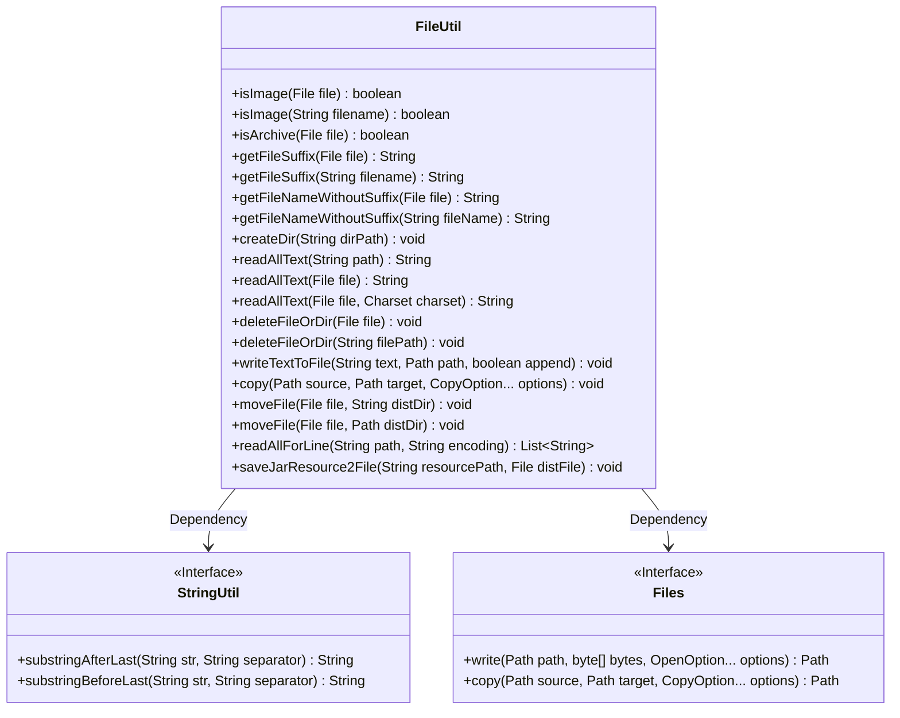

# Basic Information

|      |      |
|------|------|
| Name | FileUtil |
| Language | .java |
| Code Path | WeFe/common/java/common-lang/src/main/java/com/welab/wefe/common/util/FileUtil.java |
| Package Name | com.welab.wefe.common.util |
| Dependencies | ['java.io', 'java.nio.charset.Charset', 'java.nio.charset.StandardCharsets', 'java.nio.file', 'java.util.ArrayList', 'java.util.List'] |
| Brief Description | The FileUtil class provides file operation functionalities, including determining file types (images, compressed packages), obtaining file extensions, reading and writing files, creating and deleting directories, moving and copying files, etc. |

# Description

FileUtil is a Java utility class that provides file operation-related functionalities. Its main features include: determining whether a file is an image or a compressed package, retrieving file extensions and filenames (without extensions), creating directories, reading file contents (supporting line-by-line or full reads), deleting files or directories, writing text to files (supporting append or overwrite modes), file copying and moving, and saving resources from JAR packages as files. The class handles file paths, encoding (default UTF-8), and exceptions, making it suitable for common file operation requirements.

# Class Summary

| Name   | Type  | Description |
|-------|------|-------------|
| FileUtil | class | The FileUtil class provides utility methods for file operations, including determining file types, obtaining file extensions, reading and writing files, deleting files, moving files, and other functionalities. |

## Class FileUtil

|      |      |
|------|------|
| Access Modifier | public |
| Type | class |
| Name | FileUtil |
| Description | The FileUtil class provides utility methods for file operations, including determining file types, obtaining file extensions, reading and writing files, deleting files, moving files, and other functionalities. |

### UML Class Diagram

This class diagram illustrates the structure of the FileUtil utility class and its dependencies on the StringUtil and Files interfaces. FileUtil provides comprehensive file operation methods including file type checking (via extensions), file content reading/writing, and file moving/copying. Key methods include isImage() and isArchive() for file type verification, readAllText() and readAllForLine() for file reading in different formats, and deleteFileOrDir() supporting recursive directory deletion. The class relies on StringUtil for string processing and Files interface for underlying file operations, demonstrating high cohesion characteristic of utility classes.

### Internal Method Call Graph

```mermaid
graph TD
    A["Class FileUtil"]
    B["Method: isImage(File file)"]
    C["Method: isImage(String filename)"]
    D["Method: isArchive(File file)"]
    E["Method: getFileSuffix(File file)"]
    F["Method: getFileSuffix(String filename)"]
    G["Method: getFileNameWithoutSuffix(File file)"]
    H["Method: getFileNameWithoutSuffix(String fileName)"]
    I["Method: createDir(String dirPath)"]
    J["Method: readAllText(String path)"]
    K["Method: readAllText(File file)"]
    L["Method: readAllText(File file, Charset charset)"]
    M["Method: deleteFileOrDir(File file)"]
    N["Method: deleteFileOrDir(String filePath)"]
    O["Method: writeTextToFile(String text, Path path, boolean append)"]
    P["Method: copy(Path source, Path target, CopyOption... options)"]
    Q["Method: moveFile(File file, String distDir)"]
    R["Method: moveFile(File file, Path distDir)"]
    S["Method: readAllForLine(String path, String encoding)"]
    T["Method: saveJarResource2File(String resourcePath, File distFile)"]
    U["Method: main(String[] args)"]

    A --> B
    A --> C
    A --> D
    A --> E
    A --> F
    A --> G
    A --> H
    A --> I
    A --> J
    A --> K
    A --> L
    A --> M
    A --> N
    A --> O
    A --> P
    A --> Q
    A --> R
    A --> S
    A --> T
    A --> U

    B --> C
    E --> F
    G --> H
    J --> K
    K --> L
    M --> N
    Q --> R
    U --> T
    U --> L
```

This code represents a file utility class FileUtil that provides various file operation methods, including determining file types (images, archives), obtaining file extensions, reading file contents, deleting files or directories, writing text to files, copying and moving files, etc. The flowchart illustrates the invocation relationships between the methods in the class, where some methods have dependency calls. For example, isImage(File file) calls isImage(String filename), getFileSuffix(File file) calls getFileSuffix(String filename), etc. The main method demonstrates how to use the class's methods to save resources from a JAR as files and read their contents.

### Field List

| Name  | Type  | Description |
|-------|-------|------|

### Method List

| Name  | Type  | Description |
|-------|-------|------|
| readAllForLine | List<String> | Static method reads all lines from a file, processes with specified encoding, returns a string list, throws IO error on exception, ensures resource closure. |
| deleteFileOrDir | void | Recursively delete files or directories: If non-empty, directly delete if it's a file; if it's a directory, recursively delete its contents before deleting itself. |
| moveFile | void | Move the file to the target directory, skip if it is already in the target directory. Ensure the target directory exists, delete the target file if it exists, and finally move the file. |
| copy | void | Java Method: Copy file to target path, automatically create parent directories, with configurable copy options, may throw IO exceptions. |
| main | void | Java code example: Extract resource files from a jar package, read the content, save it to D drive as test.txt, and then output it. |
| readAllText | String | The static method `readAllText` reads the file content and returns a string encoded in UTF-8, potentially throwing an `IOException`. |
| createDir | void | Method to create a directory: Check if the path exists, and if not, create multi-level directories. |
| writeTextToFile | void | The static method `writeTextToFile` writes text to a file at the specified path, with an optional append mode. In overwrite mode, it deletes the original file, ensures the directory exists, and then writes the content in UTF-8 encoding. |
| getFileNameWithoutSuffix | String | Static method to get the filename without extension: Returns an empty string if the input is a directory, otherwise calls the method of the same name to process the filename. |
| getFileSuffix | String | This method is used to obtain the file name suffix by extracting the string after the last dot. |
| deleteFileOrDir | void | The static method `deleteFileOrDir` takes a file path string parameter and invokes the method of the same name to process the corresponding `File` object. |
| readAllText | String | Java static method, reads the entire text content of a file at the specified path using UTF-8 encoding, may throw an IOException. |
| isArchive | boolean | Determine whether a file is a compressed file, supporting formats such as zip, tar, gz, tgz, 7z, and rar. |
| readAllText | String | Read file content and return as string, handle specified character set and exceptions, ensure resource release. |
| isImage | boolean | Check if the file extension is a common image format (e.g., jpg, png, etc.), return true if yes, otherwise false. |
| getFileSuffix | String | This method checks whether the file is a directory, and if so, returns null; otherwise, it returns the suffix of the filename. |
| moveFile | void | Methods for moving files to a specified directory, with parameters being the file object and the destination path string. |
| saveJarResource2File | void | Save the JAR resource to a file, delete the file if it exists, and complete the operation through stream reading and writing. |
| isImage | boolean | Check if the file is an image: return false if it is a directory, otherwise check if the filename matches an image format. |
| getFileNameWithoutSuffix | String | Static method to get the filename without extension, returns an empty string if input is empty, otherwise extracts the part before the last dot. |

