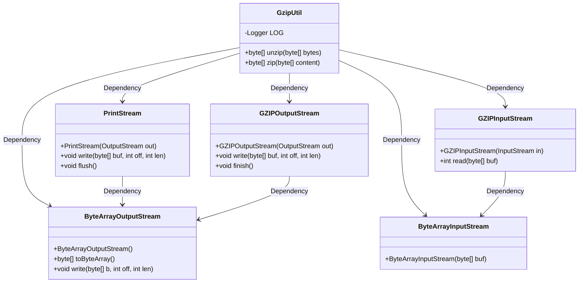
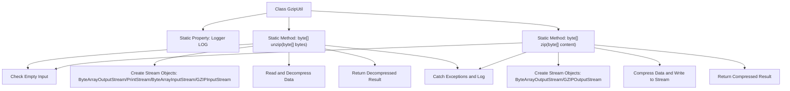

# Basic Information

|      |      |
|------|------|
| Name | GzipUtil |
| Language | .java |
| Code Path | WeFe/common/java/common-lang/src/main/java/com/welab/wefe/common/util/GzipUtil.java |
| Package Name | com.welab.wefe.common.util |
| Dependencies | ['org.slf4j.Logger', 'org.slf4j.LoggerFactory', 'java.io.ByteArrayInputStream', 'java.io.ByteArrayOutputStream', 'java.io.PrintStream', 'java.util.zip.GZIPInputStream', 'java.util.zip.GZIPOutputStream'] |
| Brief Description | The GzipUtil class provides zip and unzip methods for compressing and decompressing byte arrays, handling exceptions, and logging. |

# Description

GzipUtil is a utility class that provides GZIP compression and decompression functionalities. It contains two static methods: the unzip method accepts a byte array, decompresses the data via GZIPInputStream, and returns the decompressed byte array; the zip method accepts a byte array, compresses the data via GZIPOutputStream, and returns the compressed byte array. Both methods handle null inputs, use try-with-resources to ensure resource release, catch exceptions, and log errors. During decompression, a 1024-byte buffer is used to read data, and the finish method is called after compression to ensure data integrity. Returns null in case of exceptions.

# Class Summary

| Name   | Type  | Description |
|-------|------|-------------|
| GzipUtil | class | The GzipUtil class provides static methods zip and unzip for GZIP compression and decompression of byte arrays, handling exceptions and logging them. |

## Class GzipUtil

|      |      |
|------|------|
| Access Modifier | public |
| Type | class |
| Name | GzipUtil |
| Description | The GzipUtil class provides static methods zip and unzip for GZIP compression and decompression of byte arrays, handling exceptions and logging them. |

### UML Class Diagram

This class diagram illustrates the structure of the GzipUtil utility class and its dependencies. GzipUtil provides two static methods, `zip` and `unzip`, for compressing and decompressing byte arrays, respectively. During implementation, it relies on multiple classes from the Java I/O library: ByteArrayOutputStream for buffering output data, PrintStream for writing decompressed data, ByteArrayInputStream for reading input data, and GZIPInputStream and GZIPOutputStream for handling GZIP format compression and decompression. All resources are automatically managed through the try-with-resources syntax to ensure proper release.

### Internal Method Call Graph

This code illustrates the GzipUtil utility class, which contains two core static methods: unzip for decompressing GZIP-format data and zip for compressing data into GZIP format. Both methods first validate input validity, then process data conversion through Java's IO stream system, using try-with-resources to ensure automatic resource release, and uniformly catch exceptions for logging. The decompression process employs a 1024-byte buffer for incremental reading, while the compression process directly writes data and calls finish to ensure data integrity.

### Field List

| Name  | Type  | Description |
|-------|-------|------|
| LOG = LoggerFactory.getLogger(GzipUtil.class) | Logger | The GzipUtil class defines a static immutable logger named LOG. |

### Method List

| Name  | Type  | Description |
|-------|-------|------|
| unzip | byte[] | The static method `unzip` decompresses a GZIP-format byte array and returns null if the input is empty. It processes data using streams, logs exceptions, and returns null in case of errors. |
| zip | byte[] | The static method `zip` compresses a byte array into GZIP format, returns `null` for empty input, and logs exceptions before returning `null`. |

