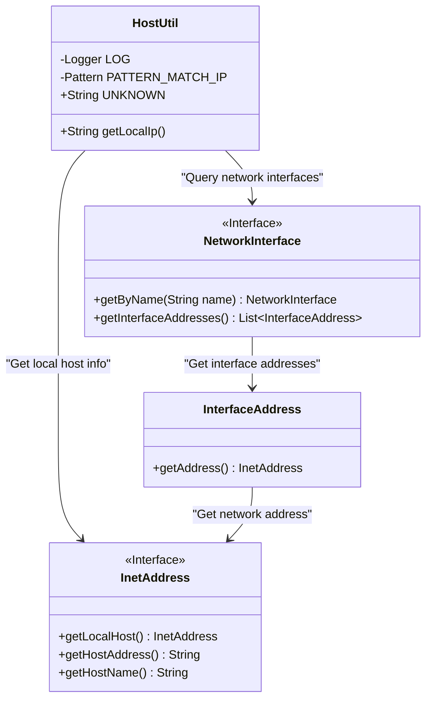
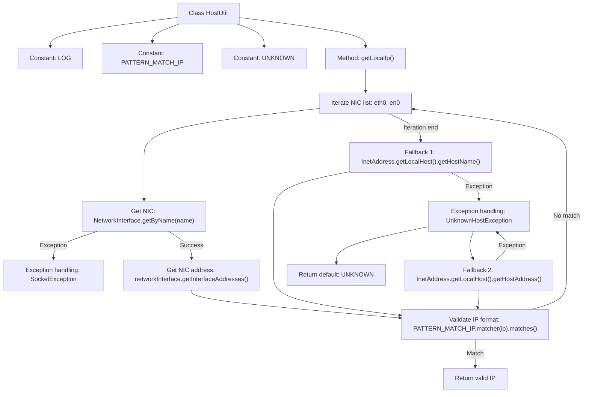

# Basic Information

|      |      |
|------|------|
| Name | HostUtil |
| Language | .java |
| Code Path | WeFe/common/java/common-lang/src/main/java/com/welab/wefe/common/util/HostUtil.java |
| Package Name | com.welab.wefe.common.util |
| Dependencies | ['org.slf4j.Logger', 'org.slf4j.LoggerFactory', 'java.net', 'java.util.regex.Pattern'] |
| Brief Description | The HostUtil class provides a method to obtain the local IPv4 address, prioritizing checks on the eth0 and en0 network interfaces. If unsuccessful, it then attempts to retrieve the hostname and address. If all attempts fail, it returns "unknown". |

# Description

The `HostUtil` class is a utility class designed to retrieve local IPv4 addresses. It contains a static method `getLocalIp`, which first attempts to obtain the IP address through the `eth0` and `en0` network interfaces. If unsuccessful, it then tries to fetch the local hostname and address via `InetAddress`. The method validates the IP format using a regular expression. If all attempts fail, it returns the `unknown` constant. During execution, it catches and logs `SocketException` and `UnknownHostException` exceptions. The class includes a regular expression constant for matching IPv4 addresses and a string constant representing an unknown IP.

# Class Summary

| Name   | Type  | Description |
|-------|------|-------------|
| HostUtil | class | The HostUtil class provides a method to obtain the local IPv4 address, prioritizing checks on the eth0 and en0 network interfaces. If unsuccessful, it then attempts to retrieve the hostname and address. If all attempts fail, it returns "unknown". |

## Class HostUtil

|      |      |
|------|------|
| Access Modifier | public |
| Type | class |
| Name | HostUtil |
| Description | The HostUtil class provides a method to obtain the local IPv4 address, prioritizing checks on the eth0 and en0 network interfaces. If unsuccessful, it then attempts to retrieve the hostname and address. If all attempts fail, it returns "unknown". |

### UML Class Diagram

This code defines a HostUtil utility class primarily used to obtain local IPv4 addresses. The class contains a private logger, an IP address regex matching pattern, and an unknown address constant. The core method getLocalIp() attempts to retrieve the IP through three approaches: first checking the address of a specified network interface (eth0/en0), then attempting to obtain the IP corresponding to the local hostname, and finally trying to directly fetch the local host address. If all attempts fail, it returns "unknown". The code relies on Java's network-related classes such as NetworkInterface, InterfaceAddress, and InetAddress for address queries and validation.

### Internal Method Call Graph

This flowchart describes the logical process of the HostUtil class obtaining the local IP address. The method first iterates through a predefined list of network interface names (eth0/en0) to attempt acquiring a valid IPv4 address; if unsuccessful, it sequentially tries obtaining through hostname and host address, with strict IP format validation throughout. The entire process incorporates three layers of exception handling mechanisms, ultimately returning either a valid IP or the default "unknown" value, demonstrating robust network address acquisition strategies and comprehensive exception handling mechanisms.

### Field List

| Name  | Type  | Description |
|-------|-------|------|
| PATTERN_MATCH_IP = Pattern.compile("[0-9]{1,3}\\.[0-9]{1,3}\\.[0-9]{1,3}\\.[0-9]{1,3}") | Pattern | Define static regular expressions to match IPv4 addresses composed of 1-3 digit numbers. |
| LOG = LoggerFactory.getLogger(HostUtil.class) | Logger | Declare a private static immutable log object LOG for logging in the HostUtil class. |
| UNKNOWN = "unknown" | String | Define a constant string UNKNOWN with the value "unknown". |

### Method List

| Name  | Type  | Description |
|-------|-------|------|
| getLocalIp | String | Methods to obtain the local IP address: first check the eth0 and en0 network interfaces, then attempt to retrieve the hostname and address, and finally return the matched IP or "unknown." |

