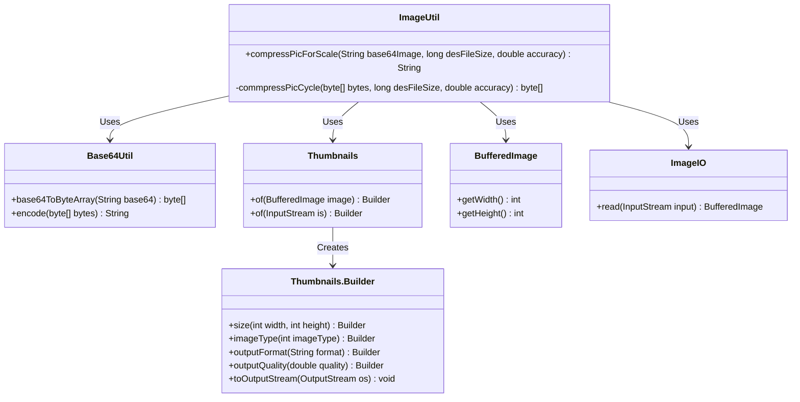
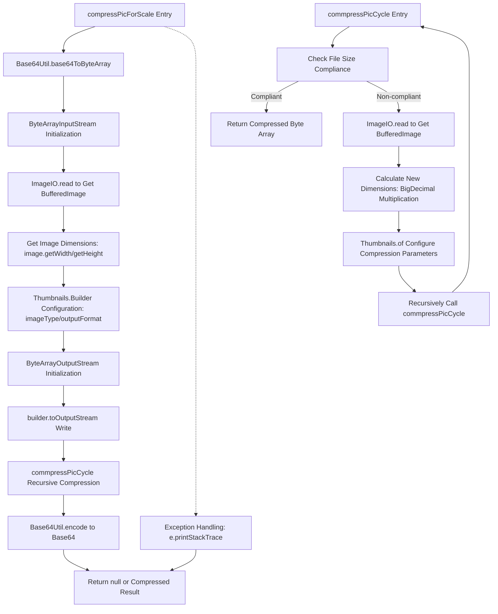

# Basic Information

|      |      |
|------|------|
| Name | ImageUtil |
| Language | .java |
| Code Path | WeFe/common/java/common-lang/src/main/java/com/welab/wefe/common/util/ImageUtil.java |
| Package Name | com.welab.wefe.common.util |
| Dependencies | ['net.coobird.thumbnailator.Thumbnails', 'javax.imageio.ImageIO', 'java.awt.image.BufferedImage', 'java.io.ByteArrayInputStream', 'java.io.ByteArrayOutputStream', 'java.io.IOException', 'java.math.BigDecimal'] |
| Brief Description | The ImageUtil class provides image compression functionality, which recursively compresses Base64 images to specified dimensions and quality, supporting both PNG and JPG formats, and returns the compressed Base64 string. |

# Description

The ImageUtil class provides image compression functionality, using the `compressPicForScale` method to compress a Base64-format image to a specified size. This method first converts the image to PNG format, retrieves the original width and height, and then invokes the recursive compression method `commpressPicCycle`. The recursive method gradually adjusts the image dimensions and quality based on the precision parameter, iteratively compressing until the target file size (in KB) is achieved or the original dimensions fall below the target value. It returns `null` in case of exceptions and the compressed Base64 string upon success.

# Class Summary

| Name   | Type  | Description |
|-------|------|-------------|
| ImageUtil | class | The ImageUtil class provides image compression functionality, recursively compressing Base64 images to specified dimensions and quality levels, supporting both PNG and JPG formats, and returning the compressed Base64 string. |

## Class ImageUtil

|      |      |
|------|------|
| Access Modifier | public |
| Type | class |
| Name | ImageUtil |
| Description | The ImageUtil class provides image compression functionality, recursively compressing Base64 images to specified dimensions and quality levels, supporting both PNG and JPG formats, and returning the compressed Base64 string. |

### UML Class Diagram

Class Diagram Description:
This diagram illustrates the core structure and dependencies of the ImageUtil utility class. ImageUtil provides image compression functionality, primarily relying on Base64Util for Base64 encoding/decoding, utilizing the Thumbnails library for image resizing and quality compression, obtaining image dimensions through BufferedImage, and invoking ImageIO to read image data. Thumbnails.Builder implements the builder pattern to support chained configuration of compression parameters. The design implements recursive compression logic until the target file size is achieved.

### Internal Method Call Graph

Flowchart Description: This flowchart illustrates the complete image compression process in the ImageUtil class. The main method compressPicForScale first converts a base64 image into a byte stream, obtains the original dimensions, performs PNG format conversion via Thumbnails, and then enters the recursive compression loop commpressPicCycle. The recursive method continuously adjusts image dimensions and quality parameters until the file size meets requirements or the maximum compression attempts are reached, ultimately returning the compressed base64 string. The entire process includes exception handling and multiple format conversion stages.

### Field List

| Name  | Type  | Description |
|-------|-------|------|

### Method List

| Name  | Type  | Description |
|-------|-------|------|
| commpressPicCycle | byte[] | This method recursively compresses the image to the target size. If the current dimensions meet the requirements, it returns the original data; otherwise, it adjusts the width and height according to the precision ratio and recompresses, looping until the conditions are satisfied. |
| compressPicForScale | String | This method compresses a Base64 image to the target size by first converting it to PNG format, then iteratively compressing it to the specified precision, and finally returning the compressed Base64 string. |

