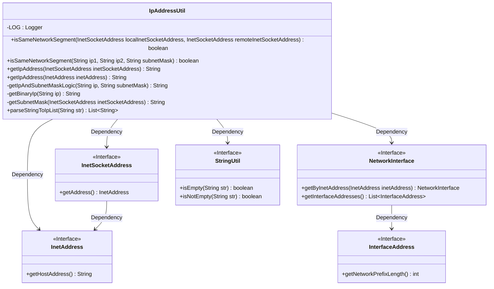
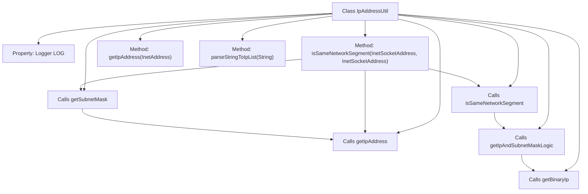

# Basic Information

|      |      |
|------|------|
| Name | IpAddressUtil |
| Language | .java |
| Code Path | WeFe/common/java/common-lang/src/main/java/com/welab/wefe/common/util/IpAddressUtil.java |
| Package Name | com.welab.wefe.common.util |
| Dependencies | ['org.slf4j.Logger', 'org.slf4j.LoggerFactory', 'java.net', 'java.util.ArrayList', 'java.util.List'] |
| Brief Description | The IpAddressUtil class provides IP address utility methods, including checking if IPs are in the same network segment, obtaining IP addresses, subnet masks, and parsing IP lists. The core method isSameNetworkSegment determines whether IPs belong to the same network segment by comparing them with subnet masks through binary operations. |

# Description

The `IpAddressUtil` class provides functionalities related to IP addresses and subnet masks. Its primary features include checking whether local and remote IPs are on the same network segment by comparing the logical AND results of the IP and subnet mask; retrieving IP addresses and subnet masks; converting IP addresses to binary strings; extracting subnet masks from Socket address objects; and parsing IP whitelist configuration text with support for comments and wildcard processing. The class includes detailed error handling and logging.

# Class Summary

| Name   | Type  | Description |
|-------|------|-------------|
| IpAddressUtil | class | The IpAddressUtil class provides IP address utility methods, including checking if IPs are in the same network segment, obtaining IPs and subnet masks, parsing IP lists, etc. The core method isSameNetworkSegment determines whether IPs belong to the same segment by comparing the logical AND results of IPs and masks, supporting exception handling and log recording. |

## Class IpAddressUtil

|      |      |
|------|------|
| Access Modifier | public |
| Type | class |
| Name | IpAddressUtil |
| Description | The IpAddressUtil class provides IP address utility methods, including checking if IPs are in the same network segment, obtaining IPs and subnet masks, parsing IP lists, etc. The core method isSameNetworkSegment determines whether IPs belong to the same segment by comparing the logical AND results of IPs and masks, supporting exception handling and log recording. |

### UML Class Diagram

This code implements an IP address utility class primarily used to determine whether two IP addresses belong to the same network segment. Core functionalities include: retrieving IP addresses and subnet masks via InetSocketAddress, performing logical AND operations between IP addresses and subnet masks, and parsing IP whitelist text. The class diagram illustrates the dependency relationships between IpAddressUtil and Java network interface classes (such as InetSocketAddress and InetAddress), as well as the invocation relationship with the utility class StringUtil. All network-related interfaces are marked with <<Interface>>, reflecting dependencies on Java standard library interfaces.

### Internal Method Call Graph

This code represents a utility class for IP address-related operations. Its main functionalities include checking whether two IP addresses are on the same network segment, retrieving IP addresses, obtaining subnet masks, converting IP addresses to binary strings, and parsing IP address lists. Core methods implement their functionality through call relationships. For example, the isSameNetworkSegment method sequentially calls getIpAddress, getSubnetMask, and other methods to obtain necessary information, ultimately determining whether addresses are on the same segment through binary logical AND operations. All methods are static for direct invocation.

### Field List

| Name  | Type  | Description |
|-------|-------|------|
| LOG = LoggerFactory.getLogger(IpAddressUtil.class) | Logger | The IpAddressUtil class defines a static immutable logger LOG for recording log information. |

### Method List

| Name  | Type  | Description |
|-------|-------|------|
| getBinaryIp | String | Convert the IP address to an 8-bit binary format string, padding each segment with zeros and concatenating them. |
| getSubnetMask | String | The method obtains the subnet mask via InetSocketAddress, converts the network prefix length to the standard dotted-decimal format, logs exceptions, and throws them. |
| getIpAddress | String | Get the IP address of InetSocketAddress, return an empty string if it is null, otherwise call the internal method to process the address. |
| getIpAndSubnetMaskLogic | String | This method converts the IP address and subnet mask into binary and performs a bitwise AND operation on each corresponding bit, returning the result as a string. |
| isSameNetworkSegment | boolean | This method checks whether the local and remote addresses are on the same subnet by comparing the IP addresses and subnet masks, records the result, and returns false if an exception occurs. |
| isSameNetworkSegment | boolean | This method checks whether two IP addresses are on the same network segment by comparing whether their logical AND results with the subnet mask are identical. |
| getIpAddress | String | The method takes an InetAddress object and returns its IP address string. |
| parseStringToIpList | List<String> | Parse the string into an IP list, skip empty lines and comment lines, and return the valid IP list after processing inline comments. |

