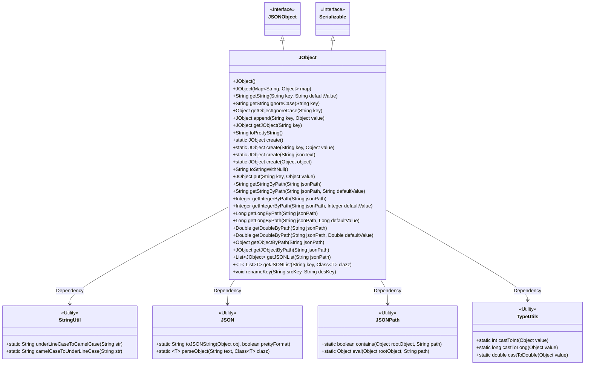

# Basic Information

|      |      |
|------|------|
| Name | JObject |
| Language | .java |
| Code Path | WeFe/common/java/common-lang/src/main/java/com/welab/wefe/common/util/JObject.java |
| Package Name | com.welab.wefe.common.util |
| Dependencies | ['com.alibaba.fastjson.JSON', 'com.alibaba.fastjson.JSONArray', 'com.alibaba.fastjson.JSONObject', 'com.alibaba.fastjson.JSONPath', 'com.alibaba.fastjson.serializer.SerializerFeature', 'com.alibaba.fastjson.util.TypeUtils', 'org.apache.commons.lang3.StringUtils', 'java.io.Serializable', 'java.util.ArrayList', 'java.util.List', 'java.util.Map', 'java.util.stream.Collectors'] |
| Brief Description | JObject is a class that extends JSONObject, supporting serialization and providing functionalities such as key-value operations, JSON path queries, case-insensitive value retrieval, formatted output, and type conversion. |

# Description

JObject is a serializable class extended from JSONObject, providing various JSON operation functionalities. It supports constructing empty objects or initializing based on a Map, and includes methods for obtaining strings, retrieving values case-insensitively, and appending key-value pairs. It enables fetching different types of data via JSONPath, such as strings, integers, long integers, double-precision floating-point numbers, etc. It offers formatted output, null value handling, key renaming capabilities, and can create JObject instances or convert from JSON text. The class includes methods for processing JSON arrays and lists, supporting type conversion and fluent operations.

# Class Summary

| Name   | Type  | Description |
|-------|------|-------------|
| JObject | class | JObject is an extended class of JSONObject that supports serialization, provides various construction methods and convenient operations such as key-value retrieval, path querying, type conversion, key name modification, and supports case-insensitive matching and underscore-to-camelCase conversion. |

## Class JObject

|      |      |
|------|------|
| Access Modifier | public |
| Type | class |
| Name | JObject |
| Description | JObject is an extended class of JSONObject that supports serialization, provides various construction methods and convenient operations such as key-value retrieval, path querying, type conversion, key name modification, and supports case-insensitive matching and underscore-to-camelCase conversion. |

### UML Class Diagram

This code defines a `JObject` class that inherits from `JSONObject` and implements the `Serializable` interface. `JObject` provides extensive JSON manipulation capabilities, including key-value retrieval (with case-insensitive and underscore/camelCase conversion support), JSON path queries, type conversion, data formatting, and key renaming. It achieves these functionalities by composing multiple utility classes (`StringUtil`, `JSON`, `JSONPath`, `TypeUtils`), forming a powerful and user-friendly JSON processing utility class.

### Internal Method Call Graph

```mermaid
graph TD
    A["Class JObject"]
    B["Inheritance: JSONObject"]
    C["Implements: Serializable"]
    D["Constructor: JObject()"]
    E["Constructor: JObject(Map<String, Object>)"]
    F["Method: getString(key, defaultValue)"]
    G["Method: getStringIgnoreCase(key)"]
    H["Method: getObjectIgnoreCase(key)"]
    I["Method: append(key, value)"]
    J["Method: getJObject(key)"]
    K["Method: toPrettyString()"]
    L["Static Method: create()"]
    M["Static Method: create(key, value)"]
    N["Static Method: create(jsonText)"]
    O["Static Method: create(object)"]
    P["Method: toStringWithNull()"]
    Q["Overridden Method: put(key, value)"]
    R["JSONPath Method Group"]
    S["Method: renameKey(srcKey, desKey)"]

    A --> B
    A --> C
    A --> D
    A --> E
    A --> F
    A --> G
    G --> H
    A --> I
    A --> J
    A --> K
    A --> L
    A --> M
    A --> N
    A --> O
    A --> P
    A --> Q
    A --> R
    R -->|Includes| H
    R -->|Includes| F
    A --> S
```

This code defines a JObject class that inherits from JSONObject and implements the Serializable interface. Its core functionalities include: providing multiple constructors, enhanced key-value operations (including case-insensitive queries), JSONPath-supported data extraction, key renaming, and various static creation methods. Notably, it features capabilities for handling null values and formatting, along with complex data querying through JSONPath, making JSON operations more flexible and robust.

### Field List

| Name  | Type  | Description |
|-------|-------|------|

### Method List

| Name  | Type  | Description |
|-------|-------|------|
| toPrettyString | String | This method converts the current object into a formatted JSON string for easy reading. |
| getStringByPath | String | This method retrieves a string value from JSON by specifying a path, and returns a default value if the path does not exist. |
| create | JObject | This method takes a JSON string as input, returns an empty JObject if the string is null, otherwise parses it into a JObject and returns the result. |
| append | JObject | Java Method: Adds a key-value pair to a JObject and returns the modified JObject instance. |
| getDoubleByPath | Double | This method retrieves the value via JSON path and converts it to Double type, returning the default value if the value is empty. |
| getIntegerByPath | Integer | The method getIntegerByPath retrieves an integer value via jsonPath and returns null if none exists. |
| getStringByPath | String | Get the string value of the specified JSON path, or return null if it does not exist. |
| getJObject | JObject | The method getJObject takes a string key, invokes the parent class's get method to retrieve the object obj. If obj is null, it returns null; otherwise, it processes and returns the result by calling the create method. |
| put | JObject | Override the put method, call the parent class method, and then return the current object instance. |
| getString | String | This method retrieves the string value by key and returns the default value if not found. |
| getIntegerByPath | Integer | Get an integer value from a JSON path, return the default value if it does not exist. |
| getLongByPath | Long | The method retrieves a Long value by JSON path, returning the default value if the path corresponds to a null value, otherwise converting the value to a Long type. |
| create | JObject | The static method `create` accepts an object parameter, returning a new JObject if it is null, otherwise converting it to a JSON string before further processing. |
| create | JObject | The static method `create` accepts key-value pairs, creates and returns a `JObject` instance containing those key-value pairs. |
| getStringIgnoreCase | String | The method `getStringIgnoreCase` retrieves an object by key while ignoring case sensitivity. If the object is null, it returns null; otherwise, it converts the object to a string and returns it. |
| getDoubleByPath | Double | Get the Double value corresponding to the JSON path, returning null by default. |
| toStringWithNull | String | This method converts the object into a JSON string, including fields with null values, using the SerializerFeature.WriteMapNullValue feature. |
| getObjectIgnoreCase | Object | The method getObjectIgnoreCase retrieves the value corresponding to a key in three ways: the original key, converting underscores to camel case, and converting camel case to underscores, prioritizing the return of non-null values. |
| getLongByPath | Long | The method getLongByPath retrieves a Long value by jsonPath, returning null by default. |
| getObjectByPath | Object | This method retrieves the object value via JSON path and returns null if the path does not exist. |
| getJObjectByPath | JObject | This method retrieves an object from JSON based on the specified path, returning an empty JObject if the object does not exist, otherwise returning a JObject containing the object. |
| getJSONList | List<JObject> | This method retrieves an object from the specified JSON path. If the object is a JSON array, it converts it into a list of JObjects; otherwise, it returns an empty list. |
| getJSONList | List<T> | This method extracts an array of specified keys from JSON and converts its elements into a list of objects of the specified type. If the array does not exist, it returns null. |
| renameKey | void | Method for renaming keys: Check if the target key exists. If it does not, retrieve the value of the source key, delete the source key, and assign the value to the target key. |
| create | JObject | The static method create returns a new instance of JObject. |

