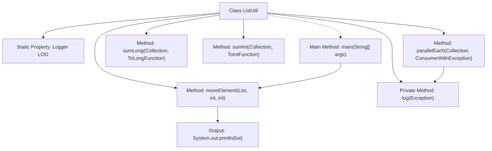

# Basic Information

|      |      |
|------|------|
| Name | ListUtil |
| Language | .java |
| Code Path | WeFe/common/java/common-lang/src/main/java/com/welab/wefe/common/util/ListUtil.java |
| Package Name | com.welab.wefe.common.util |
| Dependencies | ['com.welab.wefe.common.function.ConsumerWithException', 'org.slf4j.Logger', 'org.slf4j.LoggerFactory', 'java.util.ArrayList', 'java.util.Arrays', 'java.util.Collection', 'java.util.List', 'java.util.concurrent.atomic.AtomicReference', 'java.util.function.ToIntFunction', 'java.util.function.ToLongFunction'] |
| Brief Description | The ListUtil class provides functionalities for parallel list traversal, numerical summation, and element movement. It includes methods such as parallelEach for concurrent processing, sumLong/sumInt for summation, and moveElement for repositioning elements. |

# Description

ListUtil is a utility class that provides collection operation functionalities. The parallelEach method traverses collections concurrently via parallel streams, capturing exceptions and logging them. The sumLong and sumInt methods perform summation of collection elements for long and integer types respectively, returning 0 for empty collections. The moveElement method relocates elements within a list, handling cases of empty lists and identical positions. The class includes private logging methods, and the main method demonstrates the usage of moveElement.

# Class Summary

| Name   | Type  | Description |
|-------|------|-------------|
| ListUtil | class | The ListUtil class provides parallel list traversal, numerical summation, and element movement functionalities, incorporating exception handling and logging. |


## Class ListUtil

|      |      |
|------|------|
| Access Modifier | public |
| Type | class |
| Name | ListUtil |
| Description | The ListUtil class provides parallel list traversal, numerical summation, and element movement functionalities, incorporating exception handling and logging. |


### UML Class Diagram

```mermaid
classDiagram
    class ListUtil {
        -Logger LOG
        +Exception parallelEach~T~(Collection~T~ list, ConsumerWithException~T~ consumer)
        +long sumLong~T~(Collection~T~ list, ToLongFunction~T~ toLongFunction)
        +int sumInt~T~(Collection~T~ list, ToIntFunction~T~ toIntFunction)
        +void moveElement~T~(List~T~ list, int from, int to)
        -void log(Exception e)
        +void main(String[] args)
    }

    <<Interface>> ConsumerWithException~T~ {
        +void accept(T t) throws Exception
    }

    ListUtil --> ConsumerWithException : depends
    ListUtil --> ToLongFunction : depends
    ListUtil --> ToIntFunction : depends
```

Class diagram description:
ListUtil is a utility class that provides static methods for parallel traversal, numerical summation, and element movement of collections. It depends on three functional interfaces: ConsumerWithException (a consumer with exception handling), ToLongFunction (a long conversion function), and ToIntFunction (an integer conversion function). The parallelEach method processes collection elements using parallel streams and can capture and log exceptions; sumLong and sumInt calculate the long and integer sums of collection elements respectively; the moveElement method adjusts the position of elements in a list.


### Internal Method Call Graph



The flowchart depicts the structure and method invocation relationships of the ListUtil class. This class contains 5 core methods: parallelEach for concurrently traversing lists with exception handling, sumLong/sumInt for long and integer summation respectively, and moveElement for relocating list elements. The private log method records exception logs. The main method demonstrates moveElement's invocation process by relocating list elements twice and printing results. All methods are statically accessed, reflecting the utility class design characteristics.

### Field List

| Name  | Type  | Description |
|-------|-------|------|
| LOG = LoggerFactory.getLogger(ListUtil.class) | Logger | Declare a private static immutable log object LOG for logging in the ListUtil class. |

### Method List

| Name  | Type  | Description |
|-------|-------|------|
| sumInt | int | This is a Java static method that calculates the sum of integer values of elements in a collection. The method accepts a collection and a conversion function, processes the elements via stream operations to convert them into integers and sums them up. It returns 0 if the collection is empty. |
| sumLong | long | This is a Java static method that calculates the sum of long values for elements in a collection. The method accepts a collection and a long conversion function, returning 0 if the collection is empty, otherwise returning the sum of the converted values for all elements. |
| moveElement | void | The static method `moveElement` moves an element from a specified position in the list to another position, handling cases of empty lists and identical positions. |
| parallelEach | Exception | Process collection elements in parallel, capture and log exceptions, then return the first exception encountered. |
| log | void | The static method `log` is used to record exception information, outputting the exception class name and message to the logging system, including the complete exception stack trace. |
| main | void | Java code example: Create a list of integers, move element 3 to position 1, move element 2 to position 0, and print the list. |


