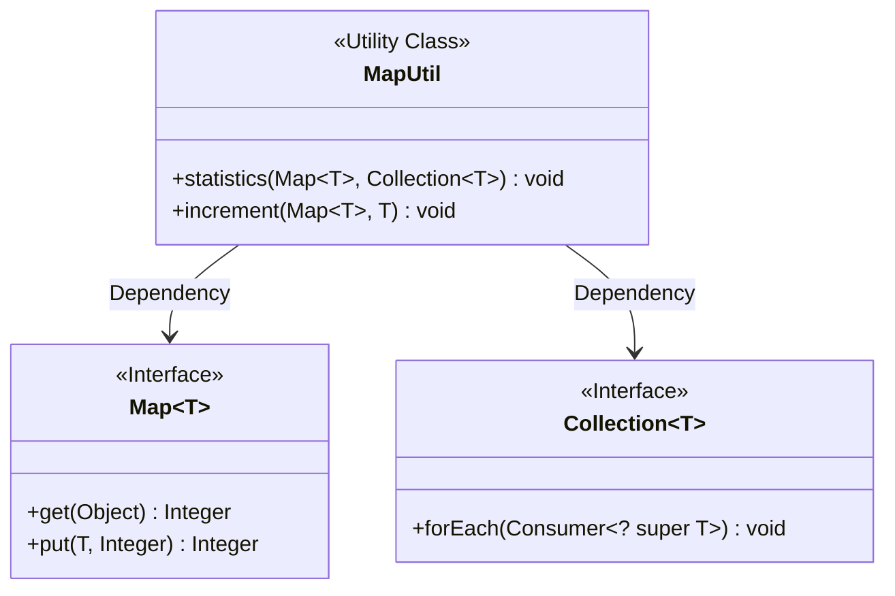
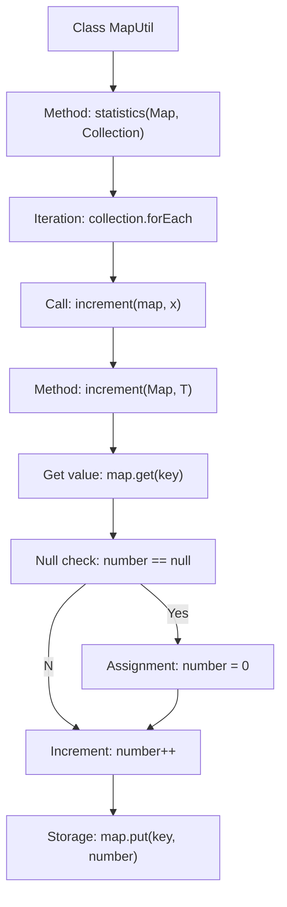

# Basic Information

|      |      |
|------|------|
| Name | MapUtil |
| Language | .java |
| Code Path | WeFe/common/java/common-lang/src/main/java/com/welab/wefe/common/util/MapUtil.java |
| Package Name | com.welab.wefe.common.util |
| Dependencies | ['java.util.Collection', 'java.util.Map'] |
| Brief Description | The MapUtil class provides methods for counting elements in a collection, including statistics to count the entire collection and increment to increase the count of a single element. |

# Description

MapUtil is a utility class that provides two static generic methods for counting elements. The `statistics` method takes a Map and a Collection, iterates through the collection elements, and calls the `increment` method to count them one by one. The `increment` method accepts a Map and a key, checks if the key exists, initializes it to 0 if absent, then increments the value by 1 and updates the Map. Both methods use generics to support any type.

# Class Summary

| Name   | Type  | Description |
|-------|------|-------------|
| MapUtil | class | The MapUtil class provides a method for counting elements in a collection: statistics iterates through the collection and calls the increment method to increase the count value of corresponding elements in the Map. The increment method handles cases where the key does not exist and updates the count. |

## Class MapUtil

|      |      |
|------|------|
| Access Modifier | public |
| Type | class |
| Name | MapUtil |
| Description | The MapUtil class provides a method for counting elements in a collection: statistics iterates through the collection and calls the increment method to increase the count value of corresponding elements in the Map. The increment method handles cases where the key does not exist and updates the count. |

### UML Class Diagram

This code demonstrates a utility class MapUtil containing two static generic methods: `statistics` for counting element occurrences in a Collection and storing results in a Map, and `increment` for increasing the count value of a specified key in the Map. The class diagram clearly illustrates MapUtil's dependency relationships with Map and Collection interfaces, where Map and Collection are marked as <<Interface>> as generic interfaces. The `statistics` method traverses the collection via forEach and calls `increment` to update counts, reflecting the utility class's encapsulation of collection operations.

### Internal Method Call Graph

This flowchart illustrates the core logic of the MapUtil utility class. The statistics method traverses the input collection and calls the increment method for each element to perform counting. The increment method implements complete counting logic: first retrieving the current value, handling null cases, then incrementing and updating the Map. This design elegantly achieves element frequency statistics, supports multiple data types through generics, and while not thread-safe, offers high efficiency suitable for single-threaded environments.

### Field List

| Name  | Type  | Description |
|-------|-------|------|

### Method List

| Name  | Type  | Description |
|-------|-------|------|
| statistics | void | Count the occurrences of collection elements and update them into a Map. |
| increment | void | The static method `increment` takes a Map and a key as input. If the value corresponding to the key is null, it initializes it to 0, then increments it by 1 and updates the Map. The generic implementation supports keys of any type. |

