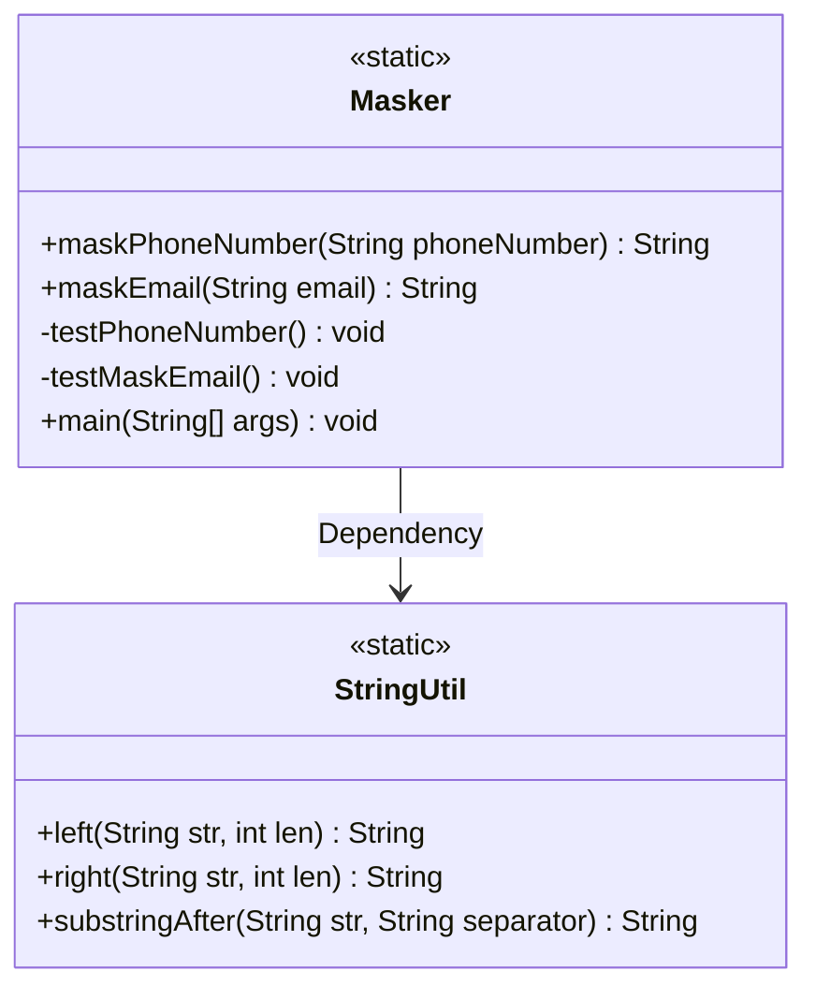
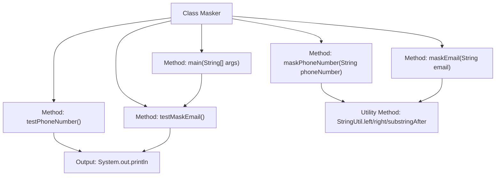
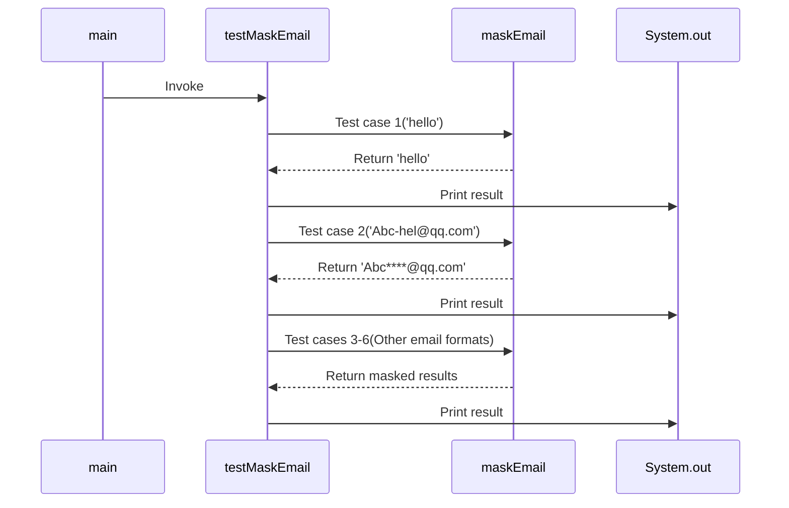

# Basic Information

|      |      |
|------|------|
| Name | Masker |
| Language | .java |
| Code Path | WeFe/common/java/common-lang/src/main/java/com/welab/wefe/common/util/Masker.java |
| Package Name | com.welab.wefe.common.util |
| Dependencies | [] |
| Brief Description | The Masker class provides phone number and email masking functionality. Phone numbers retain the first few digits and the last two digits, with asterisks replacing the middle part; emails retain some characters before the @ symbol, followed by asterisks and the domain. It handles edge cases such as short inputs or invalid formats. |

# Description

The Masker class provides masking methods for phone numbers and email addresses. Phone numbers are masked by retaining the first few digits and the last two digits, with asterisks replacing the middle part, e.g., 13880000088 becomes 1388*****88. Email addresses are masked by retaining some characters before the @ symbol and replacing the rest with asterisks, e.g., Abc-hel@qq.com becomes Abc****@qq.com. Various edge cases are considered during processing, such as empty input, insufficient length, or mismatched formats. Test methods validate the processing results for different inputs.

# Class Summary

| Name   | Type  | Description |
|-------|------|-------------|
| Masker | class | The Masker class provides phone number and email masking functionality. For phone numbers, it retains the first few digits and the last two digits, replacing the middle part with asterisks. For emails, it keeps some characters before the @ symbol and replaces the rest with asterisks, ensuring at least one plaintext character is displayed. |

## Class Masker

|      |      |
|------|------|
| Access Modifier | public |
| Type | class |
| Name | Masker |
| Description | The Masker class provides phone number and email masking functionality. For phone numbers, it retains the first few digits and the last two digits, replacing the middle part with asterisks. For emails, it keeps some characters before the @ symbol and replaces the rest with asterisks, ensuring at least one plaintext character is displayed. |

### UML Class Diagram

Class Diagram Description:  
The Masker class provides two core static methods: maskPhoneNumber for masking phone numbers (retaining the first 4 and last 2 digits) and maskEmail for masking email addresses (retaining partial characters before the @ symbol). Both methods include input parameter validation logic, with maskEmail additionally implementing dynamic mask length calculation. StringUtil is depended upon as a utility class, providing string truncation functionality. The test methods testPhoneNumber and testMaskEmail are used to verify core logic, while the main method serves as the program entry point.

### Internal Method Call Graph

This code implements a data masking utility class, primarily containing phone number and email masking functionalities. The flowchart illustrates the class structure and method invocation relationships, while the sequence diagram details the execution flow when the main method calls testMaskEmail. The maskPhoneNumber method handles phone number masking by preserving the first few digits and last two digits; the maskEmail method processes email masking by retaining partial characters before the @ symbol and replacing others with asterisks. Both methods include exception handling for cases like null values or overly short strings. Test methods verify the correctness of masking logic through various edge cases.

### Field List

| Name  | Type  | Description |
|-------|-------|------|

### Method List

| Name  | Type  | Description |
|-------|-------|------|
| main | void | Java main method calls the test function testMaskEmail. |
| testPhoneNumber | void | Testing the phone number masking function, inputs include short codes, domestic mobile numbers, international format mobile numbers, and excessively long digits, with the output being the masked results. |
| maskPhoneNumber | String | This method is used to hide the middle five digits of a phone number, keeping the first few digits and the last two digits. If the phone number is empty or has fewer than 11 digits, it will be returned as-is. |
| testMaskEmail | void | Test the maskEmail method with inputs including regular strings and email addresses of varying lengths, and output the processed results for each string. |
| maskEmail | String | This method is used to mask an email address. If the email is empty or in an invalid format, it will be returned directly. By default, the first 4 characters before the @ symbol are masked. If there are fewer than 4 characters, half of them are masked, with at least 1 character remaining unmasked. The final result is the masked email string. |

