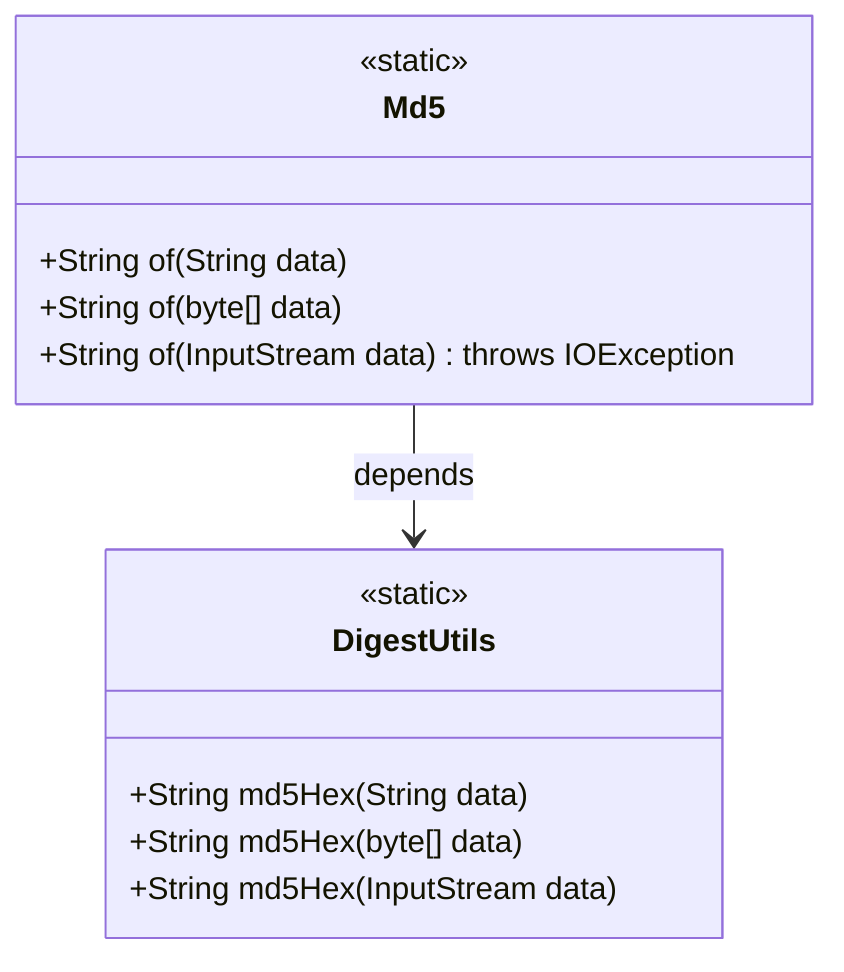
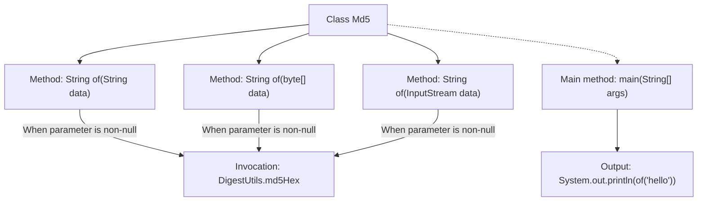

# Basic Information

|      |      |
|------|------|
| Name | Md5 |
| Language | .java |
| Code Path | WeFe/common/java/common-lang/src/main/java/com/welab/wefe/common/util/Md5.java |
| Package Name | com.welab.wefe.common.util |
| Dependencies | ['org.apache.commons.codec.digest.DigestUtils', 'java.io.IOException', 'java.io.InputStream'] |
| Brief Description | The Md5 class provides static methods to support MD5 hash calculation for strings, byte arrays, and input streams, returning null for empty inputs. Example: calculating the hash value of "hello". |

# Description

This is a utility class named Md5 that provides three static methods for generating MD5 hash values. The methods support three input types: string, byte array, and input stream, returning null if the input is null. The string method directly processes text, the byte array method handles binary data, and the input stream method reads and processes the stream content. The class includes a main method example demonstrating how to generate an MD5 hash for the string "hello" and print the result. All methods rely on DigestUtils.md5Hex to implement the core hash computation functionality.

# Class Summary

| Name   | Type  | Description |
|-------|------|-------------|
| Md5 | class | The Md5 class provides static methods to generate MD5 hash values for strings, byte arrays, and input streams, returning null for empty inputs. Example output shows the MD5 value of "hello". |

## Class Md5

|      |      |
|------|------|
| Access Modifier | public |
| Type | class |
| Name | Md5 |
| Description | The Md5 class provides static methods to generate MD5 hash values for strings, byte arrays, and input streams, returning null for empty inputs. Example output shows the MD5 value of "hello". |

### UML Class Diagram

This code demonstrates an Md5 utility class that provides three static methods for calculating MD5 hash values from different input types (String, byte array, InputStream). All methods implement the core functionality by calling the DigestUtils.md5Hex() method from the Apache Commons Codec library, with uniform handling of null inputs. The class diagram clearly shows the dependency relationship between the Md5 class and the DigestUtils utility class, as well as the static nature of all methods.

### Internal Method Call Graph

Flowchart description: This flowchart illustrates the structure of the Md5 class, which contains three overloaded static methods named "of" that handle String, byte[], and InputStream type data respectively. When parameters are non-null, they invoke DigestUtils.md5Hex to generate MD5 hashes. The main method demonstrates the MD5 calculation process for the string "hello". All methods follow a null-check pattern, ensuring null is returned for null inputs.

### Field List

| Name  | Type  | Description |
|-------|-------|------|

### Method List

| Name  | Type  | Description |
|-------|-------|------|
| of | String | This method takes a string parameter and returns null if it is empty, otherwise returns its MD5 hash value. |
| of | String | This method takes a byte array as input, returns null if the array is empty, otherwise returns the hexadecimal string of its MD5 hash value. |
| of | String | This method takes an input stream parameter, returns null if it is empty, otherwise calculates and returns its MD5 hash value. May throw an IOException. |
| main | void | The main method in Java prints the string "hello". |

