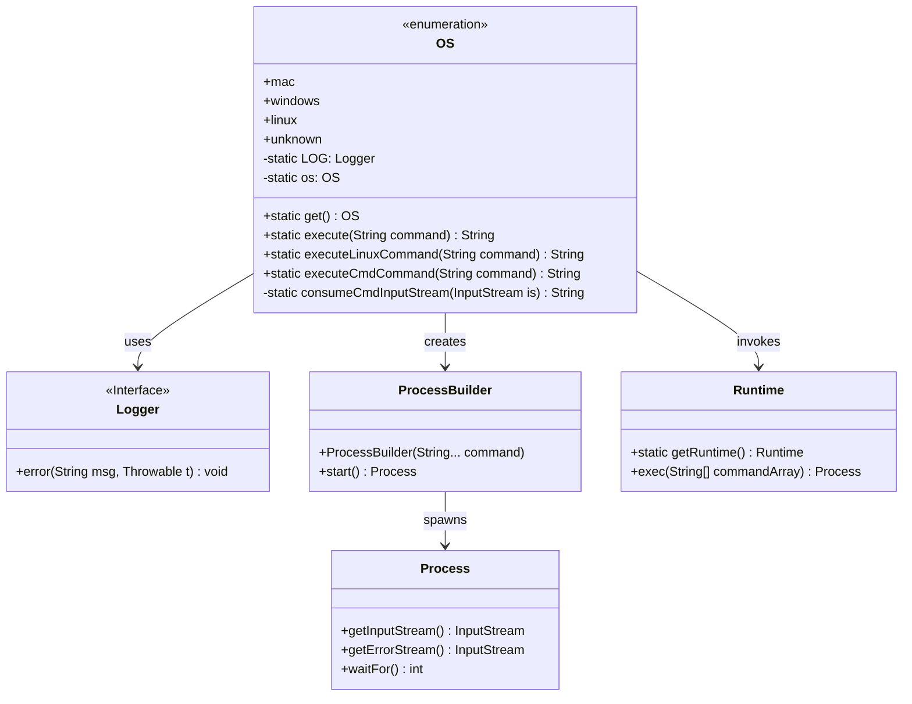
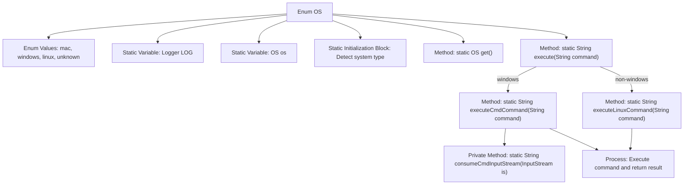
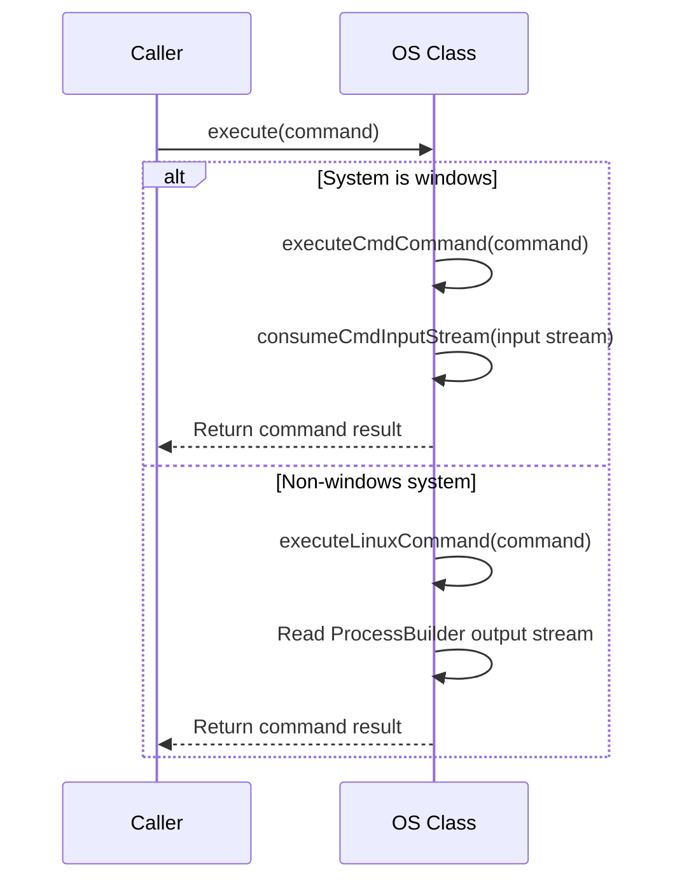

# Basic Information

|      |      |
|------|------|
| Name | OS |
| Language | .java |
| Code Path | WeFe/common/java/common-lang/src/main/java/com/welab/wefe/common/util/OS.java |
| Package Name | com.welab.wefe.common.util |
| Dependencies | ['org.slf4j.Logger', 'org.slf4j.LoggerFactory', 'java.io.BufferedReader', 'java.io.IOException', 'java.io.InputStream', 'java.io.InputStreamReader', 'java.nio.charset.StandardCharsets'] |
| Brief Description | The code defines an enumeration class `OS` containing four operating system types: mac, windows, linux, and unknown. It automatically detects the current system type through a static initialization block and provides a method to execute system commands, supporting different command execution approaches for Windows and Linux/Mac. |

# Description

The code defines an enumeration class `OS` containing four enum values: `mac`, `windows`, `linux`, and `unknown`. A static initialization block detects the current operating system type and assigns it to the static variable `os`. It provides a `get` method to retrieve the current operating system type and an `execute` method to execute system commands, invoking different command execution methods based on the OS type. For Linux systems, commands are executed using `sh`, while for Windows systems, they are executed via `powershell`. The command execution results are read through streams and returned, with error messages logged.

# Class Summary

| Name   | Type  | Description |
|-------|------|-------------|
| OS | enum | Define an enumeration OS to represent operating system types, including mac, windows, linux, and unknown. The static method get() returns the current system type, while execute() executes commands based on the system type and returns results, supporting command execution for both Linux and Windows. |

## Class OS

|      |      |
|------|------|
| Access Modifier | public |
| Type | enum |
| Name | OS |
| Description | Define an enumeration OS to represent operating system types, including mac, windows, linux, and unknown. The static method get() returns the current system type, while execute() executes commands based on the system type and returns results, supporting command execution for both Linux and Windows. |

### UML Class Diagram

This code defines an enumeration class `OS` for detecting operating system types and providing cross-platform command execution functionality. The class diagram illustrates the relationships between the `OS` enumeration and the `Logger` interface, `ProcessBuilder`, `Process`, and `Runtime` classes. The `OS` class uses the static method `execute()` to select and execute either Windows PowerShell commands or Linux Shell commands based on the current operating system type. Internally, it employs `ProcessBuilder` and `Runtime` to create processes and handle command output, while utilizing `Logger` to log error information. The overall design implements core functionalities for automatic operating system detection and cross-platform command execution.

### Internal Method Call Graph

This code implements a cross-platform system command execution utility. The OS enum automatically detects the operating system type through a static initialization block and provides a unified execute() method for command execution. The core workflow is: select the execution method based on system type (PowerShell for Windows/sh for non-Windows), read the process output stream, handle exceptions, and return results. The code handles different platform commands through ProcessBuilder and Runtime approaches, uses GBK encoding to resolve Chinese garbled text issues, and logs exception information.

### Field List

| Name  | Type  | Description |
|-------|-------|------|

### Method List

| Name  | Type  | Description |
|-------|-------|------|

