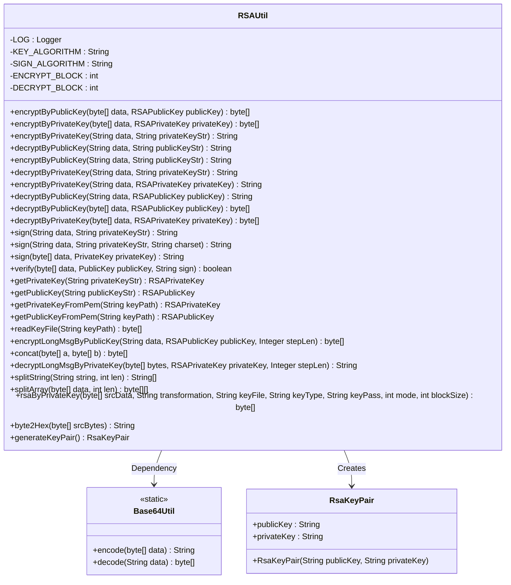
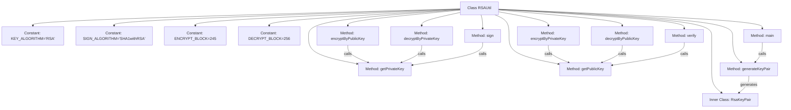

# Basic Information

|      |      |
|------|------|
| Name | RSAUtil |
| Language | .java |
| Code Path | WeFe/common/java/common-lang/src/main/java/com/welab/wefe/common/util/RSAUtil.java |
| Package Name | com.welab.wefe.common.util |
| Dependencies | ['com.alibaba.fastjson.JSON', 'org.apache.commons.codec.binary.Base64', 'org.slf4j.Logger', 'org.slf4j.LoggerFactory', 'org.springframework.util.Base64Utils', 'javax.crypto.Cipher', 'java.io', 'java.nio.charset.StandardCharsets', 'java.security', 'java.security.interfaces.RSAPrivateKey', 'java.security.interfaces.RSAPublicKey', 'java.security.spec.PKCS8EncodedKeySpec', 'java.security.spec.X509EncodedKeySpec', 'java.util.Enumeration'] |
| Brief Description | RSA utility class, providing public/private key encryption and decryption, signature verification, key conversion, and long text segmentation processing functions, with support for Base64 encoding. |

# Description

The code implements an RSA encryption utility class, encompassing functionalities such as key generation, encryption/decryption, and signature verification. Key features include: encrypting and decrypting data using public or private keys with support for segmented processing of large data; providing methods for converting between strings and key objects; implementing the SHA1withRSA signature algorithm; supporting key reading from PEM files; and including key pair generation capability. The class defines constants for encryption block sizes and handles Base64 encoding/decoding. The utility class encapsulates a complete RSA operation workflow, making it suitable for various encryption scenarios.

# Class Summary

| Name   | Type  | Description |
|-------|------|-------------|
| RSAUtil | class | RSA utility class, providing public/private key encryption and decryption, signature generation and verification, key generation, and format conversion functions, with support for segmented processing of long data. |

## Class RSAUtil

|      |      |
|------|------|
| Access Modifier | public |
| Type | class |
| Name | RSAUtil |
| Description | RSA utility class, providing public/private key encryption and decryption, signature generation and verification, key generation, and format conversion functions, with support for segmented processing of long data. |

### UML Class Diagram

This code implements a comprehensive RSA encryption utility class, encompassing core functionalities such as key generation, encryption/decryption, and signing/verification. The class diagram illustrates RSAUtil as the main class, providing various cryptographic operations through static methods, relying on Base64Util for encoding conversion, and embedding the RsaKeyPair class to store key pairs. Key features include segmented encryption for large texts, support for reading PEM-format key files, offering multiple encryption modes (e.g., ECB/PKCS1Padding), and a complete exception handling mechanism.

### Internal Method Call Graph

This flowchart illustrates the core structure and method invocation relationships of the RSAUtil class. The class contains 4 encryption-related constants, 6 core encryption/decryption methods (supporting public/private key operations), 2 signature verification methods, 2 key conversion methods, 1 key pair generation method, and 1 inner class RsaKeyPair. Arrows indicate method dependencies, such as encryptByPublicKey calling getPublicKey for key conversion. The overall structure clearly reflects the implementation logic of RSA asymmetric encryption, including key handling, data chunking, Base64 encoding/decoding, and other critical components.

### Field List

| Name  | Type  | Description |
|-------|-------|------|
| KEY_ALGORITHM = "RSA" | String | Define the static constant string KEY_ALGORITHM for the RSA algorithm. |
| LOG = LoggerFactory.getLogger(RSAUtil.class) | Logger | Define a private static log constant LOG for the RSAUtil class. |
| DECRYPT_BLOCK = 256 | int | The private static constant DECRYPT_BLOCK has a value of 256, which is used for the decryption block size. |
| SIGN_ALGORITHM = "SHA1withRSA" | String | Define the constant SIGN_ALGORITHM with the value SHA1withRSA signature algorithm. |
| ENCRYPT_BLOCK = 245 | int | Private static constant with an encryption block size of 245 bytes. |

### Method List

| Name  | Type  | Description |
|-------|-------|------|
| decryptByPublicKey | String | Decrypt data using the public key string by first converting it into an RSAPublicKey object and then calling the decryption method. |
| decryptLongMsgByPrivateKey | String | Decrypting long messages in segments using an RSA private key. Group decryption is performed based on step size or modulus length, and the results are concatenated before returning. |
| sign | String | Sign the byte array data using a private key and return the Base64-encoded signature result. |
| decryptByPublicKey | String | Using RSA public key to decrypt Base64-encoded data in segments, supporting PKCS1 padding, and returning a UTF-8 string. |
| encryptByPublicKey | String | Encrypt data using RSA public key, with the input being a string and the public key, and output the Base64-encoded encrypted result. |
| getPublicKeyFromPem | RSAPublicKey | Reading RSA public key from PEM file: Read the file content, use X509 encoded key specification, and generate an RSAPublicKey object through the key factory. |
| encryptByPrivateKey | String | Encrypt data using a private key string and return the encrypted result. |
| encryptByPublicKey | byte[] | Encrypt data using RSA public key and return the encrypted byte array. |
| decryptByPrivateKey | byte[] | Decrypt data using a private key, with the input being a byte array and an RSA private key, and return the decrypted byte array. |
| encryptByPrivateKey | String | Encrypt data using an RSA private key, process it in chunks, and return the result encoded in Base64. |
| sign | String | Sign the data using an RSA private key and return the Base64-encoded signature result. |
| decryptByPrivateKey | String | Decrypt data using an RSA private key, including private key conversion, initializing the decryptor, Base64 decoding, and UTF-8 encoding processing. |
| encryptLongMsgByPublicKey | byte[] | Using RSA public key to encrypt long text in segments, with the default block length being the modulus length divided by 8 minus 11. The results are merged after iterative encryption and returned as a byte array. |
| sign | String | Sign the data using an RSA private key and return the Base64-encoded signature result. |
| getPublicKey | RSAPublicKey | This method converts a Base64-encoded RSA public key string into an RSAPublicKey object, using the X509 standard for decoding and key generation. |
| verify | boolean | Method for verifying data signature: Use the public key and specified algorithm to check whether the data matches the signature, returning a boolean result. |
| concat | byte[] | The static method `concat` merges two byte arrays `a` and `b`, returning a new array `c` with a length equal to `a` plus `b`. It uses `System.arraycopy` to sequentially copy `a` and `b` into `c`. |
| decryptByPublicKey | byte[] | Using RSA public key to decrypt data: pass in the encrypted data and public key, initialize the Cipher in decryption mode, execute the decryption, and return the result. |
| getPrivateKeyFromPem | RSAPrivateKey | Read the RSA private key from a PEM file and generate an RSAPrivateKey object using the PKCS8 encoding specification. |
| readKeyFile | byte[] | Read the key file, filter out lines starting with '-', and return the Base64-decoded byte array. If the file does not exist or a read error occurs, an exception will be thrown. |
| getPrivateKey | RSAPrivateKey | This method generates an RSA private key object from a Base64-encoded private key string, decodes it using the PKCS8 specification, and converts it through a key factory. |
| splitString | String[] | Split a string into an array of specified lengths, handle the remainder part, and return the resulting array of strings. |
| splitArray | byte[][] | Split the byte array into a two-dimensional array by specified length, handle the remainder part, and return the segmented result. |
| rsaByPrivateKey | byte[] | Use a private key to perform RSA encryption or decryption on data, supporting chunk processing. Requires providing the key file, type, password, and operation mode. |
| encryptByPrivateKey | byte[] | Encrypt data using an RSA private key and return the encrypted byte array. Requires passing in the data and private key, and may throw exceptions. |
| byte2Hex | String | Convert a byte array to a hexadecimal string, with each byte converted to a two-digit hexadecimal number, padding with zeros if necessary. |
| generateKeyPair | RsaKeyPair | Generate an RSA key pair, with the public and private keys returned after Base64 encoding. Returns null if the algorithm is not supported. Key length is 2048 bits. |
| main | void | Generate RSA key pairs in Java main method and output the results in JSON format. |

