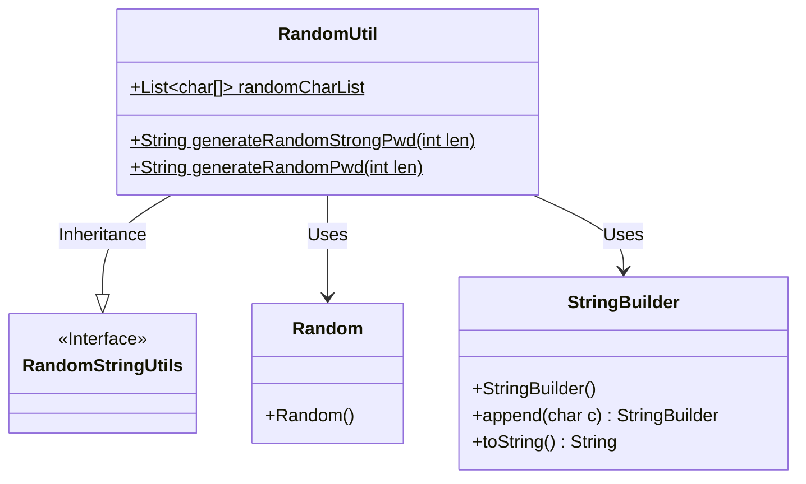
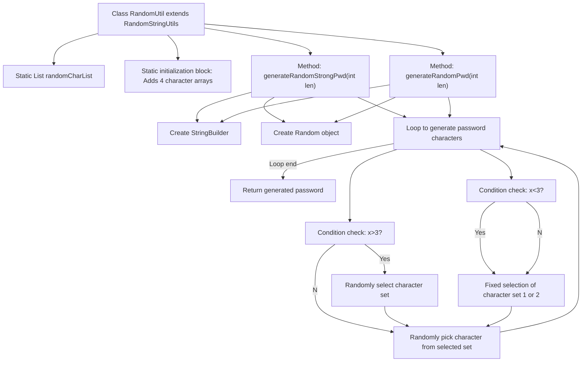

# Basic Information

|      |      |
|------|------|
| Name | RandomUtil |
| Language | .java |
| Code Path | WeFe/common/java/common-lang/src/main/java/com/welab/wefe/common/util/RandomUtil.java |
| Package Name | com.welab.wefe.common.util |
| Dependencies | ['org.apache.commons.lang3.RandomStringUtils', 'java.util'] |
| Brief Description | The RandomUtil class provides functionality for generating random passwords, including two methods: strong passwords and regular passwords. Strong passwords combine uppercase and lowercase letters, numbers, and special characters, while regular passwords use only lowercase letters and numbers. |

# Description

The RandomUtil class inherits from RandomStringUtils and is used to generate random passwords. It includes a static character array list called randomCharList, which is initialized by adding four character sets: uppercase letters, lowercase letters, digits, and special symbols. It provides two methods: generateRandomStrongPwd generates a strong password, where the first four characters are taken from different character sets, and the subsequent characters are randomly selected from any character set; generateRandomPwd generates a regular password, where the first three characters are taken from lowercase letters, and the subsequent characters are taken from digits. Both methods accept a length parameter and use the Random class to implement random selection.

# Class Summary

| Name   | Type  | Description |
|-------|------|-------------|
| RandomUtil | class | The RandomUtil class provides functionality for generating random passwords, including uppercase and lowercase letters, numbers, and special characters. The `generateRandomStrongPwd` method generates a strong password, ensuring the first four characters include each character type. The `generateRandomPwd` method generates a standard password using only lowercase letters and numbers. |

## Class RandomUtil

|      |      |
|------|------|
| Access Modifier | public |
| Type | class |
| Name | RandomUtil |
| Description | The RandomUtil class provides functionality for generating random passwords, including uppercase and lowercase letters, numbers, and special characters. The `generateRandomStrongPwd` method generates a strong password, ensuring the first four characters include each character type. The `generateRandomPwd` method generates a standard password using only lowercase letters and numbers. |

### UML Class Diagram

This code illustrates a random password generation utility class RandomUtil, which inherits from the RandomStringUtils interface. The class contains a static character list randomCharList for storing four character sets: uppercase letters, lowercase letters, digits, and special symbols. It provides two main methods: generateRandomStrongPwd generates a strong password (randomly selected from all character sets), while generateRandomPwd generates a regular password (selected only from lowercase letters and digits). The class relies on Java's Random class for random number generation and uses StringBuilder to construct the password string.

### Internal Method Call Graph

This code implements a random password generator utility class containing two password generation methods. The static initialization block preloads 4 character sets (uppercase letters, lowercase letters, numbers, and special symbols). The generateRandomStrongPwd method randomly mixes all character sets to generate strong passwords, while the generateRandomPwd method only uses lowercase letters and numbers to generate regular passwords. The flowchart clearly illustrates the class structure, initialization process, and the logical flow of both password generation methods, including key steps such as loops, conditional checks, and character selection.

### Field List

| Name  | Type  | Description |
|-------|-------|------|
| randomCharList = new ArrayList<>() | List<char[]> | Declare a static public list randomCharList to store the character array. |

### Method List

| Name  | Type  | Description |
|-------|-------|------|
| generateRandomStrongPwd | String | Methods for generating random strong passwords, where the first 4 characters are selected from fixed positions and subsequent characters are randomly selected, returning a password string of the specified length. |
| generateRandomPwd | String | Generate a random password where the first 3 characters are specific, and the rest are from another set of characters, with the length specified by a parameter. |

