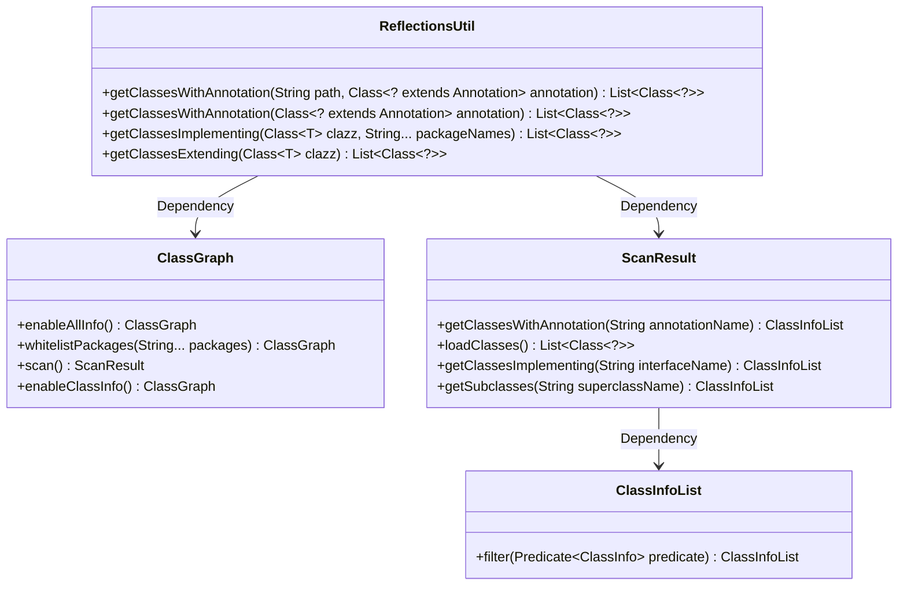
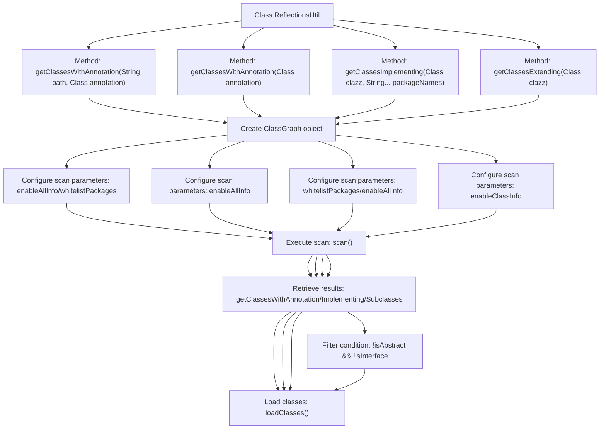

# Basic Information

|      |      |
|------|------|
| Name | ReflectionsUtil |
| Language | .java |
| Code Path | WeFe/common/java/common-lang/src/main/java/com/welab/wefe/common/util/ReflectionsUtil.java |
| Package Name | com.welab.wefe.common.util |
| Dependencies | ['io.github.classgraph.ClassGraph', 'io.github.classgraph.ScanResult', 'java.lang.annotation.Annotation', 'java.util.List'] |
| Brief Description | The ReflectionsUtil class provides four static methods: scanning classes via annotations, obtaining interface implementation classes and subclasses, and implementing classpath scanning using the ClassGraph library. |

# Description

ReflectionsUtil is a Java utility class that provides reflection scanning capabilities based on the ClassGraph library. It includes four core methods: 1. Scan classes with specific annotations under a specified package path; 2. Scan classes with specific annotations across all paths; 3. Retrieve implementation classes of a specified interface within a specific package; 4. Retrieve non-abstract, non-interface subclasses of a specified type. All methods employ try-with-resources to ensure automatic release of ScanResult resources, using ClassGraph to build scan conditions and load matched class information.

# Class Summary

| Name   | Type  | Description |
|-------|------|-------------|
| ReflectionsUtil | class | The ReflectionsUtil class provides four static methods: scanning classes via annotations, obtaining interface implementation classes and specified type subclasses, all implemented using the ClassGraph library. |

## Class ReflectionsUtil

|      |      |
|------|------|
| Access Modifier | public |
| Type | class |
| Name | ReflectionsUtil |
| Description | The ReflectionsUtil class provides four static methods: scanning classes via annotations, obtaining interface implementation classes and specified type subclasses, all implemented using the ClassGraph library. |

### UML Class Diagram

This code demonstrates the ReflectionsUtil utility class, which implements classpath scanning functionality through the ClassGraph library, containing four core methods: finding classes by annotation, obtaining interface implementation classes, and retrieving type subclasses. The class diagram clearly illustrates the interaction between the utility class and the ClassGraph library, with ScanResult handling scan results and ClassInfoList providing filtering capabilities, forming a complete class scanning toolchain. All methods employ try-with-resources to ensure resource release, reflecting sound resource management practices.

### Internal Method Call Graph

This code flowchart illustrates four core reflection operations of the ReflectionsUtil utility class. All methods leverage the ClassGraph library for classpath scanning, implementing three functionalities through different configuration parameters: retrieving annotated classes, interface-implementing classes, and type-subclassing classes. Each method follows a standard workflow of "create scanner → configure parameters → execute scan → process results", with the getClassesExtending method additionally incorporating filtering logic for abstract classes and interfaces. The methods share a similar scanning framework but vary in parameter configuration, reflecting the design philosophy of the strategy pattern.

### Field List

| Name  | Type  | Description |
|-------|-------|------|

### Method List

| Name  | Type  | Description |
|-------|-------|------|
| getClassesWithAnnotation | List<Class<?>> | Scan classes with specific annotations under the specified path and return a list of classes. Implemented using the ClassGraph library with automatic resource closure. |
| getClassesWithAnnotation | List<Class<?>> | Scan the classpath and return all classes with the specified annotation. The ClassGraph library is used to scan and load class information, automatically managing resources. |
| getClassesImplementing | List<Class<?>> | This method scans all classes within the specified package that implement the given interface or extend the parent class, returning a list of class objects. It utilizes the ClassGraph library for classpath scanning and supports filtering by multiple package names. |
| getClassesExtending | List<Class<?>> | Retrieve all non-abstract, non-interface subclasses of the specified class. Use ClassGraph to scan and filter the results, returning a list of classes that meet the criteria. |

