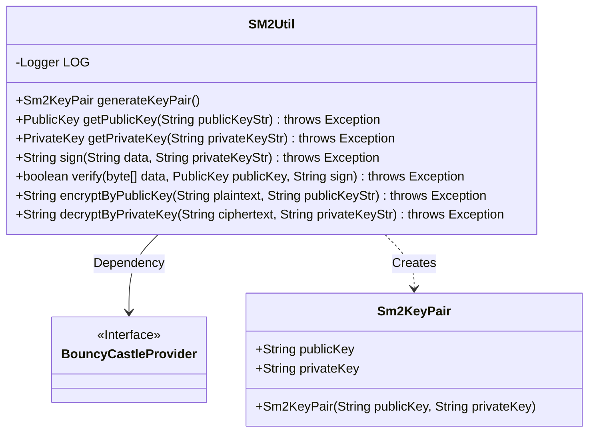

# Basic Information

|      |      |
|------|------|
| Name | SM2Util |
| Language | .java |
| Code Path | WeFe/common/java/common-lang/src/main/java/com/welab/wefe/common/util/SM2Util.java |
| Package Name | com.welab.wefe.common.util |
| Dependencies | ['org.apache.commons.codec.binary.Base64', 'org.bouncycastle.asn1.gm.GMNamedCurves', 'org.bouncycastle.asn1.gm.GMObjectIdentifiers', 'org.bouncycastle.asn1.x9.X9ECParameters', 'org.bouncycastle.crypto.engines.SM2Engine', 'org.bouncycastle.crypto.params.ECDomainParameters', 'org.bouncycastle.crypto.params.ECPrivateKeyParameters', 'org.bouncycastle.crypto.params.ECPublicKeyParameters', 'org.bouncycastle.crypto.params.ParametersWithRandom', 'org.bouncycastle.jcajce.provider.asymmetric.ec.BCECPrivateKey', 'org.bouncycastle.jcajce.provider.asymmetric.ec.BCECPublicKey', 'org.bouncycastle.jce.provider.BouncyCastleProvider', 'org.bouncycastle.jce.spec.ECParameterSpec', 'org.bouncycastle.math.ec.ECPoint', 'org.bouncycastle.util.encoders.Hex', 'org.slf4j.Logger', 'org.slf4j.LoggerFactory', 'java.math.BigInteger', 'java.nio.charset.StandardCharsets', 'java.security', 'java.security.spec.ECGenParameterSpec', 'org.bouncycastle.jce.spec.ECPrivateKeySpec', 'org.bouncycastle.jce.spec.ECPublicKeySpec'] |
| Brief Description | The SM2Util class provides SM2 national cryptographic algorithm utilities, including key generation, public/private key conversion, signature verification, public key encryption, and private key decryption functions, implemented based on BouncyCastle. |

# Description

The SM2Util class implements key generation, format conversion, signature verification, and encryption/decryption functionalities for the Chinese national cryptographic SM2 algorithm. The static initialization block ensures the BouncyCastle security provider is registered. The generateKeyPair method generates an SM2 key pair and returns the public/private keys in hexadecimal string format. The inner class Sm2KeyPair encapsulates the key pair. The getPublicKey/getPrivateKey methods enable bidirectional conversion between strings and key objects. The sign/verify methods provide SM3 hash-based signature verification functionality. The encryptByPublicKey/decryptByPrivateKey methods implement SM2 asymmetric encryption/decryption using the C1C3C2 mode, with all data transmitted in Base64 encoding. All operations rely on the BouncyCastle cryptography library for implementation.

# Class Summary

| Name   | Type  | Description |
|-------|------|-------------|
| SM2Util | class | The SM2Util class provides SM2 national cryptographic algorithm utilities, including key pair generation, public/private key conversion, signature verification, public key encryption, and private key decryption functions, implemented based on BouncyCastle. |

## Class SM2Util

|      |      |
|------|------|
| Access Modifier | public |
| Type | class |
| Name | SM2Util |
| Description | The SM2Util class provides SM2 national cryptographic algorithm utilities, including key pair generation, public/private key conversion, signature verification, public key encryption, and private key decryption functions, implemented based on BouncyCastle. |

### UML Class Diagram

This code represents an SM2 encryption utility class, whose main functionalities include generating key pairs, public/private key format conversion, signing/verification, and encryption/decryption operations. The class diagram includes the main utility class SM2Util and its inner class Sm2KeyPair, while also depending on the BouncyCastleProvider cryptographic library interface. SM2Util provides a complete implementation of the SM2 national cryptographic algorithm through static methods, covering core cryptographic operations such as key management, data encryption, and digital signatures.

### Internal Method Call Graph

```mermaid
graph TD
    A["Class SM2Util"]
    B["Static Block: Register BouncyCastleProvider"]
    C["Method: generateKeyPair()"]
    D["Inner Class: Sm2KeyPair"]
    E["Method: getPublicKey(String)"]
    F["Method: getPrivateKey(String)"]
    G["Method: sign(String, String)"]
    H["Method: verify(byte[], PublicKey, String)"]
    I["Method: encryptByPublicKey(String, String)"]
    J["Method: decryptByPrivateKey(String, String)"]

    A --> B
    A --> C
    A --> D
    A --> E
    A --> F
    A --> G
    A --> H
    A --> I
    A --> J

    C --> C1["Create ECGenParameterSpec"]
    C --> C2["Initialize KeyPairGenerator"]
    C --> C3["Generate Key Pair"]
    C --> C4["Convert Key Format"]
    C --> C5["Return Sm2KeyPair"]

    E --> E1["Get Elliptic Curve Parameters"]
    E --> E2["Decode Public Key String"]
    E --> E3["Generate PublicKey Object"]

    F --> F1["Convert Private Key String"]
    F --> F2["Generate PrivateKey Object"]

    G --> G1["Get Signature Instance"]
    G --> G2["Initialize Signature"]
    G --> G3["Generate Signature"]
    G --> G4["Return Base64 Encoding"]

    H --> H1["Get Signature Instance"]
    H --> H2["Initialize Verification"]
    H --> H3["Execute Verification"]

    I --> I1["Get PublicKey Object"]
    I --> I2["Initialize SM2Engine"]
    I --> I3["Execute Encryption"]
    I --> I4["Return Base64 Encoding"]

    J --> J1["Get PrivateKey Object"]
    J --> J2["Initialize SM2Engine"]
    J --> J3["Execute Decryption"]
    J --> J4["Return Decryption Result"]
```

This flowchart illustrates the complete structure of the SM2Util class, which primarily includes core functionalities such as key generation, format conversion, signature verification, and encryption/decryption. The static block ensures registration of BouncyCastleProvider, while the generateKeyPair() method implements SM2 key pair generation. The inner class Sm2KeyPair encapsulates public/private key strings. Other methods handle public/private key format conversion, data signing/verification, and SM2 algorithm-based encryption/decryption operations, forming a comprehensive toolkit for national cryptographic algorithms. The internal workflows of each method clearly demonstrate the processing chain from parameter preparation to core operations and result return.

### Field List

| Name  | Type  | Description |
|-------|-------|------|
| LOG = LoggerFactory.getLogger(IpAddressUtil.class) | Logger | The IpAddressUtil class defines a static immutable logger named LOG. |

### Method List

| Name  | Type  | Description |
|-------|-------|------|
| generateKeyPair | Sm2KeyPair | Generate an SM2 key pair, including hexadecimal strings of the public and private keys. Implement using the BouncyCastle library, returning null in case of exceptions. |
| sign | String | This method uses the SM2 algorithm and SM3 hash to sign the input data. It takes the input data and a private key string, and returns a Base64-encoded signature result. |
| getPrivateKey | PrivateKey | This method converts an SM2 private key string in HEX format into a BCECPrivateKey object, utilizing the BouncyCastle library to handle elliptic curve parameters. |
| getPublicKey | PublicKey | This method generates an SM2 elliptic curve public key object from a public key string, including parsing curve parameters, decoding the public key point, and converting it into a BCECPublicKey instance. |
| verify | boolean | SM2 signature verification method, using SM3 hash and BouncyCastle library, takes input data, public key, and signature, and returns the verification result. |
| encryptByPublicKey | String | Encrypt the plaintext using an SM2 public key to generate a Base64-encoded ciphertext. |
| decryptByPrivateKey | String | Decrypt a string using the SM2 algorithm and private key, involving key parameter conversion, Base64 decoding, and decryption processing. |

