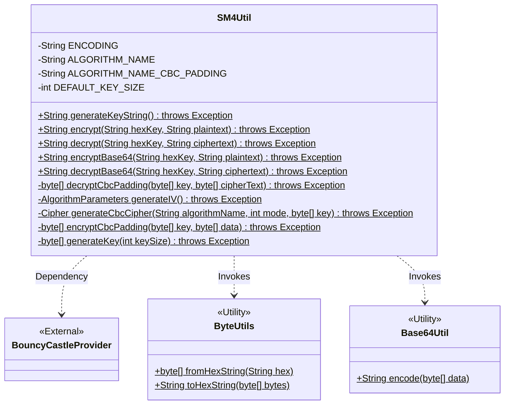
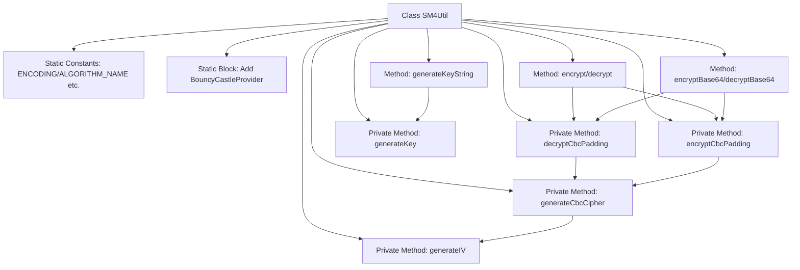
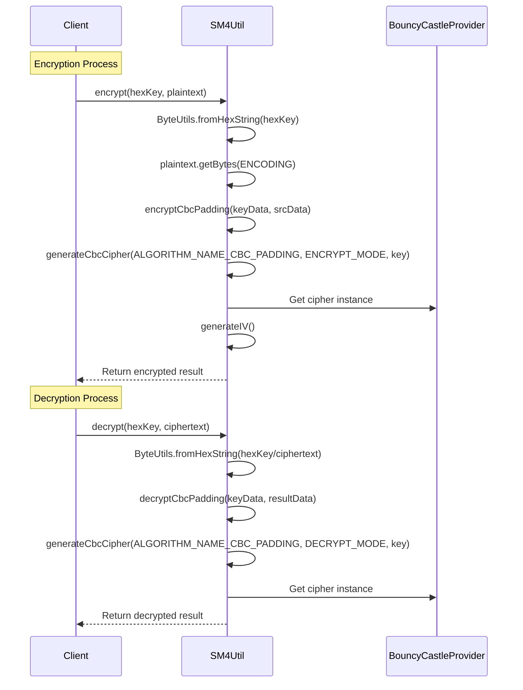

# Basic Information

|      |      |
|------|------|
| Name | SM4Util |
| Language | .java |
| Code Path | WeFe/common/java/common-lang/src/main/java/com/welab/wefe/common/util/SM4Util.java |
| Package Name | com.welab.wefe.common.util |
| Dependencies | ['org.apache.commons.codec.binary.Base64', 'org.apache.commons.codec.binary.Hex', 'org.bouncycastle.jce.provider.BouncyCastleProvider', 'org.bouncycastle.pqc.math.linearalgebra.ByteUtils', 'javax.crypto.Cipher', 'javax.crypto.KeyGenerator', 'javax.crypto.spec.IvParameterSpec', 'javax.crypto.spec.SecretKeySpec', 'java.security.AlgorithmParameters', 'java.security.Key', 'java.security.SecureRandom', 'java.security.Security', 'java.util.Arrays'] |
| Brief Description | The SM4Util class provides SM4 encryption functionality, supports CBC mode, includes key generation and encryption/decryption methods, and supports hexadecimal and Base64 formats. |

# Description

SM4Util is a utility class for SM4 encryption and decryption, supporting CBC mode with PKCS5Padding. Its main functions include generating 128-bit key strings, as well as encryption and decryption in hexadecimal and Base64 formats. UTF-8 encoding is used for encryption and decryption, with the key being a hexadecimal string (case-insensitive). Internally, it employs BouncyCastleProvider and implements CBC mode encryption/decryption via Cipher, using an all-zero initialization vector (IV). It provides functionalities for key generation, CBC mode encryption/decryption, and Base64 encoding/decoding.

# Class Summary

| Name   | Type  | Description |
|-------|------|-------------|
| SM4Util | class | The SM4Util class provides SM4 encryption functionality, supports CBC mode, includes key generation and encryption/decryption methods, and supports hexadecimal and Base64 formats. |

## Class SM4Util

|      |      |
|------|------|
| Access Modifier | public |
| Type | class |
| Name | SM4Util |
| Description | The SM4Util class provides SM4 encryption functionality, supports CBC mode, includes key generation and encryption/decryption methods, and supports hexadecimal and Base64 formats. |

### UML Class Diagram

This diagram illustrates the structure of the SM4Util encryption utility class, which is a static utility class providing SM4 algorithm key generation, CBC mode encryption/decryption, and Base64 encoding functionalities. The class contains private constant definitions and 9 core methods, including 5 public static encryption/decryption methods and 4 private helper methods. It depends on the BouncyCastleProvider security library and utilizes ByteUtils and Base64Util utility classes for data format conversion. All methods declare possible exception throws, reflecting the inherent uncertainty of cryptographic operations.

### Internal Method Call Graph

This flowchart demonstrates the complete structure of the SM4Util encryption utility class, including constant definitions, key generation, and core CBC mode encryption/decryption functionalities. The sequence diagram details the interaction sequence between components during encryption/decryption processes, particularly highlighting security service interactions with BouncyCastleProvider. The class design adopts a layered architecture where public methods rely on underlying private methods to implement SM4 algorithm operations. All encryption operations use CBC mode with PKCS5 padding scheme, reflecting full compliance with the national cryptographic algorithm implementation standards.

### Field List

| Name  | Type  | Description |
|-------|-------|------|
| DEFAULT_KEY_SIZE = 128 | int | Define the default key size as 128 bits. |
| ALGORITHM_NAME = "SM4" | String | The code defines a private static constant string ALGORITHM_NAME with the value "SM4", indicating the use of the SM4 encryption algorithm. |
| ALGORITHM_NAME_CBC_PADDING = "SM4/CBC/PKCS5Padding" | String | SM4 algorithm in CBC mode, using PKCS5 padding. |
| ENCODING = "UTF-8" | String | Define a static constant string with UTF-8 encoding. |

### Method List

| Name  | Type  | Description |
|-------|-------|------|
| generateKeyString | String | Generate a random key string in hexadecimal format with default length, may throw an exception. |
| encryptCbcPadding | byte[] | Encrypt data using CBC mode with padding, receive the key and data, and return the encrypted result. |
| encrypt | String | Java Method: Encrypts plaintext in CBC mode using a hexadecimal key and returns the ciphertext in hexadecimal format. |
| generateIV | AlgorithmParameters | Generate a 16-byte all-zero initialization vector (IV), encapsulated as an AlgorithmParameters object and returned. |
| generateCbcCipher | Cipher | Generate a CBC mode encryption/decryption tool: Initialize the Cipher with the specified algorithm and key, and automatically generate the IV. Return the configured Cipher instance. |
| generateKey | byte[] | Generate a byte array of specified length for encryption keys using the BouncyCastle secure random number generator. |
| decryptBase64 | String | The static method `decryptBase64` accepts `hexKey` and `ciphertext`, converts the `hexKey` into a byte array, decodes the Base64 ciphertext, decrypts it using CBC mode, and returns the resulting string. |
| encryptBase64 | String | Java Method: Using Base64 encryption, input a hexadecimal key and plaintext, output the encrypted Base64 string. |
| decryptCbcPadding | byte[] | Decrypts CBC-padded data using the specified key and ciphertext, returning the decrypted result. This is a private method. |
| decrypt | String | Java Decryption Method: Input a hexadecimal key and ciphertext, output the decrypted string. Uses CBC mode and padding for decryption, returns a string in the specified encoding. |

