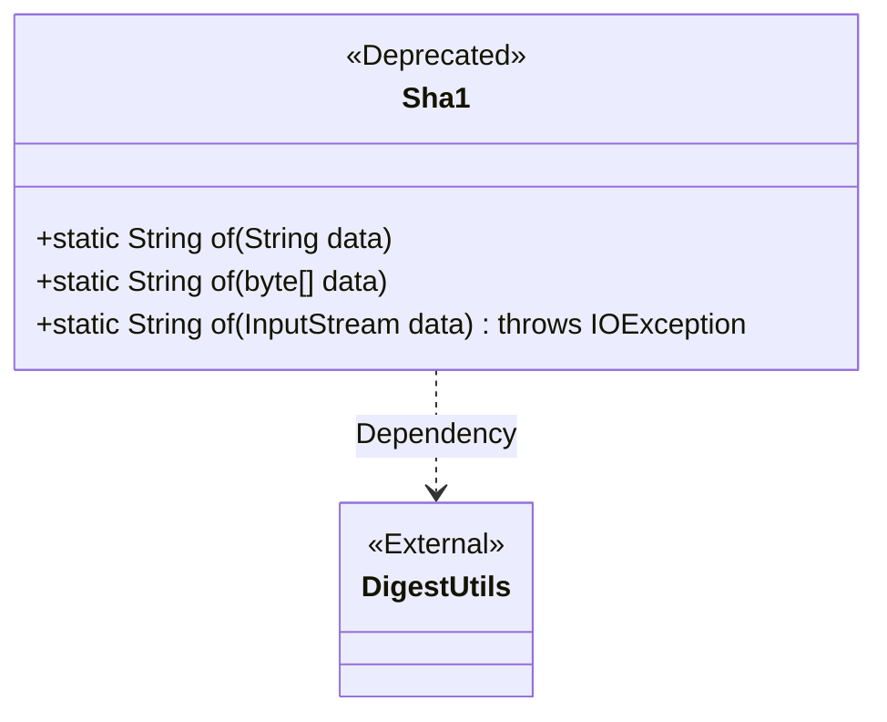
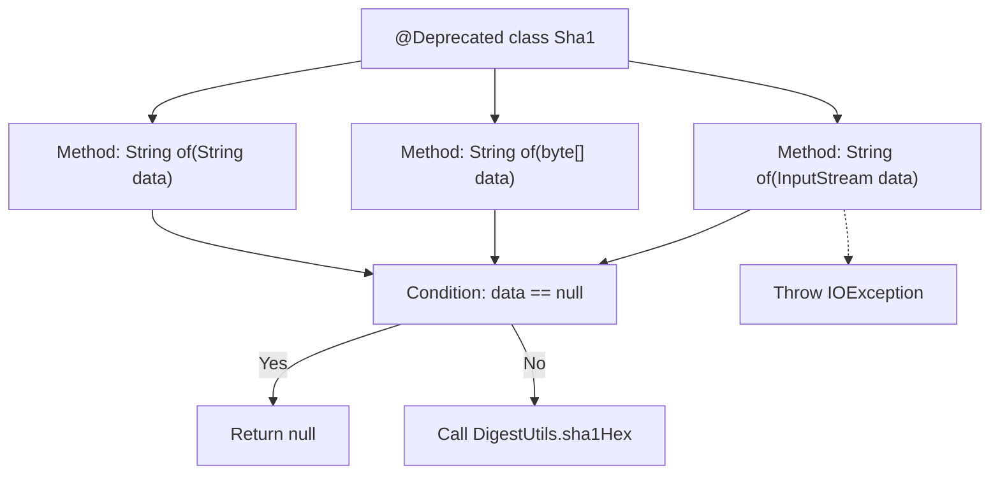

# Basic Information

|      |      |
|------|------|
| Name | Sha1 |
| Language | .java |
| Code Path | WeFe/common/java/common-lang/src/main/java/com/welab/wefe/common/util/Sha1.java |
| Package Name | com.welab.wefe.common.util |
| Dependencies | ['org.apache.commons.codec.digest.DigestUtils', 'java.io.IOException', 'java.io.InputStream'] |
| Brief Description | The deprecated Sha1 class provides three static methods for calculating SHA-1 hash values of strings, byte arrays, and input streams, internally calling DigestUtils.sha1Hex for implementation. |

# Description

This is a deprecated Java class Sha1 that provides three static methods for generating SHA-1 hash values from strings, byte arrays, or input streams. All methods utilize DigestUtils.sha1Hex for implementation, return null for null inputs, and the input stream method may throw IOException.

# Class Summary

| Name   | Type  | Description |
|-------|------|-------------|
| Sha1 | class | The deprecated Sha1 class provides three static methods for calculating SHA1 hash values of strings, byte arrays, and input streams. Internally, it calls DigestUtils.sha1Hex for implementation and returns null when the input is null. |

## Class Sha1

|      |      |
|------|------|
| Access Modifier | @Deprecated;public |
| Type | class |
| Name | Sha1 |
| Description | The deprecated Sha1 class provides three static methods for calculating SHA1 hash values of strings, byte arrays, and input streams. Internally, it calls DigestUtils.sha1Hex for implementation and returns null when the input is null. |

### UML Class Diagram

Class diagram description:  
The Sha1 class is a utility class marked as @Deprecated, providing three static method overloads for computing SHA-1 hash values from different input types (String/byte[]/InputStream). All methods delegate the implementation to Apache Commons' DigestUtils utility class and return null when the input is null. The InputStream version may throw an IOException. The diagram explicitly shows Sha1's dependency on the third-party DigestUtils.

### Internal Method Call Graph

This code demonstrates a @Deprecated Sha1 utility class containing three overloaded static methods that handle String, byte[], and InputStream type data respectively. Each method first checks if the input is null - returning null if true, otherwise invoking Apache Commons Codec's DigestUtils.sha1Hex method to generate SHA-1 hash. The InputStream version may throw IOException. The flowchart clearly illustrates the class structure and method logic branches, particularly highlighting the core null-check logic and exception handling path.

### Field List

| Name  | Type  | Description |
|-------|-------|------|

### Method List

| Name  | Type  | Description |
|-------|-------|------|
| of | String | This method takes a byte array as input, returns null if it is empty, otherwise returns the hexadecimal string of its SHA-1 hash value. |
| of | String | This method takes a string parameter `data`, returns `null` if it is null, otherwise returns its SHA-1 hash value. |
| of | String | This method takes an input stream parameter, returns null if it is empty, otherwise calculates and returns the hexadecimal string of its SHA-1 hash value. May throw an IOException. |

