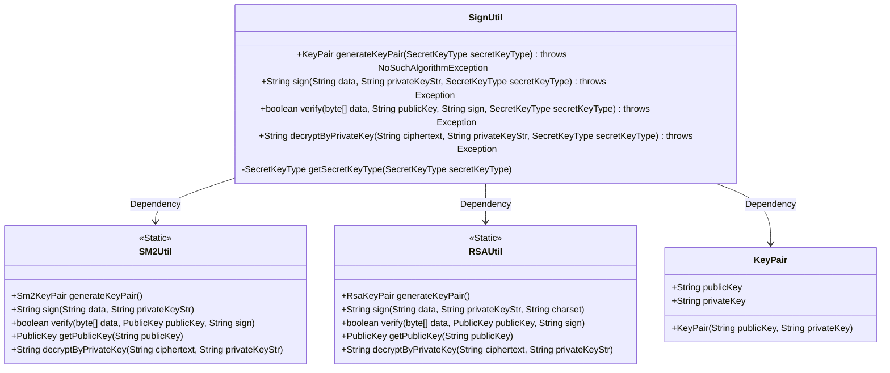
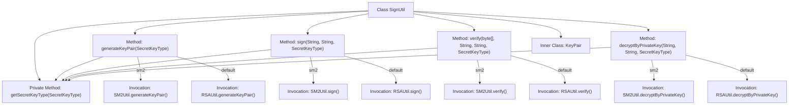

# Basic Information

|      |      |
|------|------|
| Name | SignUtil |
| Language | .java |
| Code Path | WeFe/common/java/common-lang/src/main/java/com/welab/wefe/common/util/SignUtil.java |
| Package Name | com.welab.wefe.common.util |
| Dependencies | ['com.welab.wefe.common.constant.SecretKeyType', 'java.nio.charset.StandardCharsets', 'java.security.NoSuchAlgorithmException'] |
| Brief Description | The SignUtil class provides key pair generation, signing, signature verification, and decryption functionalities, supporting both SM2 and RSA algorithms. By default, it uses RSA and automatically selects RSA when no type is specified. It includes an internal KeyPair class for storing public and private keys. |

# Description

The SignUtil class provides key generation, signing, signature verification, and private key decryption functionalities. It supports both SM2 and RSA algorithms, with RSA being the default. The generateKeyPair method generates a key pair; the sign method signs data with a private key; the verify method verifies a signature with a public key; and the decryptByPrivateKey method decrypts data with a private key. The inner class KeyPair encapsulates public and private key strings. The getSecretKeyType method handles cases where the key type is null.

# Class Summary

| Name   | Type  | Description |
|-------|------|-------------|
| SignUtil | class | The SignUtil class provides key pair generation, signing, signature verification, and decryption functionalities, supporting both SM2 and RSA algorithms. By default, it uses RSA and includes an internal KeyPair class for storing public and private keys. |

## Class SignUtil

|      |      |
|------|------|
| Access Modifier | public |
| Type | class |
| Name | SignUtil |
| Description | The SignUtil class provides key pair generation, signing, signature verification, and decryption functionalities, supporting both SM2 and RSA algorithms. By default, it uses RSA and includes an internal KeyPair class for storing public and private keys. |

### UML Class Diagram

This code implements a signature utility class SignUtil, providing key pair generation, signing, signature verification, and private key decryption functionalities, supporting both SM2 and RSA encryption algorithms. SignUtil dynamically selects the encryption algorithm based on the input SecretKeyType by invoking static methods from SM2Util and RSAUtil. KeyPair serves as an inner class to store public and private key strings. The class diagram illustrates the dependency relationships between SignUtil, SM2Util, and RSAUtil, as well as the internal structure of KeyPair, reflecting the design philosophy of the strategy pattern.

### Internal Method Call Graph

This code represents an encryption signature utility class, with primary functionalities including key pair generation, data signing, signature verification, and private key decryption. It supports two cryptographic algorithms (SM2 and RSA), dynamically selecting implementations via the SecretKeyType parameter. The inner class KeyPair encapsulates public and private keys, while the private method getSecretKeyType handles default key type logic. All public methods route to corresponding SM2Util or RSAUtil utility class implementations through switch statements for specific functionalities.

### Field List

| Name  | Type  | Description |
|-------|-------|------|

### Method List

| Name  | Type  | Description |
|-------|-------|------|
| generateKeyPair | KeyPair | The static method `generateKeyPair` generates an SM2 or RSA key pair based on the key type, returning a `KeyPair` object containing the public and private keys. By default, it uses the RSA algorithm. |
| verify | boolean | The static method `verify` validates data signatures based on the key type, supporting both SM2 and RSA algorithms, with RSA being the default. |
| decryptByPrivateKey | String | The static method `decryptByPrivateKey` selects SM2 or RSA private key decryption based on the key type, with parameters including ciphertext, private key string, and key type enumeration. Exceptions are thrown to the caller for handling. |
| sign | String | The static method `sign` selects either SM2 or RSA signing based on the key type, defaulting to RSA. Parameters include data, private key, and key type, and it may throw exceptions. |
| getSecretKeyType | SecretKeyType | The method returns the default RSA key type or the passed-in key type. If the parameter is null, it returns RSA. |

