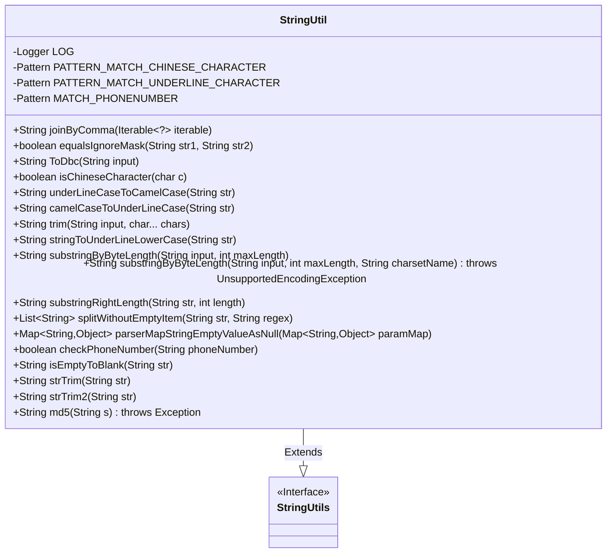

# Basic Information

|      |      |
|------|------|
| Name | StringUtil |
| Language | .java |
| Code Path | WeFe/common/java/common-lang/src/main/java/com/welab/wefe/common/util/StringUtil.java |
| Package Name | com.welab.wefe.common.util |
| Dependencies | ['com.welab.wefe.common.function.CharFunction', 'org.apache.commons.lang3.StringUtils', 'org.slf4j.Logger', 'org.slf4j.LoggerFactory', 'java.io.UnsupportedEncodingException', 'java.nio.charset.StandardCharsets', 'java.security.MessageDigest', 'java.util.ArrayList', 'java.util.List', 'java.util.Map', 'java.util.regex.Matcher', 'java.util.regex.Pattern'] |
| Brief Description | The StringUtil utility class provides string processing functionalities, including Chinese character matching, underscore-camelCase conversion, full-width/half-width conversion, string concatenation, mask comparison, phone number validation, MD5 encryption, and more. |

# Description

The StringUtil class is a string processing utility that inherits from StringUtils. It provides various string manipulation methods, including: Chinese character matching, underscore matching, mobile number format validation, list concatenation into comma-separated strings, masked string comparison ignoring masks, full-width/half-width character conversion, Chinese character checking, underscore-to-camelCase conversion and vice versa, string trimming, substring truncation by byte length, string splitting with empty removal, Map null value handling, mobile number validation, empty string processing, MD5 encryption, and more. This class encapsulates common string operations, enhancing code reusability and development efficiency.

# Class Summary

| Name   | Type  | Description |
|-------|------|-------------|
| StringUtil | class | The StringUtil utility class provides string processing functionalities, including Chinese character matching, underscore-camelCase conversion, full-width/half-width conversion, string concatenation, mask comparison, phone number validation, MD5 encryption, whitespace trimming, and byte-length-based truncation. |

## Class StringUtil

|      |      |
|------|------|
| Access Modifier | public |
| Type | class |
| Name | StringUtil |
| Description | The StringUtil utility class provides string processing functionalities, including Chinese character matching, underscore-camelCase conversion, full-width/half-width conversion, string concatenation, mask comparison, phone number validation, MD5 encryption, whitespace trimming, and byte-length-based truncation. |

### UML Class Diagram

Class diagram description: The StringUtil class extends the StringUtils interface, providing comprehensive string manipulation capabilities including string concatenation, comparison, format conversion (e.g., full-width/half-width conversion, camelCase/underscore interconversion), truncation, splitting, encryption, etc. This class encapsulates multiple static utility methods, employs regular expressions for complex pattern matching, and incorporates logging functionality. The inheritance relationship indicates it is an enhanced implementation of StringUtils, suitable for diverse string operation scenarios.

### Internal Method Call Graph

```mermaid
graph TD
    A["Class StringUtil"]
    B["Constant: LOG"]
    C["Constant: PATTERN_MATCH_CHINESE_CHARACTER"]
    D["Constant: PATTERN_MATCH_UNDERLINE_CHARACTER"]
    E["Constant: MATCH_PHONENUMBER"]
    F["Method: joinByComma"]
    G["Method: equalsIgnoreMask"]
    H["Method: ToDbc"]
    I["Method: isChineseCharacter"]
    J["Method: underLineCaseToCamelCase"]
    K["Method: camelCaseToUnderLineCase"]
    L["Method: trim"]
    M["Method: stringToUnderLineLowerCase"]
    N["Method: substringByByteLength"]
    O["Method: substringRightLength"]
    P["Method: splitWithoutEmptyItem"]
    Q["Method: parserMapStringEmptyValueAsNull"]
    R["Method: checkPhoneNumber"]
    S["Method: isEmptyToBlank"]
    T["Method: strTrim"]
    U["Method: strTrim2"]
    V["Method: md5"]

    A --> B
    A --> C
    A --> D
    A --> E
    A --> F
    A --> G
    A --> H
    A --> I
    A --> J
    A --> K
    A --> L
    A --> M
    A --> N
    A --> O
    A --> P
    A --> Q
    A --> R
    A --> S
    A --> T
    A --> U
    A --> V
```

This flowchart illustrates the complete structure of the StringUtil class, which includes 4 constant definitions and 18 core methods. Inheriting from StringUtils, the class primarily provides string processing functionalities, including: string concatenation (joinByComma), masked comparison (equalsIgnoreMask), full-width/half-width character conversion (ToDbc), Chinese character detection (isChineseCharacter), camelCase/underscore case conversion (underLineCaseToCamelCase/camelCaseToUnderLineCase), string trimming (trim), phone number validation (checkPhoneNumber), and MD5 encryption (md5), among other utility methods. All methods account for null handling and edge cases, demonstrating robust string processing capabilities.

### Field List

| Name  | Type  | Description |
|-------|-------|------|
| PATTERN_MATCH_UNDERLINE_CHARACTER = Pattern.compile("_(\\w)") | Pattern | Define a regular expression pattern to match an underscore followed by a word character and capture the latter. |
| PATTERN_MATCH_CHINESE_CHARACTER = Pattern.compile("[\\u4e00-\\u9fa5]") | Pattern | Define a regular expression pattern to match the range of Chinese characters (\\u4e00-\\u9fa5). |
| LOG = LoggerFactory.getLogger(StringUtil.class) | Logger | Define the static constant LOG in the StringUtil class for logging purposes. |
| MATCH_PHONENUMBER = Pattern.compile("^((\\+86)|(86))?1[3456789]\\d{9}$") | Pattern | The code defines a regular expression pattern for matching mobile phone numbers in mainland China, including optional +86 or 86 prefixes, starting with 1 followed by digits from 3 to 9, totaling 11 digits. |

### Method List

| Name  | Type  | Description |
|-------|-------|------|
| camelCaseToUnderLineCase | String | Convert camelCase strings to snake_case, ignoring empty strings, adding an underscore before non-initial uppercase letters and converting to lowercase. |
| substringRightLength | String | Method truncates the right end of a string to the specified length, returns null for empty strings, and returns the original string for insufficient or negative lengths. |
| stringToUnderLineLowerCase | String | Convert a string to lowercase underscore format: remove leading/trailing spaces, special characters, and consecutive spaces, convert spaces to underscores, transform camelCase to underscores, and clean up redundant underscores. |
| ToDbc | String | Convert full-width characters to half-width characters, including spaces and characters within specific ranges. |
| isChineseCharacter | boolean | Determine whether the character is a Chinese character, using regex pattern matching to check the input character and return the result. |
| equalsIgnoreMask | boolean | Compare two strings, ignoring asterisk characters. Return false if the lengths differ or non-asterisk characters do not match, otherwise return true. Handle null cases. |
| substringByByteLength | String | This method truncates a string by byte length using UTF-8 encoding and returns the original string in case of an exception. |
| isEmptyToBlank | String | This method checks if the string is empty or equals "null"; if so, it returns a space, otherwise it returns the original string. |
| parserMapStringEmptyValueAsNull | Map<String, Object> | This method converts empty string values in a Map to null, returns null if the input Map is empty, and returns the modified Map after processing a non-empty Map. |
| substringByByteLength | String | This method truncates a string by byte length, handling multi-byte encodings to ensure the result does not exceed the specified byte count. If the input is empty, it returns null; otherwise, it checks the length and adjusts the truncation position if necessary to avoid splitting characters. |
| checkPhoneNumber | boolean | Check phone number format: non-empty, length between 11-14 digits, and complies with regex matching rules. |
| splitWithoutEmptyItem | List<String> | The static method `splitWithoutEmptyItem` splits a string by a regular expression and filters out empty items, returning a list of non-empty strings. |
| underLineCaseToCamelCase | String | Convert underscore naming to camel case naming, ignore empty strings, and capitalize the character following the underscore in the match. |
| strTrim | String | This method checks if the string is empty, returns a space if it is, otherwise trims leading and trailing spaces before returning. |
| joinByComma | String | The static method `joinByComma` accepts an iterable object and returns an empty string if it is empty; otherwise, it joins the elements with commas. |
| trim | String | The static method `trim` is used to remove specified characters from the beginning and end of a string. If the input is empty, it returns directly; otherwise, it iterates through the characters to be removed at the start and end, then returns the middle substring. |
| strTrim2 | String | This method checks if the string is empty, and returns the original string if it is; otherwise, it trims the leading and trailing spaces before returning. |
| md5 | String | Java Method: Convert the input string to an MD5 hash value and return a hexadecimal uppercase string. Implemented using MessageDigest, processing the byte array and mapping it to characters. |

