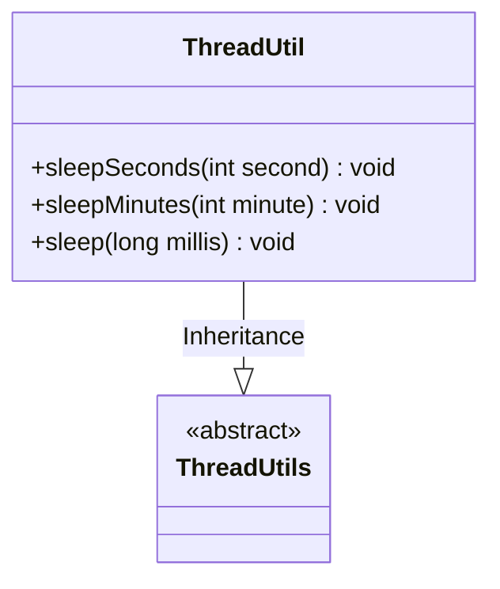
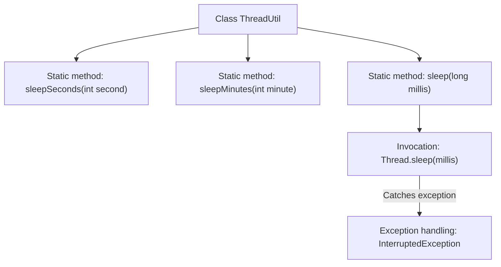

# Basic Information

|      |      |
|------|------|
| Name | ThreadUtil |
| Language | .java |
| Code Path | WeFe/common/java/common-lang/src/main/java/com/welab/wefe/common/util/ThreadUtil.java |
| Package Name | com.welab.wefe.common.util |
| Dependencies | ['org.apache.commons.lang3.ThreadUtils'] |
| Brief Description | The ThreadUtil utility class provides second-level and minute-level thread sleep methods, internally invoking Thread.sleep and handling interrupt exceptions. |

# Description

ThreadUtil is a thread utility class that inherits from ThreadUtils. It provides three static methods for thread sleeping: the sleepSeconds method accepts a parameter in seconds, converts it to milliseconds, and then calls the sleep method; the sleepMinutes method accepts a parameter in minutes, converts it to milliseconds, and then calls sleep; the core sleep method directly implements sleeping using Thread.sleep, catches InterruptedException, and prints the stack trace. All methods are static and can be called directly.

# Class Summary

| Name   | Type  | Description |
|-------|------|-------------|
| ThreadUtil | class | The ThreadUtil class provides static methods sleepSeconds, sleepMinutes, and sleep, which implement thread sleep in seconds, minutes, and milliseconds respectively, printing the stack trace when exceptions occur. |

## Class ThreadUtil

|      |      |
|------|------|
| Access Modifier | public |
| Type | class |
| Name | ThreadUtil |
| Description | The ThreadUtil class provides static methods sleepSeconds, sleepMinutes, and sleep, which implement thread sleep in seconds, minutes, and milliseconds respectively, printing the stack trace when exceptions occur. |

### UML Class Diagram

This class diagram illustrates the inheritance relationship where the ThreadUtil class extends the base class ThreadUtils. ThreadUtils is marked as an abstract class (<<abstract>>), while ThreadUtil implements three static methods: sleepSeconds() converts seconds to milliseconds before sleeping, sleepMinutes() converts minutes to milliseconds before sleeping, and the core sleep() method directly invokes Thread.sleep() while handling interrupt exceptions. All methods are public (denoted by +), reflecting the utility class design pattern for thread sleep functionality.

### Internal Method Call Graph

This flowchart illustrates the invocation relationships of static methods in the ThreadUtil class. Both sleepSeconds and sleepMinutes methods ultimately call the core sleep method, which internally implements thread suspension via Thread.sleep and handles potential InterruptedException. All methods are static and can be invoked directly through the class name without instantiation.

### Field List

| Name  | Type  | Description |
|-------|-------|------|

### Method List

| Name  | Type  | Description |
|-------|-------|------|
| sleepMinutes | void | The static method `sleepMinutes` takes the number of minutes, converts it to milliseconds, and then calls `sleep` to implement the sleep function. |
| sleepSeconds | void | Define a static method sleepSeconds that takes an integer parameter second, calls the sleep method and converts it to milliseconds (multiplied by 1000). |
| sleep | void | Java static method sleep, which calls Thread.sleep to pause the current thread for the specified milliseconds, catches and prints the InterruptedException. |

