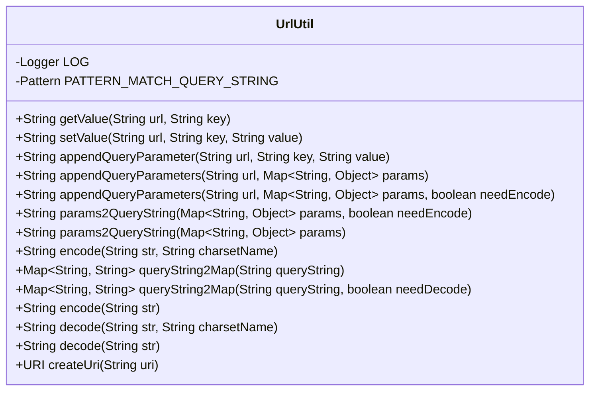

# Basic Information

|      |      |
|------|------|
| Name | UrlUtil |
| Language | .java |
| Code Path | WeFe/common/java/common-lang/src/main/java/com/welab/wefe/common/util/UrlUtil.java |
| Package Name | com.welab.wefe.common.util |
| Dependencies | ['org.apache.commons.lang3.StringUtils', 'org.slf4j.Logger', 'org.slf4j.LoggerFactory', 'java.io.UnsupportedEncodingException', 'java.net.URI', 'java.net.URISyntaxException', 'java.net.URLDecoder', 'java.net.URLEncoder', 'java.nio.charset.StandardCharsets', 'java.util.HashMap', 'java.util.Map', 'java.util.regex.Matcher', 'java.util.regex.Pattern'] |
| Brief Description | The UrlUtil class provides URL processing functionalities, including getting, setting, and concatenating parameters, parameter encoding and decoding, as well as conversion between URLs and Maps. It supports UTF-8 encoding and simplifies URL operations. |

# Description

The UrlUtil class provides URL processing functionalities, including methods for retrieving, setting, and concatenating query parameters. It supports extracting values of specified keys from URLs, modifying or adding parameters, converting Maps into query strings, and handling encoding and decoding. Features include parameter encoding (UTF-8 by default), bidirectional conversion between query strings and Maps, URI creation, and more. It uses regular expressions for parameter matching, handles exceptions, and logs errors.

# Class Summary

| Name   | Type  | Description |
|-------|------|-------------|
| UrlUtil | class | The UrlUtil class provides URL processing functionalities, including getting, setting, and concatenating parameters, parameter encoding/decoding, and conversion between URLs and Maps. It supports UTF-8 encoding and simplifies URL operations. |

## Class UrlUtil

|      |      |
|------|------|
| Access Modifier | public |
| Type | class |
| Name | UrlUtil |
| Description | The UrlUtil class provides URL processing functionalities, including getting, setting, and concatenating parameters, parameter encoding/decoding, and conversion between URLs and Maps. It supports UTF-8 encoding and simplifies URL operations. |

### UML Class Diagram

This class diagram illustrates the UrlUtil utility class, primarily designed for URL parameter processing. It includes core functionalities: getting/setting URL parameter values, appending query parameters, URL encoding/decoding, bidirectional conversion between query strings and Maps, and URI creation. The class employs Logger for logging, uses Pattern for regular expression matching of query strings, provides overloaded methods for various parameter handling scenarios, supports both default UTF-8 encoding and custom encoding, and handles parameter encoding exceptions. All methods are static and can be directly invoked via the class name.

### Internal Method Call Graph

```mermaid
graph TD
    A["Class UrlUtil"]
    B["Property: Logger LOG"]
    C["Property: Pattern PATTERN_MATCH_QUERY_STRING"]
    D["Method: getValue(String url, String key)"]
    E["Method: setValue(String url, String key, String value)"]
    F["Method: appendQueryParameter(String url, String key, String value)"]
    G["Method: appendQueryParameters(String url, Map<String, Object> params)"]
    H["Method: appendQueryParameters(String url, Map<String, Object> params, boolean needEncode)"]
    I["Method: params2QueryString(Map<String, Object> params, boolean needEncode)"]
    J["Method: params2QueryString(Map<String, Object> params)"]
    K["Method: encode(String str, String charsetName)"]
    L["Method: encode(String str)"]
    M["Method: queryString2Map(String queryString)"]
    N["Method: queryString2Map(String queryString, boolean needDecode)"]
    O["Method: decode(String str, String charsetName)"]
    P["Method: decode(String str)"]
    Q["Method: createUri(String uri)"]

    A --> B
    A --> C
    A --> D
    A --> E
    A --> F
    A --> G
    A --> H
    A --> I
    A --> J
    A --> K
    A --> L
    A --> M
    A --> N
    A --> O
    A --> P
    A --> Q
```

This code defines a UrlUtil class primarily used for handling URL-related operations. The class contains multiple static methods for retrieving, setting, and appending URL parameters, as well as URL encoding and decoding. The flowchart illustrates the class's main properties and methods, including functionalities for processing query strings, parameter encoding/decoding, and URI creation. These methods work together to provide comprehensive URL handling capabilities, suitable for various web development scenarios.

### Field List

| Name  | Type  | Description |
|-------|-------|------|
| PATTERN_MATCH_QUERY_STRING = Pattern.compile("(?<name>[^?&]+)=(?<value>[^?&]+)") | Pattern | Java regular expression for matching key-value pairs in a URL query string, capturing the `name` and `value` groups. |
| LOG = LoggerFactory.getLogger(StringUtil.class) | Logger | Declare a protected static constant log object for logging in the StringUtil class. |

### Method List

| Name  | Type  | Description |
|-------|-------|------|
| queryString2Map | Map<String, String> | Static method to convert a query string into a Map, which can call overloaded methods and by default does not handle exceptions. |
| params2QueryString | String | Convert Map parameters into a query string with optional encoding support. Returns an empty string if the parameters are empty; otherwise, concatenates key-value pairs and removes the first "&". |
| encode | String | The static method `encode` accepts a string parameter and returns the encoded string using the UTF-8 encoding format. |
| encode | String | This method is used to URL-encode a string according to the specified character set. If it fails, an error will be logged and an empty string will be returned. |
| queryString2Map | Map<String, String> | Parse the query string into a Map, supporting optional decoding. Empty input returns an empty Map. For non-empty input, key-value pairs are matched via regex and stored in the result. |
| getValue | String | Extract the value of a specified key from a URL. First, split the parts before and after the question mark, then split the key-value pairs. Return the corresponding value if the key is matched, otherwise return an empty string. |
| decode | String | The static method `decode` is used to decode a URL string with a specified character set. If decoding fails, it logs an error and returns an empty string. |
| params2QueryString | String | Convert Map parameters into a query string, with URL encoding applied by default. |
| appendQueryParameters | String | Static methods concatenate a URL with a parameter Map into a URL with a query string, returning the original URL when parameters are empty, and automatically handling the separators ? and &. |
| setValue | String | This method is used to modify parameter values in a URL. If the parameter exists, it will be replaced; otherwise, it will be appended to the end of the URL, automatically handling question marks or connectors. |
| decode | String | The static method `decode` returns the string after decoding it with UTF-8 encoding. |
| createUri | URI | The static method `createUri` accepts a string `uri`, attempts to create a URI object, and logs an error before throwing a runtime exception upon failure. |
| appendQueryParameters | String | Static methods concatenate a URL and a parameter Map into a URL with query parameters. If the parameters are empty, the original URL is returned. It automatically handles the connectors ? and &, and supports parameter encoding. |
| appendQueryParameter | String | This method is used to append query parameters to a URL. If the URL already has parameters, an ampersand (&) is added; otherwise, a question mark (?) is added. Finally, the key-value pair is concatenated with the value encoded, and the new URL is returned. |

