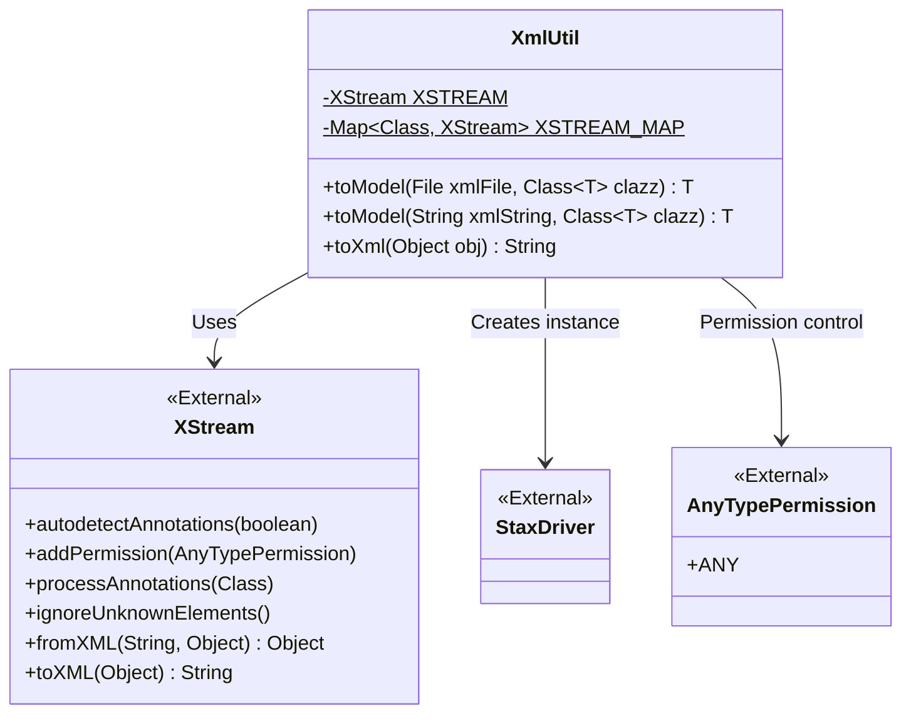
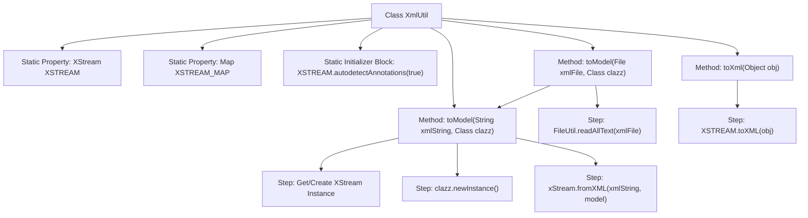

# Basic Information

|      |      |
|------|------|
| Name | XmlUtil |
| Language | .java |
| Code Path | WeFe/common/java/common-lang/src/main/java/com/welab/wefe/common/util/XmlUtil.java |
| Package Name | com.welab.wefe.common.util |
| Dependencies | ['com.thoughtworks.xstream.XStream', 'com.thoughtworks.xstream.io.xml.StaxDriver', 'com.thoughtworks.xstream.security.AnyTypePermission', 'java.io.File', 'java.io.IOException', 'java.util.HashMap', 'java.util.Map'] |
| Brief Description | The XmlUtil class provides XML-to-object conversion functionality, utilizing a thread-safe XStream instance and object reuse to enhance performance. It supports parsing XML from files or strings, as well as serializing objects into XML. |

# Description

The XmlUtil class provides conversion functionality between XML and Java objects. It primarily utilizes XStream for serialization and deserialization, ensuring thread safety through a static XSTREAM instance, and employs XSTREAM_MAP to cache configured XStream instances for performance optimization. Key methods include: toModel, which converts XML files or strings into objects of the specified type (requiring the target class to use the @XStreamAlias annotation); and toXml, which serializes objects into XML strings. During class initialization, annotation detection is automatically enabled, and the processing will ignore unknown elements while permitting any type permissions.

# Class Summary

| Name   | Type  | Description |
|-------|------|-------------|
| XmlUtil | class | The XmlUtil class provides bidirectional conversion between XML and objects, utilizing a thread-safe XStream instance with performance optimization through caching. It supports annotation-based configuration and ignores unknown elements. |

## Class XmlUtil

|      |      |
|------|------|
| Access Modifier | public |
| Type | class |
| Name | XmlUtil |
| Description | The XmlUtil class provides bidirectional conversion between XML and objects, utilizing a thread-safe XStream instance with performance optimization through caching. It supports annotation-based configuration and ignores unknown elements. |

### UML Class Diagram

Class diagram description: XmlUtil is a utility class for converting between XML and Java objects. It leverages the XStream library for serialization/deserialization, caching XStream instances via static variables for performance optimization. The class contains two core methods: toModel() converts XML to objects, while toXml() serializes objects into XML strings. StaxDriver provides XML parsing capabilities, and AnyTypePermission governs deserialization permissions.

### Internal Method Call Graph

This code represents a utility class for converting between XML and Java objects. Its main functionalities include transforming XML files or strings into Java objects of specified types, and serializing Java objects into XML strings. It enhances performance through static XStream instances and caching mechanisms, supporting annotation configuration and ignoring unknown elements. The flowchart clearly illustrates the class structure, method invocation relationships, and core processing steps, including key operations such as file reading, XStream instance management, object instantiation, and XML conversion.

### Field List

| Name  | Type  | Description |
|-------|-------|------|
| XSTREAM = new XStream() | XStream | Initialize a static immutable XStream instance. |
| XSTREAM_MAP = new HashMap<>() | Map<Class, XStream> | Define a static constant XSTREAM_MAP to store the mapping from Class types to XStream objects. |

### Method List

| Name  | Type  | Description |
|-------|-------|------|
| toXml | String | Convert objects to XML strings using the XSTREAM tool. |
| toModel | T | Convert XML string to specified class instance, reuse XStream object to improve performance, handle annotations and unknown elements, return null on exception. |
| toModel | T | Read the content of an XML file as a string and convert it into a model object of the specified type. |

