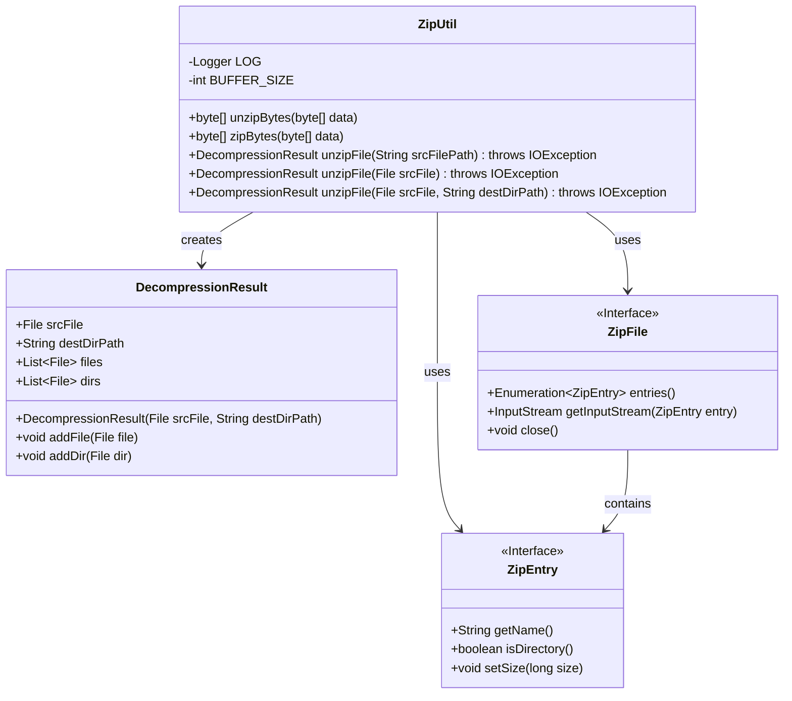
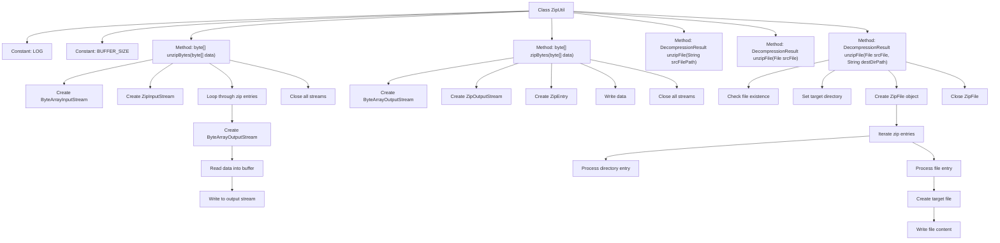
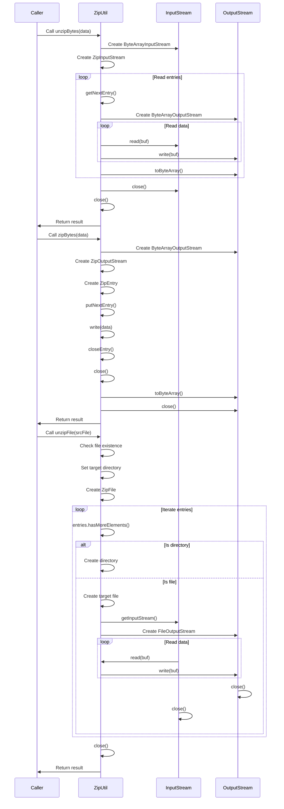

# Basic Information

|      |      |
|------|------|
| Name | ZipUtil |
| Language | .java |
| Code Path | WeFe/common/java/common-lang/src/main/java/com/welab/wefe/common/util/ZipUtil.java |
| Package Name | com.welab.wefe.common.util |
| Dependencies | ['com.welab.wefe.common.file.decompression.dto.DecompressionResult', 'org.slf4j.Logger', 'org.slf4j.LoggerFactory', 'java.io', 'java.util.Enumeration', 'java.util.zip.ZipEntry', 'java.util.zip.ZipFile', 'java.util.zip.ZipInputStream', 'java.util.zip.ZipOutputStream'] |
| Brief Description | The ZipUtil class provides compression and decompression functionality for byte arrays and files, supports multi-file decompression, and includes exception handling and result logging. |

# Description

ZipUtil is a Java utility class that provides compression and decompression functionalities for ZIP files. It includes three main methods: unzipBytes for decompressing byte array data, zipBytes for compressing byte array data, and unzipFile for extracting ZIP files to a specified directory. When decompressing files, it supports handling ZIP files containing multiple files and directories, automatically creates the target directory structure, and returns a DecompressionResult object containing the extraction results. The class defines a 2KB buffer size for IO operations and handles various exception scenarios.

# Class Summary

| Name   | Type  | Description |
|-------|------|-------------|
| ZipUtil | class | The ZipUtil class provides compression and decompression functionalities for byte arrays and files, supporting multi-file extraction to specified directories, with error handling and resource management included. |

## Class ZipUtil

|      |      |
|------|------|
| Access Modifier | public |
| Type | class |
| Name | ZipUtil |
| Description | The ZipUtil class provides compression and decompression functionalities for byte arrays and files, supporting multi-file extraction to specified directories, with error handling and resource management included. |

### UML Class Diagram

This code demonstrates a ZipUtil utility class primarily designed for ZIP compression and decompression operations. The class diagram includes the core ZipUtil class along with its associated DecompressionResult class, as well as two interfaces: ZipFile and ZipEntry. ZipUtil provides byte array-level compression/decompression methods (unzipBytes/zipBytes) and file-level decompression methods (unzipFile). The file decompression methods support processing ZIP archives containing multiple files and encapsulate the decompression results in a DecompressionResult object for return. All methods incorporate exception handling mechanisms, and file operations utilize a buffer (BUFFER_SIZE) to enhance IO efficiency.

### Internal Method Call Graph

This code implements a ZIP compression utility class containing three core functionalities: decompressing byte arrays (unzipBytes), compressing byte arrays (zipBytes), and decompressing files (unzipFile). The flowchart illustrates the class structure and main method call relationships, while the sequence diagram details the execution flow of each method. The utility class supports in-memory compression/decompression of byte arrays and physical ZIP file decompression, correctly handles directory structures and file contents, and features robust exception handling and resource management mechanisms.

### Field List

| Name  | Type  | Description |
|-------|-------|------|
| LOG = LoggerFactory.getLogger(ZipUtil.class) | Logger | The ZipUtil class defines a protected static constant LOG for logging purposes. |
| BUFFER_SIZE = 2 * 1024 | int | Define a static constant BUFFER_SIZE with a value of 2048 bytes. |

### Method List

| Name  | Type  | Description |
|-------|-------|------|
| unzipFile | DecompressionResult | Extract the ZIP file to the specified directory, process folders and files, and return the extraction result. Check the existence of the source file, automatically create the target directory structure, and ensure the stream is properly closed. |
| unzipFile | DecompressionResult | Java static method `unzipFile`, which takes a source file path string as input, extracts the file and returns the result, potentially throwing an IO exception. |
| unzipBytes | byte[] | The static method `unzipBytes` decompresses a byte array, reads the Zip stream, and outputs the decompressed byte array, handling exceptions and returning the result. |
| zipBytes | byte[] | This is a Java method that compresses a byte array into a ZIP-formatted byte array. The method creates a ZIP output stream, writes the data, and returns the compressed result. If an exception occurs, it prints an error and returns null. |
| unzipFile | DecompressionResult | The static method `unzipFile` decompresses a file, accepts a `File` parameter, returns a `DecompressionResult`, and may throw an `IOException`. It calls an overloaded method by passing `null` as the second parameter. |

