# Basic Information

|      |      |
|------|------|
| Name | util |
| Language | .java |
| Code Path | WeFe/common/java/common-lang/src/main/java/com/welab/wefe/common/util |
| Package Name | docs.common.java.common-lang.src.main.java.com.welab.wefe.common.util |
| Brief Description | A collection of multiple Java utility classes, including file type processing, collection statistics, reflection scanning, IP address operations, encryption and decryption, date handling, string manipulation, XML conversion, thread sleep, and other practical functions, covering common development needs. |

# Description

## Overview  
This module is a collection of Java utility libraries, with its core responsibility being to provide general-purpose utility methods for various fundamental operations, covering scenarios such as file processing, encryption/decryption, collection manipulation, and date handling. The interface specifications uniformly adopt a static method design, supporting generics, exception handling, and logging. Key data structures include enum classes (e.g., `ContentType`), key-value pair containers (e.g., `JObject` extending `JSONObject`), and cryptographic key pairs (e.g., `SM2Util.Sm2KeyPair`). External dependencies include the BouncyCastle cryptography library, XStream, and ClassGraph, among others. For example, `SM4Util` relies on BouncyCastle to implement the national cryptographic algorithms, while `ReflectionsUtil` uses ClassGraph for class scanning.

## Primary Business Scenarios  
The module supports typical scenarios such as file type identification (e.g., `FileType` detecting via file headers), data encryption (e.g., SM2/RSA asymmetric encryption), collection statistics (e.g., `MapUtil.element` counting), and reflection scanning (e.g., `ReflectionsUtil` fetching annotated classes). The interaction pattern resembles a toolchain design—for instance, after obtaining the MIME type via `ContentType.of`, `FileUtil` can determine the file type based on this. Functional completeness is reflected in its coverage of national cryptographic algorithms (SM2/SM4), multi-format conversions (Base64/ZIP/XML), and sensitive data processing (e.g., `Masker` for phone number desensitization). Typical applications include: combining `FileType` and `ContentType` for validation during file uploads, and using `SignUtil` for signature generation and verification during API calls. For example, `RSAUtil` supports segmented encryption for large data, while `UrlUtil` handles URL parameter encoding.

### Package Internal Structure View

```mermaid
graph TD
    util --> enums
    util --> MapUtil.java
    util --> ReflectionsUtil.java
    util --> IpAddressUtil.java
    util --> Sha1.java
    util --> ListUtil.java
    util --> StringUtil.java
    util --> EncryptUtils.java
    util --> SignUtil.java
    util --> UrlUtil.java
    util --> DateUtil.java
    util --> SM2Util.java
    util --> SM4Util.java
    util --> ClassUtils.java
    util --> JObject.java
    util --> Masker.java
    util --> OS.java
    util --> Base64Util.java
    util --> ZipUtil.java
    util --> Md5.java
    util --> ImageUtil.java
    util --> FileUtil.java
    util --> XmlUtil.java
    util --> CommentedProperties.java
    util --> AESUtil.java
    util --> RandomUtil.java
    util --> FileType.java
    util --> ThreadUtil.java
    util --> CopyUtil.java
    util --> GzipUtil.java
    util --> HostUtil.java
    util --> AsymmetricCryptoUtil.java
    util --> RSAUtil.java
    enums --> ContentType.java
```

This flowchart illustrates the hierarchical structure of the util package within the common-lang module of the WeFe project. The root node "util" contains 28 child nodes, including 27 utility class files (such as MapUtil.java, StringUtil.java, etc.) and 1 enums directory. The enums directory further contains the ContentType.java enumeration file. The entire structure clearly demonstrates the organization of various utility classes in this module, covering practical functionalities such as encryption, date processing, file operations, and more.

# File List

| Name   | Type  | Description |
|-------|------|-------------|
| [MapUtil.java](MapUtil.md) | file | The MapUtil class provides methods for counting elements in a collection, including the statistics function for tallying the entire collection and the increment function for increasing the count of a single element. |
| [ReflectionsUtil.java](ReflectionsUtil.md) | file | The ReflectionsUtil class provides four static methods: scanning classes via annotations, obtaining interface implementation classes and subclasses, and performing classpath scanning using the ClassGraph library. |
| [IpAddressUtil.java](IpAddressUtil.md) | file | The `IpAddressUtil` class provides IP address utility methods, including checking if IPs are in the same network segment, obtaining IP addresses, subnet masks, and parsing IP lists. The core method `isSameNetworkSegment` determines whether IPs are in the same network segment by comparing them with the subnet mask through binary operations. |
| [Sha1.java](Sha1.md) | file | The deprecated Sha1 class provides three static methods for calculating SHA-1 hash values of strings, byte arrays, and input streams, internally calling DigestUtils.sha1Hex for implementation. |
| [ListUtil.java](ListUtil.md) | file | The ListUtil class provides functionalities for parallel list traversal, numerical summation, and element movement. It includes methods such as parallelEach for concurrent processing, sumLong/sumInt for summation, and moveElement for repositioning elements. |
| [StringUtil.java](StringUtil.md) | file | The StringUtil utility class provides string processing functionalities, including Chinese character matching, underscore-camel case conversion, full-width/half-width conversion, string concatenation, mask comparison, phone number validation, MD5 encryption, and more. |
| [EncryptUtils.java](EncryptUtils.md) | file | The `EncryptUtils` class provides MD5 digest generation and mutual conversion between hexadecimal and binary. It includes three static methods: `md5`, `parseHexStr2Byte`, and `parseByte2HexStr`. |
| [SignUtil.java](SignUtil.md) | file | The SignUtil class provides key pair generation, signing, verification, and decryption functionalities, supporting both SM2 and RSA algorithms. By default, it uses RSA and automatically selects RSA when no type is specified. It includes an internal KeyPair class for storing public and private keys. |
| [UrlUtil.java](UrlUtil.md) | file | The UrlUtil class provides URL processing functionalities, including getting, setting, and concatenating parameters, parameter encoding/decoding, as well as conversion between URLs and Maps. It supports UTF-8 encoding and simplifies URL operations. |
| [DateUtil.java](DateUtil.md) | file | The DateUtil class provides date and time processing functionalities, including constant definitions, format conversion, time difference calculation, date addition/subtraction, range validation, and more. It supports multiple date formats such as YYYY-MM-DD, YYYYMMDDHHmmss, and can retrieve hour, weekday, and month intervals, check time ranges, convert between milliseconds and seconds, handle UTC time, etc. |
| [SM2Util.java](SM2Util.md) | file | The SM2Util class provides SM2 national cryptographic algorithm utilities, including key generation, public/private key conversion, signature verification, public key encryption, and private key decryption functionalities, implemented based on BouncyCastle. |
| [SM4Util.java](SM4Util.md) | file | The SM4Util class provides SM4 encryption functionality, supports CBC mode, includes key generation and encryption/decryption methods, and supports hexadecimal and Base64 formats. |
| [ClassUtils.java](ClassUtils.md) | file | ClassUtils provides static methods for handling class information: obtaining type simple names, resolving generic types, creating class instances, listing class fields (including parent classes), obtaining generic classes, converting static classes to JSON, and determining abstract classes. |
| [JObject.java](JObject.md) | file | JObject is a class that extends JSONObject, supporting serialization and providing functionalities such as key-value operations, JSON path queries, case-insensitive value retrieval, formatted output, and type conversion. |
| [Masker.java](Masker.md) | file | The Masker class provides phone number and email masking functionality. Phone numbers retain the first few digits and the last two digits, with asterisks replacing the middle portion; emails retain part of the characters before the @ symbol, followed by asterisks and the domain. It handles edge cases such as short inputs or invalid formats. |
| [OS.java](OS.md) | file | The code defines an enumeration class `OS` containing four operating system types: `mac`, `windows`, `linux`, and `unknown`. It automatically detects the current system type through a static initialization block and provides a method to execute system commands, supporting different command execution methods for Windows and Linux/Mac. |
| [Base64Util.java](Base64Util.md) | file | Base64 utility class, providing bidirectional conversion between strings and Base64 encoding, with support for UTF-8 encoding and ZIP/GZIP compression options. |
| [ZipUtil.java](ZipUtil.md) | file | The ZipUtil class provides compression and decompression functionalities for byte arrays and files, supports multi-file decompression, and includes exception handling and result logging. |
| [Md5.java](Md5.md) | file | The Md5 class provides static methods to support MD5 hash calculations for strings, byte arrays, and input streams, returning null for empty inputs. Example: computing the hash value of "hello". |
| [ImageUtil.java](ImageUtil.md) | file | The ImageUtil class provides image compression functionality, recursively compressing Base64 images to specified dimensions and quality levels, supporting PNG and JPG formats, and returning the compressed Base64 string. |
| [FileUtil.java](FileUtil.md) | file | The FileUtil class provides file operation functionalities, including determining file types (images, compressed packages), obtaining file extensions, reading and writing files, creating and deleting directories, moving and copying files, etc. |
| [XmlUtil.java](XmlUtil.md) | file | The XmlUtil class provides XML-to-object conversion functionality, utilizing a thread-safe XStream instance and object reuse to enhance performance. It supports XML parsing from files or strings, as well as object serialization to XML. |
| [CommentedProperties.java](CommentedProperties.md) | file | The CommentedProperties class is used for managing annotated property files, supporting loading, modifying, adding, and saving properties while preserving comments and line order. |
| [AESUtil.java](AESUtil.md) | file | The AESUtil class provides AES encryption and decryption functionality, supporting ECB and CBC modes, and includes various encryption methods and exception handling. |
| [RandomUtil.java](RandomUtil.md) | file | The RandomUtil class provides functionality for generating random passwords, including two methods: strong passwords and regular passwords. Strong passwords mix uppercase and lowercase letters, numbers, and special characters, while regular passwords only use lowercase letters and numbers. |
| [FileType.java](FileType.md) | file | The FileType class identifies file types through file headers, supporting various formats such as images, documents, audio, and video, and provides methods to retrieve file headers and determine whether a file is an image. |
| [ThreadUtil.java](ThreadUtil.md) | file | The ThreadUtil utility class provides second-level and minute-level thread sleep methods, internally invoking Thread.sleep and handling interrupt exceptions. |
| [CopyUtil.java](CopyUtil.md) | file | The `CopyUtil` class provides two static methods: `getNullPropertyNames` retrieves an array of null property names from an object, while `copyBeanIgnoreNullProterty` copies non-null properties to a target object. |
| [GzipUtil.java](GzipUtil.md) | file | The GzipUtil class provides zip and unzip methods for compressing and decompressing byte arrays, handling exceptions, and logging. |
| [HostUtil.java](HostUtil.md) | file | The HostUtil class provides a method to obtain the local IPv4 address, prioritizing checks on the eth0 and en0 network interfaces. If unsuccessful, it then attempts to retrieve the hostname and address. If all attempts fail, it returns "unknown". |
| [AsymmetricCryptoUtil.java](AsymmetricCryptoUtil.md) | file | Asymmetric encryption utility class, supports public key encryption and private key decryption, defaults to RSA, with optional SM2. |
| [RSAUtil.java](RSAUtil.md) | file | RSA utility class, providing public/private key encryption and decryption, signature generation and verification, key conversion, and long text segmentation processing functions, with Base64 encoding support. |
| [enums](enums/_module.md) | package | The enumeration ContentType defines common file extensions, descriptions, and MIME types, providing a method to retrieve the corresponding MIME type based on the filename. |

